# KK Tires CRM - Master Architectural Map

> **Definitive Source of Truth** for the KK Tires CRM codebase
> 
> **Generated:** 2026-02-14  
> **Version:** 0.1.0

---

## Table of Contents

1. [Executive Summary](#1-executive-summary)
2. [System Architecture Overview](#2-system-architecture-overview)
3. [Directory Structure Reference](#3-directory-structure-reference)
4. [Dependency Map](#4-dependency-map)
5. [Database Architecture](#5-database-architecture)
6. [API Reference Index](#6-api-reference-index)
7. [UI Component Catalog](#7-ui-component-catalog)
8. [External Services Catalog](#8-external-services-catalog)
9. [Environment Configuration Reference](#9-environment-configuration-reference)
10. [Data Flow Diagrams](#10-data-flow-diagrams)
11. [Development Guidelines](#11-development-guidelines)
12. [Deployment Architecture](#12-deployment-architecture)

---

## 1. Executive Summary

### System Overview

**KK Tires CRM** is a modern Customer Relationship Management application designed for tire businesses in Greece. It provides comprehensive customer management, email marketing campaigns, lead tracking, and geographic visualization capabilities.

| Attribute | Value |
|-----------|-------|
| **Name** | kktires-web |
| **Type** | Full-stack Web Application |
| **Primary Language** | TypeScript |
| **UI Language** | Greek (with English codebase) |
| **Purpose** | CRM for tire distribution/retail businesses |

### Technology Stack Summary

| Layer | Technology | Version |
|-------|------------|---------|
| **Framework** | Next.js | 16.1.6 |
| **UI Library** | React | 19.2.4 |
| **Styling** | Tailwind CSS | 4.x |
| **State Management** | Zustand | 5.0.2 |
| **Database** | Turso/libSQL | - |
| **ORM** | Drizzle ORM | 0.45.1 |
| **Authentication** | NextAuth.js | 5.0.0-beta.30 |
| **Email** | Nodemailer SMTP | 7.0.7 |
| **AI** | HuggingFace/Meltemi-7B | - |
| **Storage** | Vercel Blob | 2.2.0 |
| **Testing** | Vitest + Playwright | 4.0.18 / 1.58.2 |

### Key Architectural Decisions

1. **Multi-Tenant Architecture**: All business data scoped to `org_id` with cascade delete for tenant isolation
2. **Dual Database Support**: Works with both local SQLite (development) and Turso cloud (production)
3. **Email Job Queue**: Database-backed queue with distributed locking for reliable email delivery
4. **Greek-First Design**: UI in Greek, AI model (Meltemi-7B) optimized for Greek language
5. **Glass Design System**: Custom glass-morphism UI components with aurora gradient backgrounds
6. **Server/Client Separation**: Server modules for business logic, Client Components for interactivity
7. **Auto-Heal Schema**: Runtime schema drift detection and repair for resilience
8. **Multi-Deployment**: Supports both Vercel serverless and Docker containerized deployments

### Detailed Analysis Documents

| Document | Purpose |
|----------|---------|
| [`plans/configuration-dependencies-analysis.md`](../plans/configuration-dependencies-analysis.md) | Project config, dependencies, environment |
| [`plans/database-schema-analysis.md`](../plans/database-schema-analysis.md) | Database tables, migrations, relationships |
| [`plans/source-code-architecture.md`](../plans/source-code-architecture.md) | Libraries, components, modules |
| [`plans/api-routes-analysis.md`](../plans/api-routes-analysis.md) | All API endpoints and specifications |
| [`plans/dashboard-pages-analysis.md`](../plans/dashboard-pages-analysis.md) | UI pages and user workflows |
| [`plans/external-integrations-analysis.md`](../plans/external-integrations-analysis.md) | External services and integrations |

---

## 2. System Architecture Overview

### High-Level Architecture Diagram

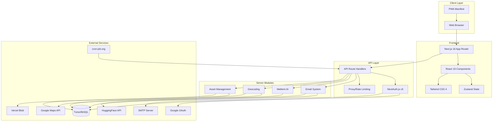

### Component Relationships

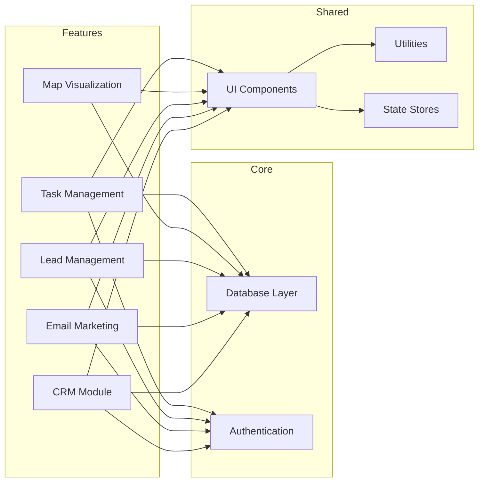

### Data Flow Overview

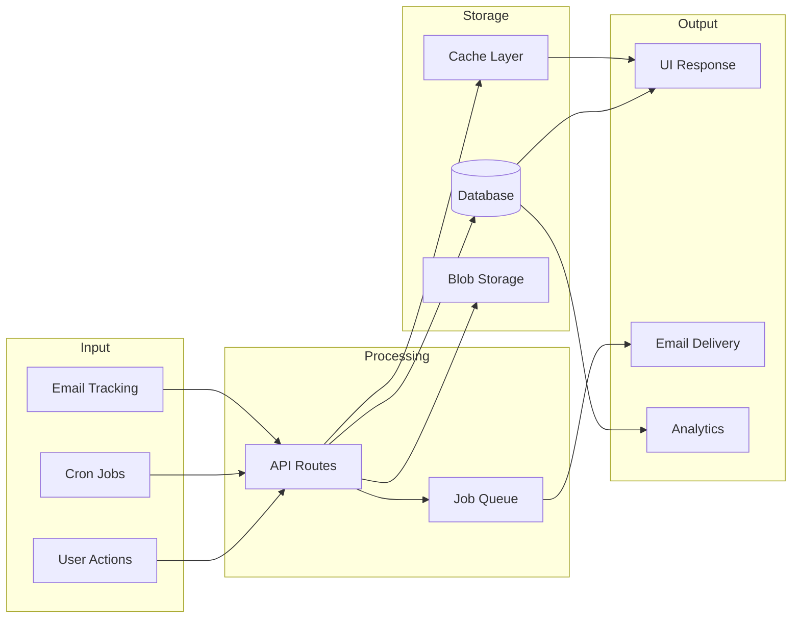

---

## 3. Directory Structure Reference

### Complete Directory Tree

```
kktires-web/
├── .claude/                    # Claude AI configuration
├── .github/                    # GitHub workflows
├── docs/                       # Documentation
│   ├── app-audit.md
│   ├── migrations.md
│   ├── ui-outlook.md
│   └── ARCHITECTURAL_MAP.md   # This document
├── drizzle/                    # Database migrations
│   ├── 0000_init.sql
│   ├── 0001_email_jobs.sql
│   ├── 0002_auth_timestamps_ms.sql
│   ├── 0003_user_preferences.sql
│   ├── 0004_email_jobs_backfill.sql
│   ├── 0005_mature_wolf_cub.sql
│   └── meta/                   # Migration metadata
├── plans/                      # Analysis documents
├── public/                     # Static assets
│   ├── manifest.json          # PWA manifest
│   └── sw.js                  # Service worker
├── scripts/                    # Utility scripts
│   ├── audit-*.ts/js          # Audit scripts
│   ├── migrate-*.ts/js        # Migration scripts
│   └── *.ts/js                # Other utilities
├── src/
│   ├── app/                   # Next.js App Router
│   │   ├── (dashboard)/       # Authenticated routes
│   │   │   ├── dashboard-shell.tsx
│   │   │   ├── layout.tsx
│   │   │   ├── page.tsx       # Main dashboard
│   │   │   ├── customers/
│   │   │   ├── email/
│   │   │   │   ├── automations/
│   │   │   │   └── templates/
│   │   │   ├── export/
│   │   │   ├── import/
│   │   │   ├── leads/
│   │   │   ├── map/
│   │   │   ├── migrate/
│   │   │   ├── segments/
│   │   │   ├── settings/
│   │   │   ├── statistics/
│   │   │   ├── tags/
│   │   │   └── tasks/
│   │   ├── api/               # API route handlers
│   │   │   ├── ai/
│   │   │   ├── auth/
│   │   │   ├── automations/
│   │   │   ├── campaigns/
│   │   │   ├── cron/
│   │   │   ├── customers/
│   │   │   ├── db/
│   │   │   ├── debug/
│   │   │   ├── email/
│   │   │   ├── health/
│   │   │   ├── integrations/
│   │   │   ├── leads/
│   │   │   ├── maps/
│   │   │   ├── migrate/
│   │   │   ├── recipients/
│   │   │   ├── seed/
│   │   │   ├── segments/
│   │   │   ├── settings/
│   │   │   ├── signatures/
│   │   │   ├── statistics/
│   │   │   ├── tags/
│   │   │   ├── tasks/
│   │   │   └── templates/
│   │   ├── favicon.ico
│   │   ├── globals.css        # Global styles
│   │   └── layout.tsx         # Root layout
│   ├── components/            # React components
│   │   ├── customers/
│   │   ├── email/
│   │   ├── layout/
│   │   ├── providers/
│   │   └── ui/                # Glass UI library
│   ├── lib/                   # Library modules
│   │   ├── ai/
│   │   ├── db/
│   │   ├── stores/
│   │   ├── cache.ts
│   │   ├── html-sanitize.ts
│   │   └── utils.ts
│   ├── server/                # Server-side code
│   │   ├── api/
│   │   ├── cron/
│   │   ├── crypto/
│   │   ├── db/
│   │   ├── email/
│   │   └── maps/
│   ├── auth.ts                # NextAuth configuration
│   └── proxy.ts               # Request proxy/middleware
├── tests/                     # Test files
├── .env.example               # Environment template
├── drizzle.config.ts          # Drizzle ORM config
├── next.config.ts             # Next.js configuration
├── package.json               # Dependencies
├── playwright.config.ts       # E2E test config
├── tsconfig.json              # TypeScript config
├── vercel.json                # Vercel deployment config
└── vitest.config.ts           # Unit test config
```

### File Naming Conventions

| Pattern | Convention | Example |
|---------|------------|---------|
| **Page Components** | `page.tsx` | `src/app/(dashboard)/customers/page.tsx` |
| **Layout Components** | `layout.tsx` | `src/app/(dashboard)/layout.tsx` |
| **API Routes** | `route.ts` | `src/app/api/customers/route.ts` |
| **Dynamic Routes** | `[param]/route.ts` | `src/app/api/customers/[id]/route.ts` |
| **UI Components** | `glass-*.tsx` | `src/components/ui/glass-button.tsx` |
| **Server Modules** | `kebab-case.ts` | `src/server/email/job-queue.ts` |
| **Utility Functions** | `kebab-case.ts` | `src/lib/html-sanitize.ts` |
| **Migrations** | `NNNN_description.sql` | `drizzle/0001_email_jobs.sql` |

### Module Organization

| Directory | Purpose | Contains |
|-----------|---------|----------|
| `src/lib/` | Shared utilities | Pure functions, stores, database client |
| `src/server/` | Server-side logic | Business logic, external integrations |
| `src/components/` | React components | UI components, feature components |
| `src/app/` | Next.js routes | Pages, API routes, layouts |
| `scripts/` | CLI utilities | Migration, audit, setup scripts |

---

## 4. Dependency Map

### Production Dependencies by Category

#### Framework & Core

| Package | Version | Purpose |
|---------|---------|---------|
| `next` | 16.1.6 | Full-stack React framework with App Router |
| `react` | 19.2.4 | UI library |
| `react-dom` | 19.2.4 | React DOM renderer |

#### Database

| Package | Version | Purpose |
|---------|---------|---------|
| `drizzle-orm` | ^0.45.1 | TypeScript ORM for SQL databases |
| `@libsql/client` | ^0.17.0 | Turso/libSQL database client |
| `@auth/drizzle-adapter` | ^1.11.1 | Drizzle ORM adapter for NextAuth |

#### Authentication

| Package | Version | Purpose |
|---------|---------|---------|
| `next-auth` | 5.0.0-beta.30 | Authentication framework (Auth.js v5 beta) |
| `bcryptjs` | ^2.4.3 | Password hashing |

#### Email

| Package | Version | Purpose |
|---------|---------|---------|
| `nodemailer` | ^7.0.7 | SMTP email sending |

#### UI & Styling

| Package | Version | Purpose |
|---------|---------|---------|
| `tailwind-merge` | ^2.6.0 | Tailwind class merging utility |
| `clsx` | ^2.1.1 | Conditional className utility |
| `framer-motion` | ^11.15.0 | Animation library |
| `lucide-react` | ^0.469.0 | Icon library |
| `recharts` | ^2.15.0 | Charting library |
| `@ckeditor/ckeditor5-build-classic` | ^44.3.0 | Rich text editor |
| `@ckeditor/ckeditor5-react` | ^11.0.1 | React integration for CKEditor |
| `@xyflow/react` | ^12.10.0 | Flow diagram/automation builder |

#### State & Forms

| Package | Version | Purpose |
|---------|---------|---------|
| `zustand` | ^5.0.2 | State management |
| `react-hook-form` | ^7.54.2 | Form state management |
| `zod` | ^4.3.6 | Schema validation |

#### Utilities

| Package | Version | Purpose |
|---------|---------|---------|
| `date-fns` | ^4.1.0 | Date manipulation library |
| `exceljs` | ^4.4.0 | Excel file reading/writing |
| `nanoid` | ^5.1.6 | Unique ID generator |

#### Storage

| Package | Version | Purpose |
|---------|---------|---------|
| `@vercel/blob` | ^2.2.0 | Vercel Blob storage for file uploads |

### Development Dependencies

| Package | Version | Purpose |
|---------|---------|---------|
| `typescript` | ^5 | TypeScript compiler |
| `eslint` | ^9 | Linting framework |
| `eslint-config-next` | 16.1.6 | Next.js ESLint configuration |
| `tailwindcss` | ^4 | Utility-first CSS framework |
| `@tailwindcss/postcss` | ^4 | Tailwind PostCSS integration |
| `vitest` | ^4.0.18 | Unit testing framework |
| `@vitest/coverage-v8` | ^4.0.18 | Code coverage for Vitest |
| `@playwright/test` | ^1.58.2 | E2E testing framework |
| `drizzle-kit` | ^0.31.9 | Drizzle CLI for migrations |
| `drizzle-zod` | ^0.8.3 | Zod schema generation from Drizzle |
| `tsx` | ^4.21.0 | TypeScript execution engine |

### Internal Module Dependencies

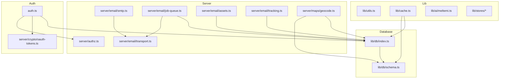

---

## 5. Database Architecture

### Entity-Relationship Summary

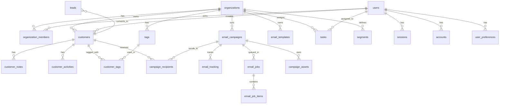

### Table Catalog

| Domain | Tables | Count |
|--------|--------|-------|
| **Multi-Tenant** | `organizations`, `organization_members`, `organization_invitations` | 3 |
| **Authentication** | `users`, `sessions`, `accounts`, `verification_tokens` | 4 |
| **CRM Core** | `customers`, `customer_notes`, `customer_activities`, `customer_tags`, `tags`, `customer_images` | 6 |
| **Custom Fields** | `custom_fields`, `customer_custom_values` | 2 |
| **Leads** | `leads` | 1 |
| **Email Marketing** | `email_templates`, `email_campaigns`, `campaign_recipients`, `email_signatures`, `email_assets`, `campaign_assets` | 6 |
| **Email Jobs** | `email_jobs`, `email_job_items` | 2 |
| **Email Tracking** | `email_tracking`, `unsubscribes` | 2 |
| **Automations** | `email_automations`, `automation_steps` | 2 |
| **Integrations** | `gmail_credentials`, `google_calendar_tokens` | 2 |
| **Maps** | `saved_locations`, `territories`, `geocode_cache` | 3 |
| **Tasks** | `tasks` | 1 |
| **Segments** | `segments` | 1 |
| **System** | `sync_metadata`, `notifications`, `user_preferences` | 3 |
| **Total** | | **33** |

### Key Tables

#### `customers` - Central CRM Entity

| Column | Type | Description |
|--------|------|-------------|
| `id` | text | Primary key |
| `org_id` | text | Organization FK |
| `first_name`, `last_name` | text | Name fields |
| `company`, `title` | text | Business info |
| `email`, `phone`, `mobile` | text | Contact info |
| `street`, `city`, `state`, `postal_code`, `country` | text | Address |
| `afm`, `doy`, `gemh` | text | Greek business fields |
| `category` | text | retail/wholesale/fleet/garage/vip |
| `lifecycle_stage` | text | lead/prospect/customer/churned |
| `latitude`, `longitude` | real | Geocoded location |
| `is_vip`, `is_active`, `unsubscribed` | integer | Boolean flags |

#### `email_campaigns` - Email Marketing

| Column | Type | Description |
|--------|------|-------------|
| `id` | text | Primary key |
| `org_id` | text | Organization FK |
| `name`, `subject`, `content` | text | Campaign content |
| `template_id`, `signature_id` | text | Template/signature FKs |
| `status` | text | draft/scheduled/sending/sent/paused/cancelled |
| `total_recipients`, `sent_count`, `open_count`, `click_count` | integer | Statistics |

#### `email_jobs` - Job Queue

| Column | Type | Description |
|--------|------|-------------|
| `id` | text | Primary key |
| `campaign_id` | text | Campaign FK |
| `status` | text | queued/processing/completed/failed/cancelled |
| `run_at` | integer | Scheduled run time |
| `locked_at`, `locked_by` | text/integer | Distributed locking |

### Migration History

| Migration | Description |
|-----------|-------------|
| `0000_init` | Initial schema with 28 tables |
| `0001_email_jobs` | Email job queue system |
| `0002_auth_timestamps_ms` | Auth timestamps to milliseconds |
| `0003_user_preferences` | User preferences table |
| `0004_email_jobs_backfill` | Idempotent email jobs creation |
| `0005_mature_wolf_cub` | Email assets system |

---

## 6. API Reference Index

### Endpoint Catalog by Domain

#### AI Endpoints

| Method | Endpoint | Purpose |
|--------|----------|---------|
| POST | `/api/ai/email-assist` | Improve email content with AI |
| POST | `/api/ai/email-expand` | Expand brief note to full email |
| POST | `/api/ai/email-subjects` | Generate subject line suggestions |

#### Authentication

| Method | Endpoint | Purpose |
|--------|----------|---------|
| GET/POST | `/api/auth/[...nextauth]` | NextAuth.js handler |

#### CRM - Customers

| Method | Endpoint | Purpose |
|--------|----------|---------|
| GET | `/api/customers` | List customers with pagination |
| POST | `/api/customers` | Create customer |
| GET | `/api/customers/[id]` | Get customer details |
| PUT | `/api/customers/[id]` | Update customer |
| DELETE | `/api/customers/[id]` | Delete customer |
| POST | `/api/customers/export` | Export to CSV/Excel |
| POST | `/api/customers/import` | Bulk import customers |
| GET | `/api/customers/locations` | Get customer locations for map |

#### CRM - Leads

| Method | Endpoint | Purpose |
|--------|----------|---------|
| GET | `/api/leads` | List leads |
| POST | `/api/leads` | Create lead |
| PATCH/PUT | `/api/leads/[id]` | Update lead |
| DELETE | `/api/leads/[id]` | Delete lead |
| POST | `/api/leads/[id]/convert` | Convert lead to customer |

#### CRM - Tags

| Method | Endpoint | Purpose |
|--------|----------|---------|
| GET | `/api/tags` | List tags |
| POST | `/api/tags` | Create tag |
| GET | `/api/tags/[id]` | Get tag details |
| PUT | `/api/tags/[id]` | Update tag |
| DELETE | `/api/tags/[id]` | Delete tag |

#### CRM - Segments

| Method | Endpoint | Purpose |
|--------|----------|---------|
| GET | `/api/segments` | List segments |
| POST | `/api/segments` | Create segment |
| GET | `/api/segments/[id]` | Get segment |
| PUT | `/api/segments/[id]` | Update segment |
| DELETE | `/api/segments/[id]` | Delete segment |

#### Email Marketing

| Method | Endpoint | Purpose |
|--------|----------|---------|
| GET | `/api/campaigns` | List campaigns |
| POST | `/api/campaigns` | Create campaign |
| GET | `/api/campaigns/[id]` | Get campaign |
| PUT | `/api/campaigns/[id]` | Update campaign |
| DELETE | `/api/campaigns/[id]` | Delete campaign |
| GET | `/api/campaigns/[id]/events` | Get tracking events |
| POST | `/api/campaigns/[id]/send` | Queue campaign for sending |

#### Email - Templates & Signatures

| Method | Endpoint | Purpose |
|--------|----------|---------|
| GET | `/api/templates` | List templates |
| POST | `/api/templates` | Create template |
| GET | `/api/signatures` | List signatures |
| POST | `/api/signatures` | Create signature |

#### Email - Assets

| Method | Endpoint | Purpose |
|--------|----------|---------|
| GET | `/api/email/assets` | List assets |
| POST | `/api/email/assets` | Upload asset |
| POST | `/api/email/assets/upload` | Upload asset (alt) |
| DELETE | `/api/email/assets/[id]` | Delete asset |

#### Email - Sending & Tracking

| Method | Endpoint | Purpose |
|--------|----------|---------|
| POST | `/api/email/send` | Send single email |
| PUT | `/api/email/send` | Send campaign |
| GET | `/api/email/tracking` | Track email open (pixel) |
| GET | `/api/email/click` | Track click and redirect |

#### Automations

| Method | Endpoint | Purpose |
|--------|----------|---------|
| GET | `/api/automations` | List automations |
| POST | `/api/automations` | Create automation |

#### Tasks

| Method | Endpoint | Purpose |
|--------|----------|---------|
| GET | `/api/tasks` | List tasks with counts |
| POST | `/api/tasks` | Create task |
| PATCH/PUT | `/api/tasks/[id]` | Update task |
| DELETE | `/api/tasks/[id]` | Delete task |

#### Settings

| Method | Endpoint | Purpose |
|--------|----------|---------|
| GET/PUT | `/api/settings/profile` | User profile |
| GET/PUT | `/api/settings/org` | Organization settings |
| GET/PUT | `/api/settings/preferences` | User preferences |

#### Statistics

| Method | Endpoint | Purpose |
|--------|----------|---------|
| GET | `/api/statistics` | Dashboard statistics |
| GET | `/api/recipients/count` | Count filtered recipients |

#### Cron Jobs

| Method | Endpoint | Purpose |
|--------|----------|---------|
| GET | `/api/cron/email-jobs` | Process email job queue |
| GET | `/api/cron/geocode-customers` | Geocode customers |

#### System

| Method | Endpoint | Purpose |
|--------|----------|---------|
| GET | `/api/health` | Health check |
| POST | `/api/db/migrate` | Runtime schema migration |
| GET/POST | `/api/migrate` | Data migration |
| POST | `/api/seed` | Seed sample data |

### Authentication Requirements

| Category | Auth Required | Role Required |
|----------|---------------|---------------|
| Public endpoints | No | - |
| Tracking endpoints | No | - |
| Standard API | Yes (Session) | Any |
| Admin endpoints | Yes (Session) | owner/admin |
| Cron endpoints | Yes (CRON_SECRET) | - |

### Request/Response Patterns

**Standard Success Response:**
```json
{
  "data": { ... },
  "requestId": "req_xxx"
}
```

**Error Response:**
```json
{
  "error": "Error message",
  "code": "ERROR_CODE",
  "requestId": "req_xxx"
}
```

**Error Codes:**
| Code | HTTP Status | Description |
|------|-------------|-------------|
| `UNAUTHORIZED` | 401 | Authentication required |
| `FORBIDDEN` | 403 | Insufficient permissions |
| `NOT_FOUND` | 404 | Resource not found |
| `BAD_REQUEST` | 400 | Invalid request |
| `INTERNAL_ERROR` | 500 | Server error |

---

## 7. UI Component Catalog

### Page Hierarchy

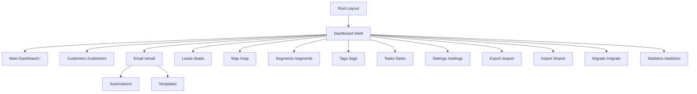

### Glass UI Component Library

Located in [`src/components/ui/`](src/components/ui/):

| Component | Purpose | Props |
|-----------|---------|-------|
| `GlassCard` | Container with glass-morphism | children, className, onClick |
| `GlassButton` | Styled button | variant, size, disabled, loading |
| `GlassInput` | Text/number/date input | type, icon, error, placeholder |
| `GlassTextarea` | Multi-line text input | rows, error, placeholder |
| `GlassSelect` | Dropdown select | options, value, onChange |
| `GlassBadge` | Status/category badges | variant, color |
| `GlassAvatar` | User avatar | src, name, size |
| `GlassAvatarGroup` | Multiple avatars | avatars, max |
| `GlassDropdown` | Dropdown menu | trigger, items |
| `GlassModal` | Modal dialog | open, onClose, title |
| `GlassTabs` | Tab navigation | tabs, activeTab |
| `GlassSwitch` | Toggle switch | checked, onChange |
| `GlassProgress` | Progress bar | value, max |
| `GlassProgressCircle` | Circular progress | value, size |
| `GlassSkeleton` | Loading skeleton | variant, count |
| `GlassEmptyState` | Empty state display | icon, title, description |
| `GlassTooltip` | Hover tooltip | content, children |
| `GlassToastContainer` | Toast notifications | - |
| `ConfirmDialog` | Confirmation dialog | open, title, message, onConfirm |

### Feature Components

#### Email Components ([`src/components/email/`](src/components/email/))

| Component | Purpose |
|-----------|---------|
| `OutlookEditor` | Full email campaign editor |
| `OutlookLayout` | Three-panel email layout |
| `OutlookSidebar` | Folder navigation |
| `OutlookList` | Campaign/template list |
| `OutlookRecipientDrawer` | Recipient filter drawer |
| `RichTextEditor` | CKEditor wrapper |
| `TemplateBuilder` | Block-based template builder |
| `AutomationBuilder` | Visual workflow builder |
| `CampaignAnalytics` | Campaign performance charts |

#### Layout Components ([`src/components/layout/`](src/components/layout/))

| Component | Purpose |
|-----------|---------|
| `Sidebar` | Main navigation sidebar |
| `Header` | Top header with search |
| `AuroraBackground` | Animated gradient background |
| `CommandPalette` | Keyboard shortcut interface (Cmd+K) |

### State Management Patterns

| Store | Location | Purpose |
|-------|----------|---------|
| `useUIStore` | [`src/lib/stores/ui-store.ts`](src/lib/stores/ui-store.ts) | UI state (sidebar, theme, toasts) |
| `useAuthStore` | [`src/lib/stores/auth-store.ts`](src/lib/stores/auth-store.ts) | Auth state (org, role) |

**UI Store State:**
```typescript
{
  sidebarCollapsed: boolean,
  theme: 'dark' | 'light',
  commandPaletteOpen: boolean,
  notificationsOpen: boolean,
  mobileMenuOpen: boolean,
  toasts: Toast[]
}
```

**Persistence:** Both stores persist to localStorage (`kktires-ui`, `kktires-auth`)

---

## 8. External Services Catalog

### Service Overview

| Service | Provider | Purpose | Criticality |
|---------|----------|---------|-------------|
| Database | Turso/libSQL | Data persistence | Critical |
| Authentication | Google OAuth | User login | High |
| Email | SMTP/Nodemailer | Email delivery | High |
| Cron Scheduling | cron-job.org | Scheduled tasks | High |
| AI | HuggingFace/Meltemi | Greek AI assistance | Medium |
| Geocoding | Google Maps API | Address coordinates | Medium |
| Storage | Vercel Blob | File/image storage | Medium |

### Service Details

#### 1. Turso/libSQL (Database)

| Attribute | Value |
|-----------|-------|
| **Provider** | Turso (edge SQLite) |
| **Client** | @libsql/client |
| **ORM** | Drizzle ORM |
| **Connection** | `libsql://` URL with auth token |
| **Env Variables** | `DATABASE_URL`, `DATABASE_AUTH_TOKEN` |

#### 2. Google OAuth (Authentication)

| Attribute | Value |
|-----------|-------|
| **Provider** | Google OAuth 2.0 |
| **Handler** | NextAuth.js v5 |
| **Scopes** | openid, email, profile, gmail.send |
| **Env Variables** | `GOOGLE_CLIENT_ID`, `GOOGLE_CLIENT_SECRET` |

#### 3. SMTP (Email Delivery)

| Attribute | Value |
|-----------|-------|
| **Provider** | Configurable SMTP |
| **Library** | Nodemailer |
| **Features** | Connection pooling, TLS |
| **Env Variables** | `SMTP_HOST`, `SMTP_PORT`, `SMTP_USER`, `SMTP_PASS` |

#### 4. cron-job.org (Scheduling)

| Attribute | Value |
|-----------|-------|
| **Provider** | cron-job.org |
| **Auth** | Bearer token (CRON_SECRET) |
| **Endpoints** | `/api/cron/email-jobs`, `/api/cron/geocode-customers` |

#### 5. HuggingFace/Meltemi (AI)

| Attribute | Value |
|-----------|-------|
| **Provider** | HuggingFace Inference API |
| **Model** | ilsp/Meltemi-7B-v1 |
| **Purpose** | Greek text generation |
| **Env Variable** | `HUGGINGFACE_API_KEY` |

#### 6. Google Maps (Geocoding)

| Attribute | Value |
|-----------|-------|
| **Provider** | Google Maps Geocoding API |
| **Features** | Address-to-coordinate, caching |
| **Env Variables** | `GOOGLE_GEOCODING_API_KEY` or `NEXT_PUBLIC_GOOGLE_MAPS_API_KEY` |

#### 7. Vercel Blob (Storage)

| Attribute | Value |
|-----------|-------|
| **Provider** | Vercel Blob Storage |
| **Purpose** | Email attachments, images |
| **Env Variable** | `BLOB_READ_WRITE_TOKEN` |

### Integration Protocols

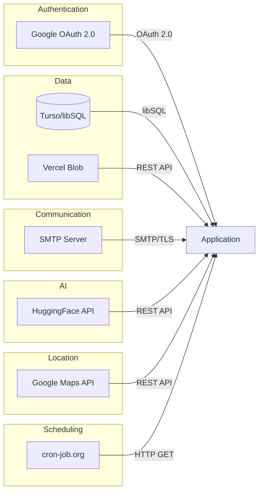

---

## 9. Environment Configuration Reference

### Required Environment Variables

| Variable | Purpose | Example |
|----------|---------|---------|
| `DATABASE_URL` | Turso database URL | `libsql://xxx.turso.io` |
| `DATABASE_AUTH_TOKEN` | Turso auth token | `eyJhbGciOiJ...` |
| `AUTH_SECRET` | Session encryption | Random 32+ char string |
| `NEXTAUTH_URL` | Application base URL | `https://app.example.com` |
| `AUTH_ALLOWED_EMAILS` | Email allowlist | `user1@example.com,user2@example.com` |

### Authentication Variables

| Variable | Required | Purpose |
|----------|----------|---------|
| `GOOGLE_CLIENT_ID` | For Google OAuth | Google OAuth client ID |
| `GOOGLE_CLIENT_SECRET` | For Google OAuth | Google OAuth client secret |
| `OAUTH_TOKEN_ENCRYPTION_KEY` | Optional | Base64 32-byte key for token encryption |
| `AUTH_DEBUG` | Optional | Enable auth debugging (0 or 1) |
| `DEFAULT_ORG_ID` | Optional | Default organization ID |

### Email Variables

| Variable | Required | Purpose |
|----------|----------|---------|
| `SMTP_HOST` | For email | SMTP server hostname |
| `SMTP_PORT` | For email | SMTP port (default: 587) |
| `SMTP_SECURE` | For email | Use TLS (default: false) |
| `SMTP_USER` | For email | SMTP username |
| `SMTP_PASS` | For email | SMTP password |
| `SMTP_FROM` | For email | Default sender address |
| `EMAIL_TRACKING_SECRET` | For tracking | HMAC signing key |

### Service Variables

| Variable | Service | Purpose |
|----------|---------|---------|
| `HUGGINGFACE_API_KEY` | AI | Meltemi API access |
| `GOOGLE_GEOCODING_API_KEY` | Maps | Server-side geocoding |
| `NEXT_PUBLIC_GOOGLE_MAPS_API_KEY` | Maps | Client-side maps |
| `BLOB_READ_WRITE_TOKEN` | Storage | Vercel Blob access |
| `CRON_SECRET` | Cron | Cron endpoint auth |
| `HEALTHCHECK_SECRET` | Health | Health endpoint auth |

### Job Queue Variables

| Variable | Default | Purpose |
|----------|---------|---------|
| `EMAIL_CRON_TIME_BUDGET_MS` | 8000 | Time budget per cron run |
| `EMAIL_CRON_MAX_JOBS` | 5 | Max jobs per cron invocation |
| `EMAIL_JOB_MAX_ITEMS_PER_RUN` | 450 | Max emails per job run |
| `EMAIL_JOB_CONCURRENCY` | 4 | Concurrent email sends |
| `EMAIL_JOB_LOCK_TIMEOUT_MS` | 900000 | Job lock timeout (15 min) |
| `EMAIL_ASSET_CLEANUP_ENABLED` | 1 | Enable asset cleanup |
| `EMAIL_ASSET_CLEANUP_HOURS` | 24 | Age threshold for cleanup |

### Feature Flags

| Variable | Default | Purpose |
|----------|---------|---------|
| `ENABLE_SEED_ENDPOINT` | false | Enable /api/seed endpoint |
| `ENABLE_MIGRATE_ENDPOINT` | false | Enable /api/migrate endpoint |

### Variable Priority

For backward compatibility, some variables have fallbacks:

| Primary | Fallback |
|---------|----------|
| `DATABASE_URL` | `TURSO_DATABASE_URL` |
| `DATABASE_AUTH_TOKEN` | `TURSO_AUTH_TOKEN` |
| `AUTH_SECRET` | `NEXTAUTH_SECRET` |

---

## 10. Data Flow Diagrams

### Customer Data Flow

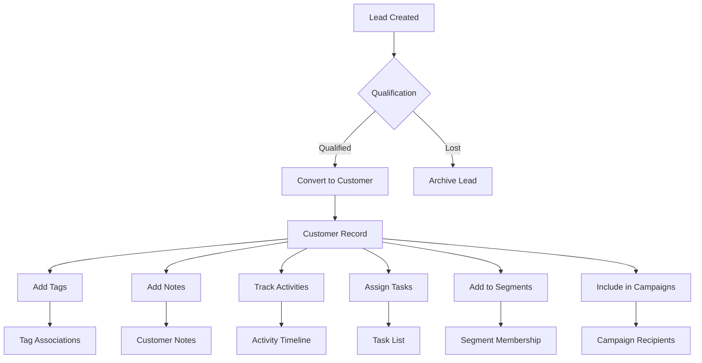

### Email Campaign Flow

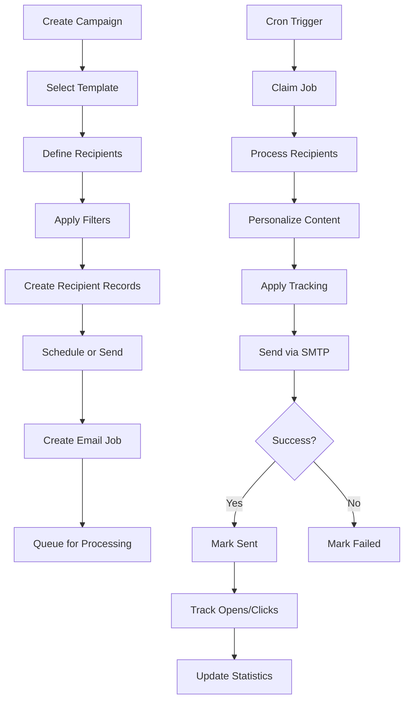

### Authentication Flow

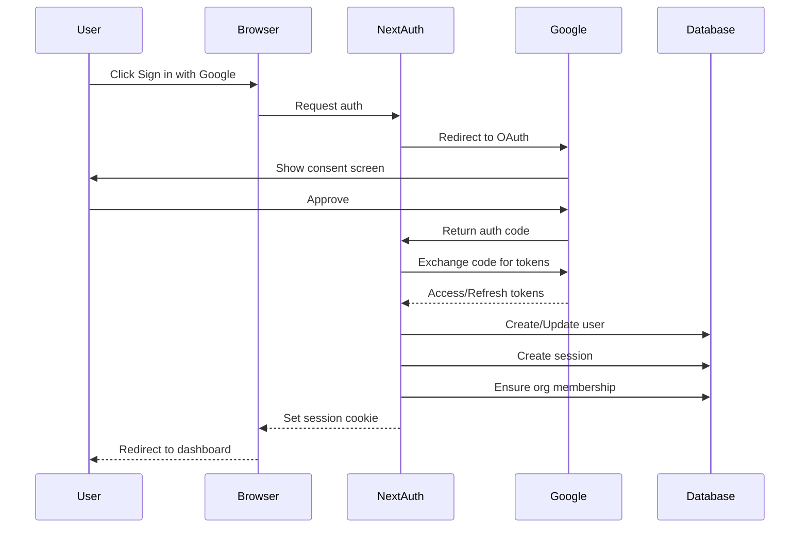

### Cron Job Execution Flow

```mermaid
flowchart TD
    A[cron-job.org] -->|HTTP GET| B[/api/cron/email-jobs]
    B --> C{isCronAuthorized}
    C -->|No| D[401 Unauthorized]
    C -->|Yes| E[processDueEmailJobs]
    
    E --> F[claimNextDueEmailJob]
    F --> G{Job available?}
    G -->|No| H[Return idle]
    G -->|Yes| I[processOneJob]
    
    I --> J[Build recipient queue]
    J --> K[Process with concurrency]
    K --> L[Send emails]
    L --> M{All sent?}
    M -->|No| K
    M -->|Yes| N[markEmailJobCompleted]
    N --> O{Time budget left?}
    O -->|Yes| F
    O -->|No| P[Return processed count]
```

---

## 11. Development Guidelines

### Code Organization Principles

1. **Server/Client Separation**
   - Server modules in `src/server/` - pure business logic
   - Client state in `src/lib/stores/` - Zustand stores
   - API routes bridge server logic and client

2. **Component Architecture**
   - UI components in `src/components/ui/` - reusable Glass library
   - Feature components in `src/components/{feature}/`
   - Page components in `src/app/(dashboard)/`

3. **Database Access Patterns**
   ```typescript
   // Direct query
   const customers = await db.select().from(customersTable);
   
   // Relational query
   const customer = await db.query.customers.findFirst({
     where: (c, { eq }) => eq(c.id, id),
     with: { tags: true },
   });
   
   // Cached query
   const count = await getCachedCustomerCount();
   ```

4. **Error Handling**
   ```typescript
   // API routes use consistent error handling
   try {
     // operation
   } catch (error) {
     return handleApiError('scope', error, requestId);
   }
   
   // Database operations use auto-heal
   try {
     await db.insert(campaigns).values(data);
   } catch (error) {
     if (isSchemaError(error)) {
       await healEmailCampaignSchema();
       // retry...
     }
   }
   ```

### Naming Conventions

| Type | Convention | Example |
|------|------------|---------|
| **Files** | kebab-case | `job-queue.ts` |
| **Components** | PascalCase | `GlassButton` |
| **Functions** | camelCase | `getCustomerById` |
| **Constants** | SCREAMING_SNAKE | `MAX_RETRIES` |
| **Database tables** | snake_case | `email_campaigns` |
| **API routes** | kebab-case | `/api/email-jobs` |

### Greek Localization

- UI text in Greek
- Label mappings in [`src/lib/utils.ts`](src/lib/utils.ts)
- AI model (Meltemi) optimized for Greek
- Date/currency formatting for Greek locale

### Testing Approach

| Test Type | Tool | Location |
|-----------|------|----------|
| Unit Tests | Vitest | `tests/**/*.test.ts` |
| E2E Tests | Playwright | `tests/e2e/**/*.spec.ts` |
| Coverage | v8 | Configured in `vitest.config.ts` |

**Coverage Thresholds:**
- Lines: 80%
- Functions: 75%
- Statements: 80%
- Branches: 70%

### Git Workflow

1. Feature branches from main
2. PR reviews required
3. CI checks: lint, typecheck, test, build
4. Merge to main triggers deployment

---

## 12. Deployment Architecture

### Deployment Targets

#### 1. Vercel (Primary)

| Attribute | Value |
|-----------|-------|
| **Config** | `vercel.json` |
| **Output** | Serverless functions + static assets |
| **Features** | Auto preview deployments, Edge CDN |

#### 2. Docker (Self-hosted)

| Attribute | Value |
|-----------|-------|
| **Dockerfile** | Multi-stage build |
| **Base Image** | node:20-alpine |
| **Output Mode** | standalone |
| **Port** | 3000 |
| **Security** | Non-root user (nextjs:nodejs) |

### Build Process

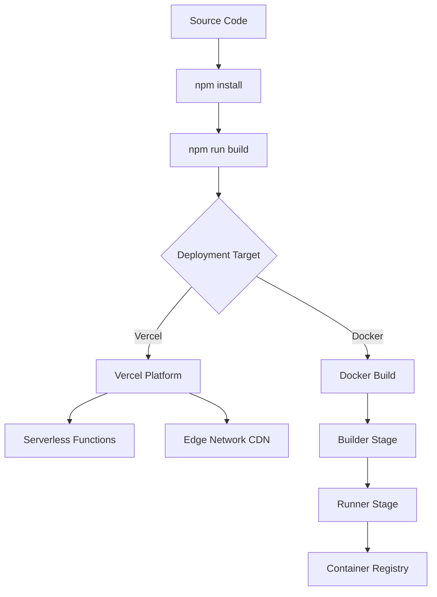

### CI/CD Pipeline

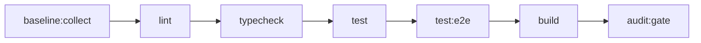

### Environment Promotion

| Environment | Purpose | Branch |
|-------------|---------|--------|
| Development | Local development | feature/* |
| Preview | PR testing | PR branches |
| Production | Live application | main |

### Security Headers

Configured in [`next.config.ts`](next.config.ts):

| Header | Value |
|--------|-------|
| `Strict-Transport-Security` | max-age=63072000 (production only) |
| `X-Frame-Options` | SAMEORIGIN |
| `X-Content-Type-Options` | nosniff |
| `Referrer-Policy` | strict-origin-when-cross-origin |
| `Permissions-Policy` | camera=(), microphone=(), geolocation=(self) |

### Rate Limiting

Configured in [`src/proxy.ts`](src/proxy.ts):

| Setting | Value |
|---------|-------|
| **Limit** | 100 requests per minute |
| **Window** | 60 seconds |
| **Max Entries** | 10,000 |

**Public Endpoints (no rate limit):**
- `/_next/*`, `/favicon*`, `/manifest.json`
- `/api/auth/*`, `/api/health`
- `/api/email/tracking`, `/api/email/click`

---

## Quick Reference

### Key Files

| File | Purpose |
|------|---------|
| [`src/auth.ts`](src/auth.ts) | NextAuth configuration |
| [`src/lib/db/index.ts`](src/lib/db/index.ts) | Database connection |
| [`src/lib/db/schema.ts`](src/lib/db/schema.ts) | Database schema |
| [`src/app/layout.tsx`](src/app/layout.tsx) | Root layout |
| [`src/app/(dashboard)/layout.tsx`](src/app/(dashboard)/layout.tsx) | Dashboard auth guard |
| [`next.config.ts`](next.config.ts) | Next.js configuration |
| [`drizzle.config.ts`](drizzle.config.ts) | Drizzle ORM config |

### Common Commands

```bash
# Development
npm run dev

# Database
npm run db:generate    # Generate migrations
npm run db:migrate     # Run migrations
npm run db:studio      # Open Drizzle Studio

# Testing
npm run test           # Unit tests
npm run test:e2e       # E2E tests

# Build
npm run build
npm run start

# Worker
npm run worker:email   # Email job processor
```

### Support Resources

- **Detailed Analysis:** See [`plans/`](plans/) directory
- **Migrations:** See [`drizzle/`](drizzle/) directory
- **Documentation:** See [`docs/`](docs/) directory

---

*This document serves as the definitive source of truth for the KK Tires CRM codebase. For detailed analysis of specific areas, refer to the corresponding analysis documents in the `plans/` directory.*
