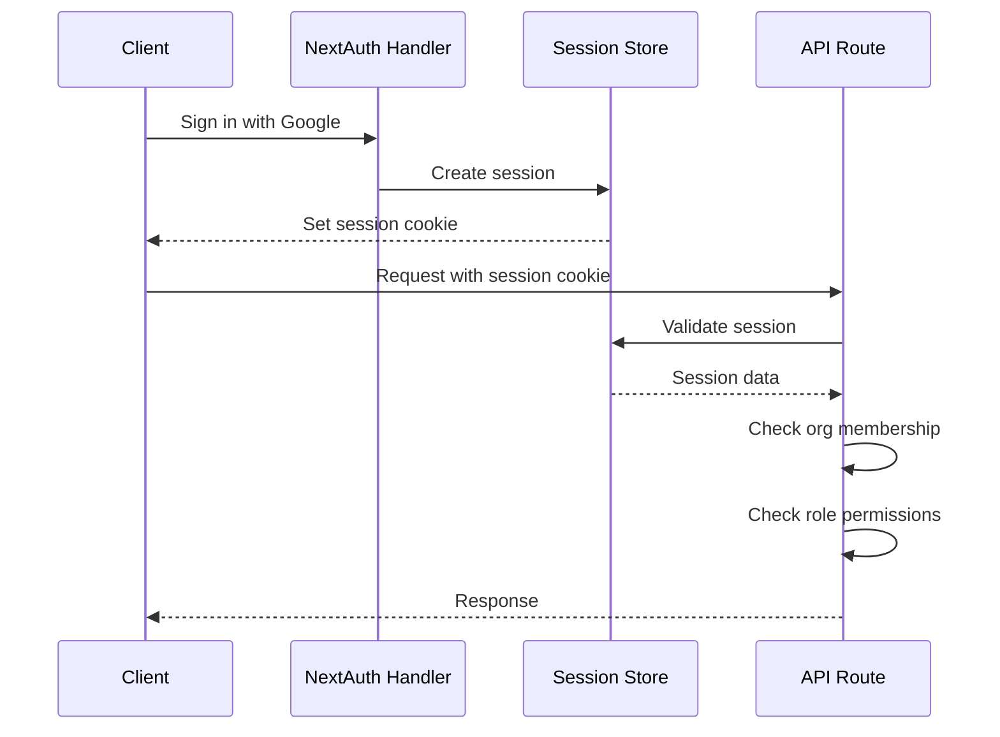

# API Routes Analysis

This document provides a comprehensive reference for all API endpoints in the KK Tires application.

## Overview

The application uses Next.js App Router with route handlers (`route.ts` files). All endpoints are organized under `/api/` and follow RESTful conventions where applicable.

### Authentication

Most endpoints require authentication via NextAuth.js session. The authentication pattern uses:
- [`requireSession()`](src/server/authz.ts) - Validates session exists
- [`getOrgIdFromSession()`](src/server/authz.ts) - Extracts organization ID for multi-tenancy
- [`hasRole()`](src/server/authz.ts) - Role-based access control

### Common Response Format

All endpoints return JSON with a consistent structure:

```typescript
// Success response
{ ...data, requestId: "req_xxx" }

// Error response
{ error: "Error message", code: "ERROR_CODE", requestId: "req_xxx" }
```

### Request ID Tracking

All endpoints generate a unique request ID using [`createRequestId()`](src/server/api/http.ts) for tracing and debugging.

---

## API Endpoints by Category

### 1. AI Endpoints

#### POST `/api/ai/email-assist`

Improve email content using AI (Meltemi-7B model via HuggingFace).

| Attribute | Value |
|-----------|-------|
| **Method** | POST |
| **Auth** | Session required |
| **Body** | `{ content: string, tone?: "professional" \| "friendly" \| "formal" }` |
| **Max Body** | 100KB |

**Response:**
```json
{
  "improved": "Improved email text...",
  "source": "meltemi" | "fallback",
  "requestId": "req_xxx"
}
```

**External Services:**
- HuggingFace API (ilsp/Meltemi-7B-v1)

---

#### POST `/api/ai/email-expand`

Expand a brief note into a full Greek email.

| Attribute | Value |
|-----------|-------|
| **Method** | POST |
| **Auth** | Session required |
| **Body** | `{ briefNote: string, customer?: { firstName?, lastName?, company?, email? } }` |
| **Max Body** | 100KB |

**Response:**
```json
{
  "generatedText": "Expanded email content...",
  "source": "meltemi",
  "requestId": "req_xxx"
}
```

**External Services:**
- Uses [`expandToGreekEmail()`](src/lib/ai/meltemi.ts) from Meltemi AI module

---

#### POST `/api/ai/email-subjects`

Generate subject line suggestions for email content.

| Attribute | Value |
|-----------|-------|
| **Method** | POST |
| **Auth** | Session required |
| **Body** | `{ emailContent: string, count?: number (1-10, default 5) }` |
| **Max Body** | 100KB |

**Response:**
```json
{
  "suggestions": ["Subject 1", "Subject 2", ...],
  "source": "meltemi",
  "requestId": "req_xxx"
}
```

---

### 2. Authentication Endpoints

#### GET/POST `/api/auth/[...nextauth]`

NextAuth.js handler for all authentication routes.

| Attribute | Value |
|-----------|-------|
| **Methods** | GET, POST |
| **Auth** | Public |
| **Handler** | Auth.js handlers from [`src/auth.ts`](src/auth.ts) |

**Supported Providers:**
- Google OAuth
- Credentials (if configured)

**Routes Handled:**
- `/api/auth/signin` - Sign-in page
- `/api/auth/signout` - Sign-out
- `/api/auth/callback/:provider` - OAuth callback
- `/api/auth/session` - Session info

---

### 3. Automations Endpoints

#### GET `/api/automations`

List all email automations for the organization.

| Attribute | Value |
|-----------|-------|
| **Method** | GET |
| **Auth** | Session required |

**Response:**
```json
{
  "requestId": "req_xxx",
  "automations": [
    {
      "id": "auto_xxx",
      "orgId": "org_xxx",
      "name": "Welcome Series",
      "description": "Automated welcome emails",
      "trigger": "customer_created",
      "triggerConfig": {},
      "isActive": true,
      "steps": [...]
    }
  ]
}
```

**Database Operations:**
- SELECT from `emailAutomations` table
- SELECT from `automationSteps` table

---

#### POST `/api/automations`

Create a new email automation.

| Attribute | Value |
|-----------|-------|
| **Method** | POST |
| **Auth** | Session required |
| **Body** | `{ name: string, description?: string, trigger: string, triggerConfig?: object, actions?: array, isActive?: boolean }` |

**Response:**
```json
{
  "id": "auto_xxx",
  "name": "Welcome Series",
  "requestId": "req_xxx"
}
```

**Database Operations:**
- INSERT into `emailAutomations` table
- INSERT into `automationSteps` table (if actions provided)

---

### 4. Campaigns Endpoints

#### GET `/api/campaigns`

List all email campaigns with pagination and statistics.

| Attribute | Value |
|-----------|-------|
| **Method** | GET |
| **Auth** | Session required |
| **Query** | `page`, `limit` (default 20, max 100) |

**Response:**
```json
{
  "requestId": "req_xxx",
  "campaigns": [...],
  "pagination": { "page": 1, "limit": 20, "total": 50, "totalPages": 3 },
  "stats": { "totalSent": 1000, "openRate": "25.5", "clickRate": "5.2" }
}
```

**Database Operations:**
- SELECT from `emailCampaigns` with COUNT aggregation

---

#### POST `/api/campaigns`

Create a new email campaign.

| Attribute | Value |
|-----------|-------|
| **Method** | POST |
| **Auth** | Session required |
| **Body** | Campaign object with name, subject, content, status, scheduledAt, recipientFilters, signatureId, assets |
| **Max Body** | 1.5MB |

**Request Body Schema:**
```typescript
{
  name: string (1-200 chars),
  subject?: string (max 300),
  content?: string (max 1M),
  status?: "draft" | "scheduled" | "sending" | "sent" | "paused" | "cancelled" | "failed",
  scheduledAt?: ISO datetime,
  recipientFilters?: object,
  signatureId?: string,
  assets?: {
    attachments?: string[],
    inlineImages?: Array<{ assetId, embedInline, widthPx, align, alt, sortOrder }>
  }
}
```

**Database Operations:**
- Ensure organization exists (auto-create if missing)
- Count recipients based on filters
- Migrate inline data images to assets
- INSERT into `emailCampaigns`
- INSERT into `campaignAssets` (if assets provided)
- Auto-heal schema on drift

**External Services:**
- Blob storage for inline image migration

---

#### GET `/api/campaigns/[id]`

Get a single campaign with assets.

| Attribute | Value |
|-----------|-------|
| **Method** | GET |
| **Auth** | Session required |
| **Path** | `id` - Campaign ID |

**Response:**
```json
{
  "id": "camp_xxx",
  "name": "Campaign Name",
  "subject": "Email Subject",
  "content": "<html>...</html>",
  "status": "draft",
  "assets": [...],
  "requestId": "req_xxx"
}
```

---

#### PUT `/api/campaigns/[id]`

Update a campaign.

| Attribute | Value |
|-----------|-------|
| **Method** | PUT |
| **Auth** | Session required |
| **Path** | `id` - Campaign ID |
| **Max Body** | 1.5MB |

**Database Operations:**
- UPDATE `emailCampaigns`
- Sync campaign assets
- Auto-heal schema on drift

---

#### DELETE `/api/campaigns/[id]`

Delete a campaign.

| Attribute | Value |
|-----------|-------|
| **Method** | DELETE |
| **Auth** | Session required |
| **Path** | `id` - Campaign ID |

---

#### GET `/api/campaigns/[id]/events`

Get tracking events for a campaign.

| Attribute | Value |
|-----------|-------|
| **Method** | GET |
| **Auth** | Session required |
| **Path** | `id` - Campaign ID |
| **Query** | `period` - "24h", "7d", "30d", or "all" |

**Response:**
```json
{
  "events": [
    { "id": "track_xxx", "type": "open", "recipientEmail": "...", "createdAt": "..." }
  ],
  "summary": {
    "openCount": 100,
    "clickCount": 25,
    "bounceCount": 2,
    "unsubscribeCount": 1,
    "period": "7d"
  }
}
```

**Database Operations:**
- SELECT from `emailTracking` with JOIN to `campaignRecipients`

---

#### POST `/api/campaigns/[id]/send`

Queue a campaign for sending.

| Attribute | Value |
|-----------|-------|
| **Method** | POST |
| **Auth** | Session required |
| **Path** | `id` - Campaign ID |
| **Body** | `{ runAt?: ISO datetime, scheduledAt?: ISO datetime }` |

**Response:**
```json
{
  "success": true,
  "requestId": "req_xxx",
  "jobId": "job_xxx",
  "alreadyQueued": false,
  "runAt": "2024-01-15T10:00:00Z"
}
```

**External Services:**
- Job queue via [`enqueueCampaignSend()`](src/server/email/job-queue.ts)

---

### 5. Cron Job Endpoints

#### GET `/api/cron/email-jobs`

Process due email jobs (called by cron scheduler).

| Attribute | Value |
|-----------|-------|
| **Method** | GET |
| **Auth** | CRON_SECRET bearer token |
| **Runtime** | nodejs |

**Environment Variables:**
- `EMAIL_CRON_TIME_BUDGET_MS` - Time budget (default 8000ms)
- `EMAIL_CRON_MAX_JOBS` - Max jobs per run (default 5)
- `EMAIL_ASSET_CLEANUP_ENABLED` - Enable asset cleanup (default 1)
- `EMAIL_ASSET_CLEANUP_HOURS` - Cleanup threshold (default 24)

**Response:**
```json
{
  "processed": 5,
  "succeeded": 4,
  "failed": 1,
  "cleanup": { "cleaned": 10 },
  "requestId": "req_xxx"
}
```

**External Services:**
- [`processDueEmailJobs()`](src/server/email/process-jobs.ts)
- [`cleanupOrphanEmailAssets()`](src/server/email/assets.ts)

---

#### GET `/api/cron/geocode-customers`

Geocode customers missing coordinates.

| Attribute | Value |
|-----------|-------|
| **Method** | GET |
| **Auth** | CRON_SECRET bearer token |
| **Query** | `limit` (1-100, default 25) |

**Environment Variables:**
- `GOOGLE_GEOCODING_API_KEY` or `NEXT_PUBLIC_GOOGLE_MAPS_API_KEY`

**Response:**
```json
{
  "processed": 25,
  "updated": 20,
  "skippedNoAddress": 3,
  "failed": 2,
  "limit": 25,
  "requestId": "req_xxx"
}
```

**External Services:**
- Google Geocoding API via [`geocodeAddress()`](src/server/maps/geocode.ts)

---

### 6. Customers Endpoints

#### GET `/api/customers`

List customers with search, filtering, and pagination.

| Attribute | Value |
|-----------|-------|
| **Method** | GET |
| **Auth** | Session required |
| **Query** | `search`, `category`, `city`, `page`, `limit` (default 50, max 100) |

**Response:**
```json
{
  "requestId": "req_xxx",
  "customers": [
    {
      "id": "cust_xxx",
      "firstName": "Γιώργος",
      "lastName": "Παπαδόπουλος",
      "company": "ABC Ltd",
      "email": "g.pap@example.gr",
      "tags": [{ "id": "tag_xxx", "name": "VIP", "color": "#EF4444" }]
    }
  ],
  "pagination": { "page": 1, "limit": 50, "total": 150, "totalPages": 3 }
}
```

**Database Operations:**
- SELECT from `customers` with LIKE search
- JOIN with `customerTags` and `tags`

---

#### POST `/api/customers`

Create a new customer.

| Attribute | Value |
|-----------|-------|
| **Method** | POST |
| **Auth** | Session required |
| **Body** | Customer object |
| **Max Body** | 200KB |

**Request Body Schema:**
```typescript
{
  firstName: string (required),
  lastName?: string,
  company?: string,
  email?: string (valid email),
  phone?: string,
  mobile?: string,
  street?: string,
  city?: string,
  postalCode?: string,
  country?: string (default "Ελλάδα"),
  afm?: string,
  doy?: string,
  category?: string (default "retail"),
  revenue?: number (default 0),
  isVip?: boolean (default false),
  notes?: string
}
```

---

#### GET `/api/customers/[id]`

Get a single customer by ID.

| Attribute | Value |
|-----------|-------|
| **Method** | GET |
| **Auth** | Session required |
| **Path** | `id` - Customer ID |

---

#### PUT `/api/customers/[id]`

Update a customer.

| Attribute | Value |
|-----------|-------|
| **Method** | PUT |
| **Auth** | Session required |
| **Path** | `id` - Customer ID |
| **Max Body** | 200KB |

---

#### DELETE `/api/customers/[id]`

Delete a customer.

| Attribute | Value |
|-----------|-------|
| **Method** | DELETE |
| **Auth** | Session required |
| **Path** | `id` - Customer ID |

---

#### POST `/api/customers/export`

Export customers to CSV or Excel.

| Attribute | Value |
|-----------|-------|
| **Method** | POST |
| **Auth** | Session required |
| **Body** | `{ fields: string[], format: "csv" | "excel", filter: "all" | "active" | "vip" }` |
| **Max Body** | 50KB |

**Response:**
- CSV: `text/csv` with UTF-8 BOM
- Excel: `application/vnd.openxmlformats-officedocument.spreadsheetml.sheet`

**Headers:**
- `X-Export-Count`: Number of exported records
- `X-Request-Id`: Request ID

**External Services:**
- ExcelJS library for Excel generation

---

#### POST `/api/customers/import`

Bulk import customers.

| Attribute | Value |
|-----------|-------|
| **Method** | POST |
| **Auth** | Session required |
| **Body** | `{ customers: CustomerData[] }` (max 5000) |
| **Max Body** | 8MB |

**Response:**
```json
{
  "requestId": "req_xxx",
  "success": 450,
  "failed": 5,
  "skipped": 45,
  "errors": ["Import error for John: ..."]
}
```

**Deduplication:**
- Skips customers with existing email or AFM

---

#### GET `/api/customers/locations`

Get customer locations for map display.

| Attribute | Value |
|-----------|-------|
| **Method** | GET |
| **Auth** | Session required |
| **Query** | `city` - Filter by city |

**Response:**
```json
{
  "customers": [
    {
      "id": "cust_xxx",
      "displayName": "ABC Ltd",
      "latitude": 37.9838,
      "longitude": 23.7275,
      "coordSource": "exact" | "cityFallback" | "missing"
    }
  ],
  "stats": {
    "total": 500,
    "geocoded": 350,
    "fallback": 100,
    "withoutCoords": 50
  },
  "cities": [{ "name": "Αθήνα", "count": 200 }]
}
```

**Fallback Geocoding:**
- Uses hardcoded Greek city coordinates for customers without exact coordinates
- Applies deterministic jitter to prevent marker overlap

---

### 7. Database Endpoints

#### POST `/api/db/migrate`

Runtime schema migration and repair.

| Attribute | Value |
|-----------|-------|
| **Method** | POST |
| **Auth** | HEALTHCHECK_SECRET bearer OR owner/admin role |

**Tables Managed:**
- `email_signatures`
- `email_assets`
- `campaign_assets`
- `email_jobs`
- `email_job_items`
- `email_campaigns` (column additions)
- `customers` (unsubscribed column)

**Response:**
```json
{
  "requestId": "req_xxx",
  "success": true,
  "applied": [
    "CREATE TABLE email_signatures",
    "ALTER TABLE email_campaigns ADD COLUMN signature_id"
  ],
  "skipped": 15,
  "errors": []
}
```

---

### 8. Debug Endpoints

#### GET `/api/debug/auth-state`

Debug authentication state (requires AUTH_DEBUG=1).

| Attribute | Value |
|-----------|-------|
| **Method** | GET |
| **Auth** | Session required + owner/admin role |
| **Env** | `AUTH_DEBUG=1` required |

**Response:**
```json
{
  "ok": true,
  "requestId": "req_xxx",
  "now": "2024-01-15T10:00:00Z",
  "cookieNames": ["authjs.session-token"],
  "sessionCookiePresent": true,
  "sessionCookieMasked": "abc12345...",
  "authUser": { "id": "user_xxx", "email": "user@example.com" },
  "dbSession": { "userId": "user_xxx", "expires": "..." }
}
```

---

### 9. Email Endpoints

#### GET `/api/email/assets`

List email assets.

| Attribute | Value |
|-----------|-------|
| **Method** | GET |
| **Auth** | Session required |
| **Query** | `campaignId` (optional), `limit` (default 50, max 200) |

---

#### POST `/api/email/assets`

Upload an email asset (multipart form).

| Attribute | Value |
|-----------|-------|
| **Method** | POST |
| **Auth** | Session required |
| **Body** | FormData with `file`, `kind`, `width`, `height` |

**External Services:**
- Blob storage via [`createEmailAsset()`](src/server/email/assets.ts)

---

#### DELETE `/api/email/assets/[id]`

Delete an email asset.

| Attribute | Value |
|-----------|-------|
| **Method** | DELETE |
| **Auth** | Session required |
| **Path** | `id` - Asset ID |
| **Query** | `campaignId` (optional) |

---

#### POST `/api/email/assets/upload`

Alternative upload endpoint (same as POST `/api/email/assets`).

---

#### GET `/api/email/click`

Track email click and redirect.

| Attribute | Value |
|-----------|-------|
| **Method** | GET |
| **Auth** | None (public tracking) |
| **Query** | `cid` (campaign ID), `rid` (recipient ID), `u` (destination URL), `sig` (signature) |

**Security:**
- Validates HMAC signature
- Limits URL length to 4096 chars
- Only allows http/https protocols

**Response:**
- 302 redirect to destination URL

**Database Operations:**
- INSERT into `emailTracking` (deduplicated)
- UPDATE `emailCampaigns.clickCount`

---

#### POST `/api/email/send`

Send a single email.

| Attribute | Value |
|-----------|-------|
| **Method** | POST |
| **Auth** | Session required |
| **Body** | `{ to: email, subject: string, content: string, html?: boolean, assets?: CampaignAssets }` |
| **Max Body** | 1MB |

**External Services:**
- SMTP via [`sendEmail()`](src/server/email/transport.ts)

---

#### PUT `/api/email/send`

Send a campaign to multiple recipients.

| Attribute | Value |
|-----------|-------|
| **Method** | PUT |
| **Auth** | Session required |
| **Body** | `{ campaignId: string, runAt?: ISO datetime }` |
| **Max Body** | 20KB |

---

#### GET `/api/email/tracking`

Track email open (pixel tracking).

| Attribute | Value |
|-----------|-------|
| **Method** | GET |
| **Auth** | None (public tracking) |
| **Query** | `cid` (campaign ID), `rid` (recipient ID), `sig` (signature) |

**Response:**
- 1x1 transparent GIF pixel

**Database Operations:**
- INSERT into `emailTracking` (deduplicated)
- UPDATE `emailCampaigns.openCount`

---

### 10. Health Endpoint

#### GET `/api/health`

Health check endpoint.

| Attribute | Value |
|-----------|-------|
| **Method** | GET |
| **Auth** | HEALTHCHECK_SECRET bearer OR owner/admin role (for details) |

**Public Response (no auth):**
```json
{
  "status": "healthy",
  "timestamp": "2024-01-15T10:00:00Z",
  "requestId": "req_xxx"
}
```

**Detailed Response (with auth):**
```json
{
  "status": "healthy",
  "timestamp": "2024-01-15T10:00:00Z",
  "database": "connected",
  "version": "1.0.0",
  "requestId": "req_xxx",
  "tables": {
    "organizations": 1,
    "users": 5,
    "sessions": 3,
    "verification_tokens": 0
  },
  "emailReadiness": {
    "transport": {
      "provider": "smtp",
      "configured": true,
      "missing": [],
      "host": "smtp.example.com",
      "port": 587,
      "secure": false,
      "from": "noreply@example.com"
    },
    "blobStorageConfigured": true,
    "trackingSecretConfigured": true,
    "oauthTokenEncryptionKeyConfigured": true,
    "cronSecretConfigured": true,
    "queueTables": {
      "email_jobs": { "ok": true, "count": 5 },
      "email_job_items": { "ok": true, "count": 100 }
    }
  }
}
```

---

### 11. Integrations Endpoints

#### GET `/api/integrations/gmail`

Check Gmail integration status.

| Attribute | Value |
|-----------|-------|
| **Method** | GET |
| **Auth** | Session required |

**Response:**
```json
{
  "connected": true,
  "hasRefreshToken": true,
  "scope": "https://www.googleapis.com/auth/gmail.send",
  "email": "user@gmail.com"
}
```

**Database Operations:**
- SELECT from `accounts` table for Google provider

---

### 12. Leads Endpoints

#### GET `/api/leads`

List leads with filtering and pagination.

| Attribute | Value |
|-----------|-------|
| **Method** | GET |
| **Auth** | Session required |
| **Query** | `status`, `page`, `limit` (default 50, max 100) |

**Response:**
```json
{
  "requestId": "req_xxx",
  "leads": [...],
  "byStatus": {
    "new": [...],
    "contacted": [...],
    "qualified": [...],
    "proposal": [...],
    "won": [...],
    "lost": [...]
  },
  "pagination": { "page": 1, "limit": 50, "total": 25, "totalPages": 1 }
}
```

---

#### POST `/api/leads`

Create a new lead.

| Attribute | Value |
|-----------|-------|
| **Method** | POST |
| **Auth** | Session required |
| **Body** | Lead object |
| **Max Body** | 120KB |

**Request Body Schema:**
```typescript
{
  firstName: string (required),
  lastName?: string,
  company?: string,
  email?: string,
  phone?: string,
  source?: "website" | "referral" | "import" | "manual",
  status?: "new" | "contacted" | "qualified" | "proposal" | "won" | "lost",
  score?: number (0-100),
  notes?: string
}
```

---

#### PATCH/PUT `/api/leads/[id]`

Update a lead.

| Attribute | Value |
|-----------|-------|
| **Methods** | PATCH, PUT |
| **Auth** | Session required |
| **Path** | `id` - Lead ID |

---

#### DELETE `/api/leads/[id]`

Delete a lead.

| Attribute | Value |
|-----------|-------|
| **Method** | DELETE |
| **Auth** | Session required |
| **Path** | `id` - Lead ID |

---

#### POST `/api/leads/[id]/convert`

Convert a lead to a customer.

| Attribute | Value |
|-----------|-------|
| **Method** | POST |
| **Auth** | Session required |
| **Path** | `id` - Lead ID |

**Response:**
```json
{
  "ok": true,
  "customerId": "cust_xxx",
  "alreadyConverted": false
}
```

**Database Operations:**
- INSERT into `customers`
- UPDATE `leads` with `convertedToCustomerId` and status "won"

---

### 13. Maps Endpoints

#### POST `/api/maps/geocode/backfill`

Manually backfill geocodes for customers.

| Attribute | Value |
|-----------|-------|
| **Method** | POST |
| **Auth** | Session required + owner/admin role |
| **Query** | `limit` (1-100, default 25) |

**Environment Variables:**
- `GOOGLE_GEOCODING_API_KEY` or `NEXT_PUBLIC_GOOGLE_MAPS_API_KEY`

---

### 14. Migration Endpoint

#### GET `/api/migrate`

Check migration status.

| Attribute | Value |
|-----------|-------|
| **Method** | GET |
| **Auth** | Session required + owner/admin role |
| **Env** | `ENABLE_MIGRATE_ENDPOINT=true` |

---

#### POST `/api/migrate`

Migrate customers from external source (WPF format).

| Attribute | Value |
|-----------|-------|
| **Method** | POST |
| **Auth** | Session required + owner/admin role |
| **Env** | `ENABLE_MIGRATE_ENDPOINT=true` |
| **Body** | `{ customers: WPFCustomer[], clearExisting?: boolean }` |
| **Max Body** | 20MB |

**Field Mapping:**
- Supports multiple field name formats (FirstName/firstName/first_name)
- Maps Greek category names to schema values
- Creates tags from comma-separated strings

---

### 15. Recipients Endpoint

#### GET `/api/recipients/count`

Count recipients matching filters.

| Attribute | Value |
|-----------|-------|
| **Method** | GET |
| **Auth** | Session required |
| **Query** | `cities`, `tags`, `segments`, `categories` (comma-separated) |

**Response:**
```json
{
  "count": 500
}
```

---

### 16. Seed Endpoint

#### POST `/api/seed`

Seed database with sample data.

| Attribute | Value |
|-----------|-------|
| **Method** | POST |
| **Auth** | Session required + owner/admin role |
| **Env** | `ENABLE_SEED_ENDPOINT=true` |

**Sample Data:**
- 8 Greek customers with realistic data
- 8 tags (Greek names)
- 4 leads in various stages

---

### 17. Segments Endpoints

#### GET `/api/segments`

List all segments with customer counts.

| Attribute | Value |
|-----------|-------|
| **Method** | GET |
| **Auth** | Session required |

---

#### POST `/api/segments`

Create a new segment.

| Attribute | Value |
|-----------|-------|
| **Method** | POST |
| **Auth** | Session required |
| **Body** | `{ name: string, description?: string, filters?: SegmentFilters }` |
| **Max Body** | 120KB |

**Segment Filters Schema:**
```typescript
{
  logic: "and" | "or",
  conditions: Array<{
    field: "firstName" | "lastName" | "company" | "email" | "city" | "category" | "lifecycleStage" | "revenue" | "isVip" | "leadScore",
    operator: "equals" | "contains" | "startsWith" | "greaterThan" | "lessThan" | "greaterOrEqual" | "lessOrEqual" | "notEquals",
    value: string | number | boolean | null
  }>
}
```

---

#### GET `/api/segments/[id]`

Get a single segment.

---

#### PUT `/api/segments/[id]`

Update a segment.

---

#### DELETE `/api/segments/[id]`

Delete a segment.

---

### 18. Settings Endpoints

#### GET `/api/settings/org`

Get organization settings.

| Attribute | Value |
|-----------|-------|
| **Method** | GET |
| **Auth** | Session required |

---

#### PUT `/api/settings/org`

Update organization settings.

| Attribute | Value |
|-----------|-------|
| **Method** | PUT |
| **Auth** | Session required |
| **Body** | `{ name: string, vatId?: string, address?: string, city?: string, phone?: string, website?: string }` |

---

#### GET `/api/settings/preferences`

Get user preferences.

| Attribute | Value |
|-----------|-------|
| **Method** | GET |
| **Auth** | Session required |

**Response:**
```json
{
  "id": "upref_xxx",
  "userId": "user_xxx",
  "orgId": "org_xxx",
  "notifications": {
    "email": true,
    "push": true,
    "birthdays": true,
    "tasks": true,
    "campaigns": true
  },
  "theme": "dark"
}
```

---

#### PUT `/api/settings/preferences`

Update user preferences.

| Attribute | Value |
|-----------|-------|
| **Method** | PUT |
| **Auth** | Session required |
| **Body** | `{ notifications?: NotificationsSchema, theme?: "dark" | "light" }` |

---

#### GET `/api/settings/profile`

Get user profile.

| Attribute | Value |
|-----------|-------|
| **Method** | GET |
| **Auth** | Session required |

---

#### PUT `/api/settings/profile`

Update user profile.

| Attribute | Value |
|-----------|-------|
| **Method** | PUT |
| **Auth** | Session required |
| **Body** | `{ name?: string }` |

---

### 19. Signatures Endpoint

#### GET `/api/signatures`

List email signatures.

| Attribute | Value |
|-----------|-------|
| **Method** | GET |
| **Auth** | Session required |

---

#### POST `/api/signatures`

Create an email signature.

| Attribute | Value |
|-----------|-------|
| **Method** | POST |
| **Auth** | Session required |
| **Body** | `{ name: string, content: string, isDefault?: boolean }` |
| **Max Body** | 150KB |

---

### 20. Statistics Endpoint

#### GET `/api/statistics`

Get dashboard statistics.

| Attribute | Value |
|-----------|-------|
| **Method** | GET |
| **Auth** | Session required |

**Response:**
```json
{
  "overview": {
    "totalCustomers": 500,
    "totalRevenue": 150000,
    "totalLeads": 25,
    "vipCustomers": 50,
    "newThisMonth": 15
  },
  "leadsByStatus": {
    "new": 10,
    "contacted": 5,
    "qualified": 3,
    "proposal": 2,
    "won": 3,
    "lost": 2
  },
  "customersByCategory": {
    "retail": 200,
    "wholesale": 100,
    "fleet": 50,
    "garage": 75,
    "vip": 50,
    "premium": 25
  },
  "customersByCity": [
    { "city": "Αθήνα", "count": 200 },
    { "city": "Θεσσαλονίκη", "count": 100 }
  ],
  "topCustomers": [...]
}
```

---

### 21. Tags Endpoints

#### GET `/api/tags`

List all tags.

| Attribute | Value |
|-----------|-------|
| **Method** | GET |
| **Auth** | Session required |

---

#### POST `/api/tags`

Create a tag.

| Attribute | Value |
|-----------|-------|
| **Method** | POST |
| **Auth** | Session required |
| **Body** | `{ name: string, color?: string, description?: string }` |
| **Max Body** | 50KB |

---

#### GET `/api/tags/[id]`

Get a single tag with customer count.

---

#### PUT `/api/tags/[id]`

Update a tag.

---

#### DELETE `/api/tags/[id]`

Delete a tag.

---

### 22. Tasks Endpoints

#### GET `/api/tasks`

List tasks with filtering and counts.

| Attribute | Value |
|-----------|-------|
| **Method** | GET |
| **Auth** | Session required |
| **Query** | `status`, `page`, `limit` (default 50, max 100) |

**Response:**
```json
{
  "requestId": "req_xxx",
  "tasks": [...],
  "counts": {
    "todo": 10,
    "in_progress": 5,
    "done": 20,
    "overdue": 3
  },
  "pagination": {...}
}
```

---

#### POST `/api/tasks`

Create a task.

| Attribute | Value |
|-----------|-------|
| **Method** | POST |
| **Auth** | Session required |
| **Body** | `{ title: string, description?: string, customerId?: string, status?: "todo" | "in_progress" | "done", priority?: "low" | "medium" | "high", dueDate?: ISO datetime }` |
| **Max Body** | 100KB |

---

#### PATCH/PUT `/api/tasks/[id]`

Update a task.

---

#### DELETE `/api/tasks/[id]`

Delete a task.

---

### 23. Templates Endpoints

#### GET `/api/templates`

List email templates.

| Attribute | Value |
|-----------|-------|
| **Method** | GET |
| **Auth** | Session required |

---

#### POST `/api/templates`

Create an email template.

| Attribute | Value |
|-----------|-------|
| **Method** | POST |
| **Auth** | Session required |
| **Body** | `{ name: string, subject?: string, content?: string, category?: string }` |
| **Max Body** | 1MB |

---

#### GET `/api/templates/[id]`

Get a single template.

---

#### PUT `/api/templates/[id]`

Update a template.

---

#### DELETE `/api/templates/[id]`

Delete a template.

---

## API Architecture Diagram

```mermaid
graph TB
    subgraph Client
        UI[Next.js Frontend]
    end

    subgraph API Layer
        Auth[Auth Middleware]
        Val[Request Validation]
        RBAC[Role-Based Access]
    end

    subgraph API Routes
        AI[AI Endpoints]
        CRM[CRM Endpoints]
        Email[Email Endpoints]
        Admin[Admin Endpoints]
        Cron[Cron Endpoints]
    end

    subgraph Services
        AI_Svc[Meltemi AI Service]
        Email_Svc[Email Transport]
        Geocode_Svc[Google Geocoding]
        Blob_Svc[Blob Storage]
    end

    subgraph Database
        DB[(Turso/SQLite)]
    end

    UI --> Auth
    Auth --> Val
    Val --> RBAC
    RBAC --> API Routes

    AI --> AI_Svc
    AI --> DB
    CRM --> DB
    Email --> Email_Svc
    Email --> Blob_Svc
    Email --> DB
    Admin --> DB
    Cron --> DB
    Cron --> Email_Svc
    Cron --> Geocode_Svc

    Geocode_Svc --> Geocode_Svc
```

## Authentication Flow



## Error Codes

| Code | HTTP Status | Description |
|------|-------------|-------------|
| `UNAUTHORIZED` | 401 | Authentication required |
| `FORBIDDEN` | 403 | Insufficient permissions |
| `NOT_FOUND` | 404 | Resource not found |
| `BAD_REQUEST` | 400 | Invalid request body/params |
| `INTERNAL_ERROR` | 500 | Server error |

## Rate Limiting

No explicit rate limiting is implemented at the API level. Rate limiting is expected to be handled by:
- Vercel platform limits
- External service rate limits (HuggingFace, Google Geocoding)

## Environment Variables Required

| Variable | Purpose |
|----------|---------|
| `AUTH_SECRET` | NextAuth session encryption |
| `GOOGLE_CLIENT_ID` | Google OAuth |
| `GOOGLE_CLIENT_SECRET` | Google OAuth |
| `TURSO_DATABASE_URL` | Database connection |
| `TURSO_AUTH_TOKEN` | Database auth |
| `HUGGINGFACE_API_KEY` | AI features |
| `GOOGLE_GEOCODING_API_KEY` | Geocoding |
| `BLOB_READ_WRITE_TOKEN` | File storage |
| `SMTP_HOST`, `SMTP_USER`, `SMTP_PASS` | Email sending |
| `EMAIL_TRACKING_SECRET` | Tracking signature |
| `CRON_SECRET` | Cron endpoint auth |
| `HEALTHCHECK_SECRET` | Health endpoint auth |
| `ENABLE_MIGRATE_ENDPOINT` | Enable migration |
| `ENABLE_SEED_ENDPOINT` | Enable seeding |
| `AUTH_DEBUG` | Enable debug endpoint |
