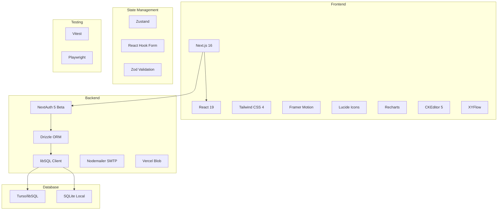
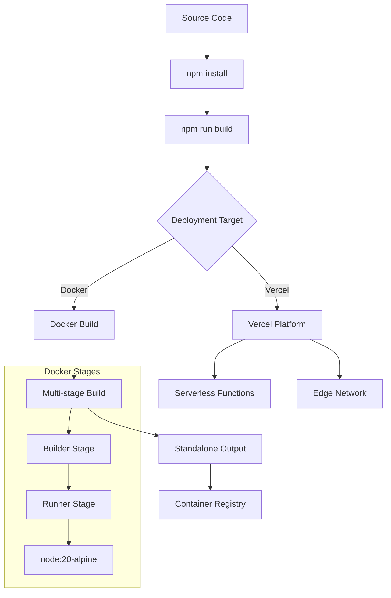
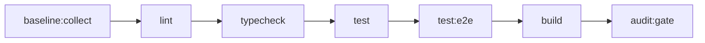

# KK Tires Web - Project Configuration & Dependencies Analysis

**Analysis Date:** 2026-02-14  
**Project:** kktires-web  
**Version:** 0.1.0

---

## Table of Contents

1. [Project Metadata](#project-metadata)
2. [NPM Dependencies](#npm-dependencies)
3. [Available Scripts](#available-scripts)
4. [Configuration Files](#configuration-files)
5. [Environment Variables](#environment-variables)
6. [Build & Deployment Pipeline](#build--deployment-pipeline)

---

## Project Metadata

| Property | Value |
|----------|-------|
| **Name** | kktires-web |
| **Version** | 0.1.0 |
| **Visibility** | Private |
| **Framework** | Next.js 16.1.6 |
| **React Version** | 19.2.4 |
| **TypeScript** | 5.x |
| **Runtime** | Node.js 20 (Alpine for Docker) |

---

## NPM Dependencies

### Production Dependencies

| Package | Version | Purpose |
|---------|---------|---------|
| `next` | 16.1.6 | Full-stack React framework with App Router |
| `react` | 19.2.4 | UI library |
| `react-dom` | 19.2.4 | React DOM renderer |
| `next-auth` | 5.0.0-beta.30 | Authentication framework (Auth.js v5 beta) |
| `@auth/drizzle-adapter` | ^1.11.1 | Drizzle ORM adapter for NextAuth |
| `drizzle-orm` | ^0.45.1 | TypeScript ORM for SQL databases |
| `@libsql/client` | ^0.17.0 | Turso/libSQL database client |
| `@vercel/blob` | ^2.2.0 | Vercel Blob storage for file uploads |
| `nodemailer` | ^7.0.7 | SMTP email sending |
| `@ckeditor/ckeditor5-build-classic` | ^44.3.0 | Rich text editor |
| `@ckeditor/ckeditor5-react` | ^11.0.1 | React integration for CKEditor |
| `@xyflow/react` | ^12.10.0 | Flow diagram/automation builder |
| `bcryptjs` | ^2.4.3 | Password hashing |
| `clsx` | ^2.1.1 | Conditional className utility |
| `tailwind-merge` | ^2.6.0 | Tailwind class merging utility |
| `date-fns` | ^4.1.0 | Date manipulation library |
| `exceljs` | ^4.4.0 | Excel file reading/writing |
| `framer-motion` | ^11.15.0 | Animation library |
| `lucide-react` | ^0.469.0 | Icon library |
| `nanoid` | ^5.1.6 | Unique ID generator |
| `react-hook-form` | ^7.54.2 | Form state management |
| `recharts` | ^2.15.0 | Charting library |
| `zod` | ^4.3.6 | Schema validation |
| `zustand` | ^5.0.2 | State management |

### Development Dependencies

| Package | Version | Purpose |
|---------|---------|---------|
| `typescript` | ^5 | TypeScript compiler |
| `eslint` | ^9 | Linting framework |
| `eslint-config-next` | 16.1.6 | Next.js ESLint configuration |
| `tailwindcss` | ^4 | Utility-first CSS framework |
| `@tailwindcss/postcss` | ^4 | Tailwind PostCSS integration |
| `lightningcss` | ^1.30.2 | Fast CSS processing |
| `vitest` | ^4.0.18 | Unit testing framework |
| `@vitest/coverage-v8` | ^4.0.18 | Code coverage for Vitest |
| `vite-tsconfig-paths` | ^6.1.0 | TypeScript path resolution for Vite |
| `@playwright/test` | ^1.58.2 | E2E testing framework |
| `drizzle-kit` | ^0.31.9 | Drizzle CLI for migrations |
| `drizzle-zod` | ^0.8.3 | Zod schema generation from Drizzle |
| `tsx` | ^4.21.0 | TypeScript execution engine |
| `dotenv` | ^17.2.3 | Environment variable loader |
| `xlsx` | ^0.18.5 | Excel file parsing (alternative) |
| `@types/*` | various | TypeScript type definitions |

### Dependency Architecture Diagram



---

## Available Scripts

### Development Scripts

| Script | Command | Purpose |
|--------|---------|---------|
| `dev` | `next dev` | Start development server |
| `build` | `next build` | Build for production |
| `start` | `next start` | Start production server |
| `lint` | `eslint` | Run ESLint |
| `typecheck` | `tsc --noEmit` | TypeScript type checking |

### Database Scripts

| Script | Command | Purpose |
|--------|---------|---------|
| `db:generate` | `drizzle-kit generate` | Generate migrations from schema |
| `db:migrate` | `drizzle-kit migrate` | Run pending migrations |
| `db:push` | `drizzle-kit push` | Push schema directly to database |
| `db:studio` | `drizzle-kit studio` | Open Drizzle Studio GUI |
| `db:check` | `drizzle-kit check` | Check migration status |

### Worker Scripts

| Script | Command | Purpose |
|--------|---------|---------|
| `worker:email` | `tsx src/worker/email-worker.ts` | Run email job processor |
| `worker:email:once` | `tsx src/worker/email-worker.ts --once` | Single email job run |

### Testing Scripts

| Script | Command | Purpose |
|--------|---------|---------|
| `test` | `vitest run` | Run unit tests |
| `test:coverage` | `vitest run --coverage` | Run tests with coverage |
| `test:watch` | `vitest` | Watch mode for tests |
| `test:e2e` | `playwright test` | Run E2E tests |

### Audit Scripts

| Script | Command | Purpose |
|--------|---------|---------|
| `audit:stubs` | `tsx scripts/audit-stubs.ts` | Check for stub implementations |
| `baseline:collect` | `node scripts/collect-baseline.cjs` | Collect baseline metrics |
| `audit:report` | `node scripts/audit-gate.cjs --report-only` | Generate audit report |
| `audit:gate` | `node scripts/audit-gate.cjs` | Run audit gate check |
| `verify:all` | Complex chain | Full verification pipeline |

---

## Configuration Files

### Next.js Configuration ([`next.config.ts`](next.config.ts))

```typescript
Key Settings:
- Output: standalone (Docker only, not Vercel)
- Dev Origins: localhost, 127.0.0.1 allowed
- Images: Google usercontent domains for avatars
- Security Headers:
  - HSTS (production only)
  - X-Frame-Options: SAMEORIGIN
  - X-Content-Type-Options: nosniff
  - Referrer-Policy: strict-origin-when-cross-origin
  - Permissions-Policy: camera/microphone disabled, geolocation self
```

### TypeScript Configuration ([`tsconfig.json`](tsconfig.json))

| Setting | Value | Purpose |
|---------|-------|---------|
| `target` | ES2017 | JavaScript output target |
| `lib` | dom, dom.iterable, esnext | Available libraries |
| `strict` | true | Enable all strict checks |
| `noEmit` | true | No JS output (Next.js handles) |
| `moduleResolution` | bundler | Modern module resolution |
| `jsx` | react-jsx | React JSX transform |
| `paths` | `@/*` → `./src/*` | Path alias for imports |

### Drizzle Configuration ([`drizzle.config.ts`](drizzle.config.ts))

```typescript
Schema Location: ./src/lib/db/schema.ts
Migrations Output: ./drizzle
Dialect: sqlite (file:) or turso (libsql://)
Credentials:
  - URL: DATABASE_URL or TURSO_DATABASE_URL
  - Auth Token: DATABASE_AUTH_TOKEN or TURSO_AUTH_TOKEN
```

### ESLint Configuration ([`eslint.config.mjs`](eslint.config.mjs))

```typescript
Extends: 
  - eslint-config-next/core-web-vitals
  - eslint-config-next/typescript

Ignored Paths:
  - .next/**
  - out/**
  - build/**
  - next-env.d.ts
  - scripts/**

Custom Rules:
  - @typescript-eslint/no-explicit-any: warn (not error)
  - react-hooks/purity: off
```

### Vitest Configuration ([`vitest.config.ts`](vitest.config.ts))

```typescript
Environment: node
Test Pattern: tests/**/*.test.ts
Globals: enabled

Coverage Settings:
  Provider: v8
  Thresholds:
    - Lines: 80%
    - Functions: 75%
    - Statements: 80%
    - Branches: 70%
  
  Priority Files:
    - src/app/api/customers/route.ts
    - src/app/api/customers/export/route.ts
    - src/app/api/email/send/route.ts
    - src/app/api/campaigns/[id]/send/route.ts
    - src/app/api/cron/email-jobs/route.ts
    - src/app/api/health/route.ts
```

### Playwright Configuration ([`playwright.config.ts`](playwright.config.ts))

```typescript
Test Directory: ./tests/e2e
Timeout: 60s (test), 10s (expect)
Base URL: http://127.0.0.1:3000
Browser: Chromium only
Retries: 1 (CI only)
Reporter: github (CI), list (local)

Global Setup: ./tests/e2e/global-setup.ts
Storage State: ./tests/.tmp/e2e.storageState.json

Test Database: file:./tests/.tmp/e2e.db (isolated)
```

### PostCSS Configuration ([`postcss.config.mjs`](postcss.config.mjs))

```javascript
Plugins:
  - @tailwindcss/postcss (Tailwind CSS 4 integration)
```

### Vercel Configuration ([`vercel.json`](vercel.json))

```json
{
  "installCommand": "npm install",
  "buildCommand": "npm run build"
}
```

---

## Environment Variables

### Database Configuration

| Variable | Required | Purpose |
|----------|----------|---------|
| `DATABASE_URL` | Yes | Primary database connection string (libsql:// or file:) |
| `DATABASE_AUTH_TOKEN` | For Turso | Authentication token for Turso database |
| `TURSO_DATABASE_URL` | Legacy | Backward compatible alias for DATABASE_URL |
| `TURSO_AUTH_TOKEN` | Legacy | Backward compatible alias for DATABASE_AUTH_TOKEN |

### Authentication

| Variable | Required | Purpose |
|----------|----------|---------|
| `NEXTAUTH_SECRET` | Yes | Secret for JWT/session encryption |
| `NEXTAUTH_URL` | Yes | Base URL for auth callbacks |
| `GOOGLE_CLIENT_ID` | Optional | Google OAuth client ID |
| `GOOGLE_CLIENT_SECRET` | Optional | Google OAuth client secret |
| `AUTH_ALLOWED_EMAILS` | Recommended | Comma-separated whitelist of allowed emails |
| `AUTH_DEBUG` | Optional | Enable auth debugging (0 or 1) |
| `DEFAULT_ORG_ID` | Optional | Default organization ID (org_kktires) |

### Security Endpoints

| Variable | Default | Purpose |
|----------|---------|---------|
| `ENABLE_SEED_ENDPOINT` | false | Enable /api/seed endpoint |
| `ENABLE_MIGRATE_ENDPOINT` | false | Enable /api/db/migrate endpoint |

### Google APIs

| Variable | Required | Purpose |
|----------|----------|---------|
| `NEXT_PUBLIC_GOOGLE_MAPS_API_KEY` | For maps | Client-side Google Maps API key |
| `GOOGLE_GEOCODING_API_KEY` | Optional | Server-side geocoding (falls back to public key) |

### SMTP Configuration

| Variable | Required | Purpose |
|----------|----------|---------|
| `SMTP_HOST` | For email | SMTP server hostname |
| `SMTP_PORT` | For email | SMTP port (default: 587) |
| `SMTP_SECURE` | For email | Use TLS (default: false) |
| `SMTP_USER` | For email | SMTP authentication username |
| `SMTP_PASS` | For email | SMTP authentication password |
| `SMTP_FROM` | For email | Default sender email address |

### Storage

| Variable | Required | Purpose |
|----------|----------|---------|
| `BLOB_READ_WRITE_TOKEN` | For uploads | Vercel Blob storage token |

### AI Integration

| Variable | Required | Purpose |
|----------|----------|---------|
| `HUGGINGFACE_API_KEY` | For AI | HuggingFace API key for Meltemi AI |
| `MELTEMI_MODEL` | Optional | AI model (default: ilsp/Meltemi-7B-v1) |

### Email Tracking & Security

| Variable | Required | Purpose |
|----------|----------|---------|
| `EMAIL_TRACKING_SECRET` | Yes | Secret for signing tracking links/pixels |
| `OAUTH_TOKEN_ENCRYPTION_KEY` | Yes | Base64 32-byte key for token encryption |

### Cron & Job Processing

| Variable | Default | Purpose |
|----------|---------|---------|
| `CRON_SECRET` | Required | Auth for /api/cron/* endpoints |
| `EMAIL_CRON_TIME_BUDGET_MS` | 8000 | Time budget per cron run |
| `EMAIL_CRON_MAX_JOBS` | 5 | Max jobs per cron invocation |
| `EMAIL_JOB_MAX_ITEMS_PER_RUN` | 450 | Max emails per job run |
| `EMAIL_JOB_CONCURRENCY` | 4 | Concurrent email sends |
| `EMAIL_JOB_YIELD_DELAY_MS` | 0 | Delay between batches |
| `EMAIL_JOB_LOCK_TIMEOUT_MS` | 900000 | Job lock timeout (15 min) |
| `EMAIL_ASSET_CLEANUP_ENABLED` | 1 | Enable asset cleanup |
| `EMAIL_ASSET_CLEANUP_HOURS` | 24 | Age threshold for cleanup |
| `EMAIL_ASSET_CLEANUP_LIMIT` | 200 | Max assets per cleanup run |

---

## Build & Deployment Pipeline

### Build Process Flow



### Deployment Targets

#### 1. Vercel (Primary)

- **Configuration:** [`vercel.json`](vercel.json)
- **Install Command:** `npm install`
- **Build Command:** `npm run build`
- **Output:** Serverless functions + static assets
- **Features:**
  - Automatic preview deployments
  - Edge network CDN
  - Serverless API routes

#### 2. Docker (Self-hosted)

- **Dockerfile:** Multi-stage build
- **Base Image:** node:20-alpine
- **Output Mode:** standalone
- **Security:** Non-root user (nextjs:nodejs)
- **Port:** 3000

**Docker Build Steps:**
1. Builder stage: Install dependencies, build Next.js
2. Runner stage: Copy standalone output, static files
3. Run as non-root user for security

**Ignored in Docker Build:**
- node_modules, .next, out, build
- .env* files (all variants)
- .git, .vercel
- IDE files (.idea, .vscode)
- drizzle migrations
- scripts

### CI/CD Pipeline (verify:all)



---

## Summary

### Technology Stack

| Layer | Technology |
|-------|------------|
| **Frontend** | Next.js 16 + React 19 + Tailwind CSS 4 |
| **State** | Zustand + React Hook Form + Zod |
| **Backend** | Next.js API Routes |
| **Auth** | NextAuth 5 Beta (Google OAuth + Email) |
| **Database** | Turso/libSQL + Drizzle ORM |
| **Email** | Nodemailer SMTP |
| **Storage** | Vercel Blob |
| **AI** | HuggingFace (Meltemi-7B) |
| **Testing** | Vitest + Playwright |
| **Deployment** | Vercel (primary) + Docker (self-hosted) |

### Key Architectural Decisions

1. **Dual Database Support:** Works with both local SQLite and Turso cloud
2. **Standalone Output:** Docker deployments use standalone mode for smaller images
3. **Security Headers:** Production-grade security headers configured
4. **Test Isolation:** E2E tests use isolated database file
5. **Email Job Queue:** External cron-based email processing with configurable limits
6. **Multi-deployment:** Supports both Vercel serverless and Docker containerized deployments

---

*This analysis serves as the source of truth for the architectural map of the KK Tires CRM application.*
