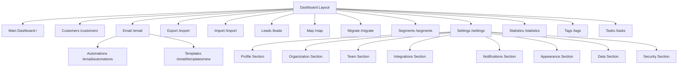

# Dashboard Pages and UI Analysis

This document provides a comprehensive forensic analysis of all dashboard pages and UI components in the KK Tires CRM application.

## Table of Contents

1. [Dashboard Shell](#1-dashboard-shell)
2. [Main Dashboard Page](#2-main-dashboard-page)
3. [Customers Page](#3-customers-page)
4. [Email Section](#4-email-section)
5. [Export Page](#5-export-page)
6. [Import Page](#6-import-page)
7. [Leads Page](#7-leads-page)
8. [Map Page](#8-map-page)
9. [Migrate Page](#9-migrate-page)
10. [Segments Page](#10-segments-page)
11. [Settings Page](#11-settings-page)
12. [Statistics Page](#12-statistics-page)
13. [Tags Page](#13-tags-page)
14. [Tasks Page](#14-tasks-page)
15. [Page Hierarchy and Navigation](#15-page-hierarchy-and-navigation)
16. [Component Architecture](#16-component-architecture)
17. [Data Flow Summary](#17-data-flow-summary)

---

## 1. Dashboard Shell

### Files
- [`src/app/(dashboard)/layout.tsx`](src/app/(dashboard)/layout.tsx:1) - Server Component
- [`src/app/(dashboard)/dashboard-shell.tsx`](src/app/(dashboard)/dashboard-shell.tsx:1) - Client Component

### Purpose
The dashboard shell provides the authenticated layout wrapper for all dashboard pages, handling session validation and rendering the main UI structure.

### Key Features

#### Layout Component (`layout.tsx`)
- **Authentication Guard**: Uses `auth()` to validate session, redirects to `/login` if unauthenticated
- **Dynamic Rendering**: `export const dynamic = 'force-dynamic'` ensures no static rendering
- **Server Component**: Runs on server for auth validation before client shell loads

#### Shell Component (`dashboard-shell.tsx`)
- **Client Component**: `'use client'` directive for interactive UI
- **Responsive Sidebar**: Collapsible sidebar with collapsed/expanded states via `useUIStore`
- **Mobile Support**: Separate `MobileSidebar` component for mobile navigation
- **Notifications Panel**: Slide-out panel for notifications (currently shows empty state)
- **Command Palette**: Global keyboard shortcut handler via `CommandPalette`
- **Toast Notifications**: `GlassToastContainer` for user feedback
- **Store Hydration**: `StoreHydration` component for Zustand state persistence

### UI Components Used
- [`Sidebar`](src/components/layout/sidebar.tsx) - Main navigation sidebar
- [`Header`](src/components/layout/header.tsx) - Top header with search and user menu
- [`AuroraBackground`](src/components/layout/aurora-background.tsx) - Animated background effect
- [`CommandPalette`](src/components/layout/command-palette.tsx) - Keyboard shortcut interface
- [`GlassAvatar`](src/components/ui/glass-avatar.tsx) - User avatar display
- [`GlassToastContainer`](src/components/ui/glass-toast.tsx) - Toast notification container

### State Management
- **Zustand Store**: `useUIStore` for UI state (sidebar collapsed, notifications open, mobile menu)
- **NextAuth**: `useSession` for authentication state
- **Navigation Items**: Imported from [`navigation.tsx`](src/components/layout/navigation.tsx)

### User Interactions
- Toggle sidebar collapse/expand
- Open/close notifications panel
- Open/close mobile menu
- Sign out via `signOut({ callbackUrl: '/login' })`

---

## 2. Main Dashboard Page

### File
- [`src/app/(dashboard)/page.tsx`](src/app/(dashboard)/page.tsx:1) - Client Component

### Purpose
The main dashboard provides an overview of business metrics, KPIs, top customers, and pending tasks.

### Key Features
- **KPI Cards**: Display total customers, new customers this month, leads, and total revenue
- **Top Customers Table**: Shows top 5 customers by revenue
- **Pending Tasks**: Shows up to 4 pending tasks with priority badges
- **Customer Summary**: VIP count, average revenue per customer, leads conversion

### Data Fetching
- **Parallel Requests**: Fetches `/api/statistics` and `/api/tasks?limit=5` simultaneously
- **Loading States**: Skeleton components during data fetch
- **Refresh Button**: Manual data refresh with spinning animation

### API Endpoints Called
| Endpoint | Method | Purpose |
|----------|--------|---------|
| `/api/statistics` | GET | Dashboard statistics |
| `/api/tasks?limit=5` | GET | Recent tasks |

### UI Components Used
- `GlassCard`, `GlassBadge`, `GlassButton`, `GlassProgress`, `GlassSkeleton`
- Custom `KpiCard` and `ActivityItem` components (inline)

### State Management
- React `useState` for stats and tasks data
- React `useEffect` for data fetching on mount

---

## 3. Customers Page

### File
- [`src/app/(dashboard)/customers/page.tsx`](src/app/(dashboard)/customers/page.tsx:1) - Client Component

### Purpose
Full-featured customer management interface with data table, search, filtering, and CRUD operations.

### Key Features
- **Data Table**: Sortable, paginated customer list with checkbox selection
- **Search**: Client-side filtering by name, company, email, city
- **Pagination**: Configurable page size (10, 20, 50, 100 per page)
- **Bulk Selection**: Select all/deselect all functionality
- **Bulk Actions**: Tag, email, delete selected customers (UI present, not fully implemented)
- **Customer Modal**: View, edit, create customer via `CustomerModal`
- **Delete Confirmation**: `ConfirmDialog` for delete confirmation

### Data Fetching
- **Paginated API**: `/api/customers?page=X&limit=Y`
- **CRUD Operations**: POST, PUT, DELETE to `/api/customers` and `/api/customers/[id]`

### API Endpoints Called
| Endpoint | Method | Purpose |
|----------|--------|---------|
| `/api/customers?page=X&limit=Y` | GET | Paginated customer list |
| `/api/customers` | POST | Create new customer |
| `/api/customers/[id]` | PUT | Update customer |
| `/api/customers/[id]` | DELETE | Delete customer |

### UI Components Used
- `GlassCard`, `GlassButton`, `GlassInput`, `GlassBadge`, `GlassAvatar`, `GlassDropdown`, `GlassEmptyState`, `GlassSkeleton`, `GlassSelect`
- `CustomerModal` - Customer create/edit/view modal
- `ConfirmDialog` - Delete confirmation

### State Management
- React `useState` for customers, pagination, selection, modal state
- React `useRef` for pagination reference to avoid stale closures
- `useRouter`, `useSearchParams` for URL-based actions (e.g., `?new=true`)

### User Interactions
- Search customers
- Select/deselect individual customers
- Select/deselect all
- View customer details
- Edit customer
- Create new customer
- Delete customer
- Navigate to export/import pages
- Change page size
- Paginate through results

---

## 4. Email Section

### Files
- [`src/app/(dashboard)/email/page.tsx`](src/app/(dashboard)/email/page.tsx:1) - Client Component
- [`src/app/(dashboard)/email/automations/page.tsx`](src/app/(dashboard)/email/automations/page.tsx:1) - Client Component
- [`src/app/(dashboard)/email/templates/new/page.tsx`](src/app/(dashboard)/email/templates/new/page.tsx:1) - Client Component

### Purpose
Outlook-inspired email campaign management interface with templates, automations, and campaign editing.

### Main Email Page Features
- **Three-Panel Layout**: Sidebar (folders), List (campaigns/templates), Editor (content)
- **Folder Navigation**: All, Drafts, Scheduled, Sending, Sent, Failed, Templates
- **Campaign Management**: Create, edit, duplicate, delete campaigns
- **Template Support**: Apply templates to new campaigns
- **Recipient Filtering**: Filter by cities, tags, segments, categories
- **Attachments**: Support for file attachments and inline images
- **Signatures**: Select email signature for campaign
- **Schedule**: Schedule campaigns for future sending
- **Send Now**: Immediate campaign dispatch

### Data Fetching
- **Parallel Load**: Fetches campaigns, templates, signatures on mount
- **Recipient Count**: Fetches count when filters change
- **Full Campaign Load**: Loads complete campaign data when selected

### API Endpoints Called
| Endpoint | Method | Purpose |
|----------|--------|---------|
| `/api/campaigns` | GET | List campaigns |
| `/api/campaigns` | POST | Create campaign |
| `/api/campaigns/[id]` | GET | Get campaign details |
| `/api/campaigns/[id]` | PUT | Update campaign |
| `/api/campaigns/[id]` | DELETE | Delete campaign |
| `/api/campaigns/[id]/send` | POST | Send/schedule campaign |
| `/api/templates` | GET | List templates |
| `/api/templates` | POST | Create template |
| `/api/signatures` | GET | List signatures |
| `/api/recipients/count` | GET | Count filtered recipients |

### UI Components Used
- `OutlookLayout`, `OutlookSidebar`, `OutlookList`, `OutlookEditor`, `OutlookRecipientDrawer`
- `ConfirmDialog`, `GlassToastContainer`

### Automations Page
- **Automation Builder**: Visual workflow builder via `AutomationBuilder` component
- **Save Automation**: Converts flow nodes/edges to automation format
- **API**: POST to `/api/automations`

### Templates New Page
- **Template Builder**: Block-based email template builder via `TemplateBuilder`
- **HTML Generation**: Converts blocks to email HTML
- **API**: POST to `/api/templates`

### State Management
- Complex state for campaign editing (name, subject, content, filters, attachments, etc.)
- `useRouter` for navigation between sections
- Toast notifications for feedback

---

## 5. Export Page

### File
- [`src/app/(dashboard)/export/page.tsx`](src/app/(dashboard)/export/page.tsx:1) - Client Component

### Purpose
Customer data export interface with field selection and format options.

### Key Features
- **Field Selection**: Choose which fields to export (17 available fields)
- **Default Fields**: Pre-selected default fields for quick export
- **Format Selection**: CSV or Excel (.xlsx) output
- **Filter Options**: Export all, active only, or VIP only customers
- **Download**: Direct file download via blob URL

### Data Flow
1. User selects fields, format, and filter
2. POST to `/api/customers/export` with options
3. Server returns file blob
4. Client creates download link and triggers download
5. Export count shown from `X-Export-Count` header

### API Endpoints Called
| Endpoint | Method | Purpose |
|----------|--------|---------|
| `/api/customers/export` | POST | Export customer data |

### UI Components Used
- `GlassCard`, `GlassButton`
- Framer Motion for success animation

### State Management
- React `useState` for field selection, format, filter, export state

---

## 6. Import Page

### File
- [`src/app/(dashboard)/import/page.tsx`](src/app/(dashboard)/import/page.tsx:1) - Client Component

### Purpose
Multi-step customer import wizard for CSV file uploads.

### Key Features
- **Four-Step Wizard**: Upload, Mapping, Preview, Complete
- **Drag & Drop**: File upload with drag and drop support
- **Auto-Mapping**: Automatic field detection based on header names
- **Field Mapping**: Manual mapping of CSV columns to database fields
- **Preview**: Preview data before import
- **Template Download**: Download sample CSV template

### Data Flow
1. User uploads CSV file
2. Client parses CSV and auto-maps fields
3. User reviews/adjusts field mappings
4. Preview shows first 5 rows
5. POST to `/api/customers/import` with mapped data
6. Success/error results displayed

### API Endpoints Called
| Endpoint | Method | Purpose |
|----------|--------|---------|
| `/api/customers/import` | POST | Import customer data |

### UI Components Used
- `GlassCard`, `GlassButton`
- Framer Motion `AnimatePresence` for step transitions

### State Management
- Multi-step state machine (step 1-4)
- File, CSV data, field mappings, import results

---

## 7. Leads Page

### File
- [`src/app/(dashboard)/leads/page.tsx`](src/app/(dashboard)/leads/page.tsx:1) - Client Component

### Purpose
Lead management with Kanban-style pipeline view.

### Key Features
- **Kanban Board**: Four columns (New, Contacted, Qualified, Proposal)
- **Lead Cards**: Display lead info with source, score, contact options
- **Lead Modal**: Create/edit lead with full form
- **Convert to Customer**: Convert qualified leads to customers
- **Status Stats**: Count badges for each status

### Data Fetching
- GET `/api/leads` for list
- POST/PATCH `/api/leads` for create/update
- DELETE `/api/leads/[id]` for delete
- POST `/api/leads/[id]/convert` for conversion

### API Endpoints Called
| Endpoint | Method | Purpose |
|----------|--------|---------|
| `/api/leads` | GET | List leads |
| `/api/leads` | POST | Create lead |
| `/api/leads/[id]` | PATCH | Update lead |
| `/api/leads/[id]` | DELETE | Delete lead |
| `/api/leads/[id]/convert` | POST | Convert to customer |

### UI Components Used
- `GlassCard`, `GlassButton`, `GlassInput`, `GlassBadge`, `GlassAvatar`, `GlassDropdown`, `GlassSkeleton`, `GlassModal`, `GlassSelect`
- `ConfirmDialog`

### State Management
- React state for leads, modal, form data
- Kanban columns derived from lead status

---

## 8. Map Page

### File
- [`src/app/(dashboard)/map/page.tsx`](src/app/(dashboard)/map/page.tsx:1) - Client Component

### Purpose
Google Maps integration for customer location visualization.

### Key Features
- **Google Maps**: Full map integration with custom dark theme styling
- **Customer Markers**: Color-coded markers by customer category
- **City Filter**: Filter customers by city
- **Search**: Search customers by name or city
- **Geocoding Backfill**: Admin-only feature to geocode customers without coordinates
- **Stats Panel**: Total, geocoded, and non-geocoded customer counts
- **Customer Details**: Selected customer info panel

### Data Fetching
- GET `/api/customers/locations` for all locations
- GET `/api/customers/locations?city=X` for city-filtered locations
- POST `/api/maps/geocode/backfill?limit=25` for geocoding

### API Endpoints Called
| Endpoint | Method | Purpose |
|----------|--------|---------|
| `/api/customers/locations` | GET | Customer locations |
| `/api/customers/locations?city=X` | GET | Filtered locations |
| `/api/maps/geocode/backfill` | POST | Geocode customers |

### External Dependencies
- Google Maps JavaScript API (via `NEXT_PUBLIC_GOOGLE_MAPS_API_KEY`)

### UI Components Used
- `GlassCard`, `GlassButton`, `GlassInput`, `GlassBadge`, `GlassSkeleton`

### State Management
- Google Maps instance stored in `useRef`
- Markers array in `useRef` for cleanup
- React state for customers, cities, stats, selected customer

### Permission Control
- Geocoding backfill restricted to `owner` or `admin` roles

---

## 9. Migrate Page

### File
- [`src/app/(dashboard)/migrate/page.tsx`](src/app/(dashboard)/migrate/page.tsx:1) - Client Component

### Purpose
Data migration tool for importing from legacy WPF/Excel systems.

### Key Features
- **File Upload**: Support for JSON and CSV files
- **JSON Editor**: Textarea for pasting/editing JSON data
- **Sample Data**: Load sample data button for reference
- **Clear Option**: Option to clear existing data before import
- **Status Display**: Current customer/tag counts in Turso database
- **Result Display**: Success/failure with import statistics

### Data Fetching
- GET `/api/migrate` for current status
- POST `/api/migrate` for data import

### API Endpoints Called
| Endpoint | Method | Purpose |
|----------|--------|---------|
| `/api/migrate` | GET | Migration status |
| `/api/migrate` | POST | Execute migration |

### UI Components Used
- `GlassCard`, `GlassButton`, `GlassBadge`

### State Management
- React state for JSON data, loading, result, clear option

### Permission Control
- Page restricted to `owner` or `admin` roles

---

## 10. Segments Page

### File
- [`src/app/(dashboard)/segments/page.tsx`](src/app/(dashboard)/segments/page.tsx:1) - Client Component

### Purpose
Customer segmentation with dynamic filter conditions.

### Key Features
- **Segment Creation**: Create named segments with multiple conditions
- **Filter Builder**: Visual condition builder with field/operator/value
- **Logic Selection**: AND/OR logic between conditions
- **Condition Types**: Text, number, boolean, select field types
- **Segment Cards**: Display segments with condition preview and customer count
- **Search**: Filter segments by name/description

### Data Fetching
- GET `/api/segments` for list
- POST `/api/segments` for create
- DELETE `/api/segments/[id]` for delete

### API Endpoints Called
| Endpoint | Method | Purpose |
|----------|--------|---------|
| `/api/segments` | GET | List segments |
| `/api/segments` | POST | Create segment |
| `/api/segments/[id]` | DELETE | Delete segment |

### UI Components Used
- `GlassCard`, `GlassButton`, `ConfirmDialog`
- Framer Motion for modal and card animations

### State Management
- React state for segments, creating modal, filter conditions

### Filter Fields Available
| Field | Type | Options |
|-------|------|---------|
| city | text | - |
| category | select | retail, wholesale, fleet, garage, vip |
| isVip | boolean | - |
| lifecycleStage | select | lead, prospect, customer, churned |
| revenue | number | - |
| leadScore | number | - |
| country | text | - |

---

## 11. Settings Page

### File
- [`src/app/(dashboard)/settings/page.tsx`](src/app/(dashboard)/settings/page.tsx:1) - Client Component

### Purpose
Comprehensive settings management with multiple sections.

### Key Features
- **Section Navigation**: Profile, Organization, Team, Integrations, Notifications, Appearance, Data, Security
- **Profile Settings**: Name editing (avatar change not implemented)
- **Organization Settings**: Company name, VAT ID, address, phone, website
- **Team Settings**: Not implemented (MVP)
- **Integrations**: Gmail connection status, Google Calendar (not implemented), Google Maps status
- **Notifications**: Toggle switches for email, push, birthdays, tasks, campaigns
- **Appearance**: Theme selection (dark/light)
- **Data**: Export all (not implemented), Delete account (not implemented)
- **Security**: Not implemented (MVP)

### Data Fetching
- Parallel load of profile, organization, preferences on mount
- Gmail integration status check

### API Endpoints Called
| Endpoint | Method | Purpose |
|----------|--------|---------|
| `/api/settings/profile` | GET/PUT | Profile settings |
| `/api/settings/org` | GET/PUT | Organization settings |
| `/api/settings/preferences` | GET/PUT | User preferences |
| `/api/integrations/gmail` | GET | Gmail connection status |

### UI Components Used
- `GlassCard`, `GlassButton`, `GlassInput`, `GlassBadge`, `GlassSwitch`, `GlassAvatar`

### State Management
- React state for active section, profile, org, notifications, theme
- `useSession` for authentication
- `useUIStore` for theme state

### Integration Features
- Gmail OAuth via `signIn('google', { callbackUrl: '/settings' })`
- Refresh token warning for Gmail connections

---

## 12. Statistics Page

### File
- [`src/app/(dashboard)/statistics/page.tsx`](src/app/(dashboard)/statistics/page.tsx:1) - Client Component

### Purpose
Business analytics and statistics dashboard.

### Key Features
- **KPI Cards**: Total customers, revenue, leads, VIP customers
- **Period Tabs**: Week, Month, Year (UI only, not implemented in API)
- **Category Distribution**: Bar chart showing customer categories
- **City Distribution**: Progress circle and list showing top cities
- **Top Customers Table**: Top customers by revenue
- **Leads by Status**: Count of leads in each status

### Data Fetching
- GET `/api/statistics` for all statistics data

### API Endpoints Called
| Endpoint | Method | Purpose |
|----------|--------|---------|
| `/api/statistics` | GET | All statistics |

### UI Components Used
- `GlassCard`, `GlassButton`, `GlassBadge`, `GlassTabs`, `GlassProgressCircle`, `GlassSkeleton`
- Custom `KpiCard` component (inline)

### State Management
- React state for statistics data, loading, period selection

---

## 13. Tags Page

### File
- [`src/app/(dashboard)/tags/page.tsx`](src/app/(dashboard)/tags/page.tsx:1) - Client Component

### Purpose
Tag management for customer categorization.

### Key Features
- **Tag Creation**: Create tags with name, color, description
- **Color Picker**: 10 preset colors for tag styling
- **Tag Editing**: Update tag properties
- **Tag Deletion**: Delete with confirmation
- **Preview**: Live preview of tag appearance
- **Search**: Filter tags by name/description
- **Stats**: Total tags, tagged customers, colors in use

### Data Fetching
- GET `/api/tags` for list
- POST `/api/tags` for create
- PUT `/api/tags/[id]` for update
- DELETE `/api/tags/[id]` for delete

### API Endpoints Called
| Endpoint | Method | Purpose |
|----------|--------|---------|
| `/api/tags` | GET | List tags |
| `/api/tags` | POST | Create tag |
| `/api/tags/[id]` | PUT | Update tag |
| `/api/tags/[id]` | DELETE | Delete tag |

### UI Components Used
- `GlassCard`, `GlassButton`, `GlassInput`, `ConfirmDialog`
- Framer Motion for modal and card animations

### State Management
- React state for tags, creating/editing modals, new tag form

---

## 14. Tasks Page

### File
- [`src/app/(dashboard)/tasks/page.tsx`](src/app/(dashboard)/tasks/page.tsx:1) - Client Component

### Purpose
Task management with status tracking and priorities.

### Key Features
- **Task List**: All tasks with status, priority, due date
- **Status Tabs**: All, To Do, In Progress, Done
- **Status Cycling**: Click to cycle through statuses (todo -> in_progress -> done -> todo)
- **Task Creation**: Create tasks with title, description, status, priority, due date
- **Task Editing**: Update task properties
- **Task Deletion**: Delete with confirmation
- **Overdue Indication**: Visual highlighting of overdue tasks
- **Stats Cards**: Count by status plus overdue count

### Data Fetching
- GET `/api/tasks` for list with counts
- POST `/api/tasks` for create
- PATCH `/api/tasks/[id]` for update (status cycling)
- DELETE `/api/tasks/[id]` for delete

### API Endpoints Called
| Endpoint | Method | Purpose |
|----------|--------|---------|
| `/api/tasks` | GET | List tasks with counts |
| `/api/tasks` | POST | Create task |
| `/api/tasks/[id]` | PATCH | Update task |
| `/api/tasks/[id]` | DELETE | Delete task |

### UI Components Used
- `GlassCard`, `GlassButton`, `GlassInput`, `GlassBadge`, `GlassTabs`, `GlassSkeleton`, `GlassModal`, `GlassSelect`
- `ConfirmDialog`
- Custom `TaskItem` component (inline)

### State Management
- React state for tasks, counts, modal, form data

---

## 15. Page Hierarchy and Navigation



### Navigation Structure

The main navigation is defined in [`src/components/layout/navigation.tsx`](src/components/layout/navigation.tsx) and includes:

**Main Navigation:**
- Dashboard (`/`)
- Customers (`/customers`)
- Email (`/email`)
- Leads (`/leads`)
- Map (`/map`)
- Segments (`/segments`)
- Tags (`/tags`)
- Tasks (`/tasks`)

**Bottom Navigation (Admin Only):**
- Migrate (`/migrate`)
- Settings (`/settings`)

---

## 16. Component Architecture

### Glass UI Component Library

All dashboard pages use a consistent "Glass" UI component library located in [`src/components/ui/`](src/components/ui/):

| Component | Purpose |
|-----------|---------|
| `GlassCard` | Container with glass morphism effect |
| `GlassButton` | Styled button with variants (primary, default, ghost, danger) |
| `GlassInput` | Text/number/date input with icon support |
| `GlassSelect` | Dropdown select |
| `GlassBadge` | Status/category badges |
| `GlassAvatar` | User avatar with initials fallback |
| `GlassDropdown` | Dropdown menu for actions |
| `GlassModal` | Modal dialog |
| `GlassTabs` | Tab navigation |
| `GlassSkeleton` | Loading skeleton |
| `GlassProgress` | Progress indicators |
| `GlassSwitch` | Toggle switch |
| `GlassEmptyState` | Empty state display |
| `ConfirmDialog` | Confirmation dialog |

### Email-Specific Components

Located in [`src/components/email/`](src/components/email/):

| Component | Purpose |
|-----------|---------|
| `OutlookLayout` | Three-panel email layout |
| `OutlookSidebar` | Folder navigation |
| `OutlookList` | Campaign/template list |
| `OutlookEditor` | Campaign content editor |
| `OutlookRecipientDrawer` | Recipient filter drawer |
| `AutomationBuilder` | Visual automation workflow builder |
| `TemplateBuilder` | Block-based email template builder |

### Layout Components

Located in [`src/components/layout/`](src/components/layout/):

| Component | Purpose |
|-----------|---------|
| `Sidebar` | Main navigation sidebar |
| `Header` | Top header with search and user menu |
| `AuroraBackground` | Animated gradient background |
| `CommandPalette` | Keyboard shortcut interface |
| `navigation` | Navigation configuration |

---

## 17. Data Flow Summary

### Client-Side Data Fetching Pattern

All dashboard pages follow a consistent pattern:

1. **Component Mount**: `useEffect` triggers data fetch
2. **Loading State**: Skeleton/placeholder UI shown
3. **API Request**: `fetch()` to API endpoint
4. **State Update**: Response data stored in React state
5. **UI Render**: Data-driven UI rendered

### API Endpoint Summary

```mermaid
graph LR
    subgraph Dashboard Pages
        P1[Dashboard] --> S1[/api/statistics]
        P1 --> S2[/api/tasks]
        P2[Customers] --> S3[/api/customers]
        P3[Email] --> S4[/api/campaigns]
        P3 --> S5[/api/templates]
        P3 --> S6[/api/signatures]
        P4[Leads] --> S7[/api/leads]
        P5[Map] --> S8[/api/customers/locations]
        P6[Segments] --> S9[/api/segments]
        P7[Tags] --> S10[/api/tags]
        P8[Tasks] --> S11[/api/tasks]
        P9[Settings] --> S12[/api/settings/*]
    end
```

### State Management Architecture

| State Type | Implementation | Usage |
|------------|----------------|-------|
| UI State | Zustand (`useUIStore`) | Sidebar, theme, notifications |
| Auth State | NextAuth (`useSession`) | User session, roles |
| Page State | React `useState` | Page-specific data |
| Form State | React `useState` | Form inputs |
| URL State | `useSearchParams` | URL-based actions |

### Authentication & Authorization

- **Authentication**: All dashboard pages protected by `layout.tsx` server-side auth check
- **Authorization**: Role-based access control via `currentOrgRole` in session
- **Admin Pages**: Migrate page restricted to `owner` or `admin` roles
- **Admin Actions**: Geocoding backfill restricted to admin roles

---

## Summary

The KK Tires CRM dashboard consists of 14 main pages with a consistent UI architecture:

- **All pages are Client Components** using `'use client'` directive
- **Consistent Glass UI library** for visual consistency
- **Zustand for global UI state**, React state for page data
- **RESTful API pattern** with fetch for data operations
- **Greek language UI** with English codebase
- **Responsive design** with mobile-specific components
- **Role-based access control** for admin features

The architecture follows Next.js App Router conventions with route groups for the dashboard section, providing a clean separation between authenticated and public routes.