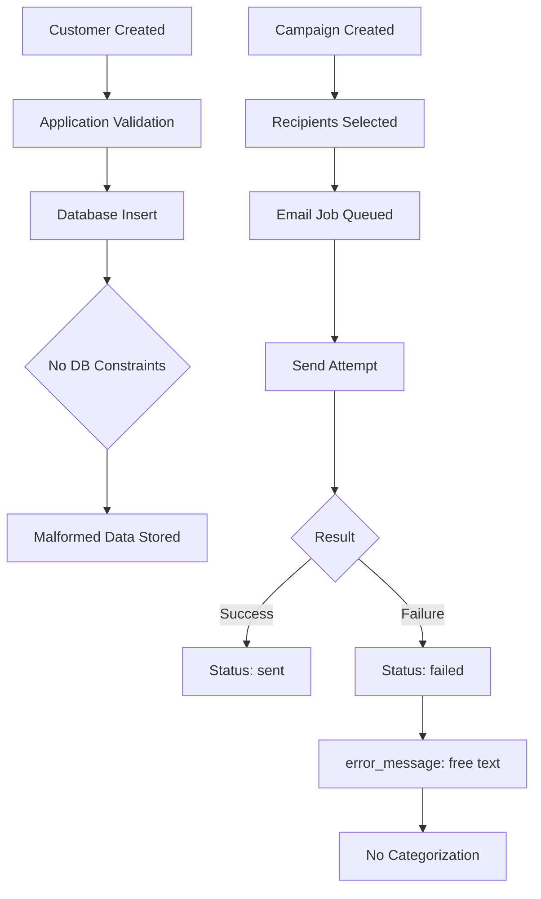
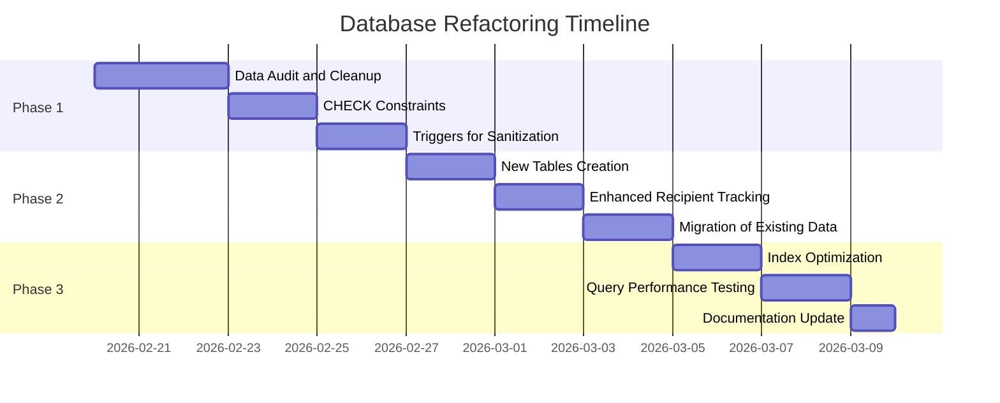
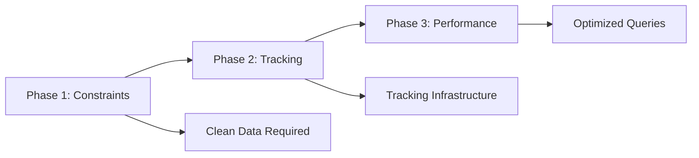
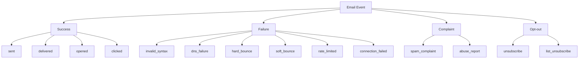

# Turso Database Refactoring Plan: Data Integrity & Email Deliverability

**Version:** 1.0  
**Created:** 2026-02-15  
**Status:** Draft for Review  
**Author:** Architecture Team

---

## Table of Contents

1. [Executive Summary](#1-executive-summary)
2. [Current State Analysis](#2-current-state-analysis)
3. [Refactoring Roadmap](#3-refactoring-roadmap)
4. [Phase 1: Data Integrity Constraints](#4-phase-1-data-integrity-constraints)
5. [Phase 2: Email Deliverability Tracking](#5-phase-2-email-deliverability-tracking)
6. [Phase 3: Performance & Scalability](#6-phase-3-performance--scalability)
7. [Complete SQL Migration Scripts](#7-complete-sql-migration-scripts)
8. [Application-Layer Changes](#8-application-layer-changes)
9. [Testing Protocol](#9-testing-protocol)
10. [Risk Assessment & Mitigation](#10-risk-assessment--mitigation)

---

## 1. Executive Summary

### Problem Statement

The KK Tires CRM database has critical data integrity issues and lacks robust email deliverability tracking:

- **Malformed email addresses** exist in production (e.g., `@gmail.grr`)
- **No schema-level validation** - all validation is application-layer only
- **No structured bounce tracking** - cannot distinguish between failure types
- **No retry intelligence** - cannot identify recoverable vs permanent failures
- **Greek business data** (AFM, phone, postal codes) lacks format validation

### Proposed Solution

A three-phase refactoring approach:

| Phase | Focus | Risk Level |
|-------|-------|------------|
| Phase 1 | Data Integrity Constraints | Low |
| Phase 2 | Email Deliverability Tracking | Medium |
| Phase 3 | Performance & Scalability | Low |

### Key Deliverables

1. CHECK constraints for email, phone, AFM, postal codes, URLs
2. New `email_delivery_events` table for granular tracking
3. Enhanced `campaign_recipients` with failure categorization
4. Triggers for automatic data sanitization
5. Comprehensive indexing strategy
6. Data migration scripts with rollback procedures

---

## 2. Current State Analysis

### 2.1 Database Overview

```
Database: Turso/libSQL (SQLite-compatible)
ORM: Drizzle ORM
Tables: 33 across 14 domains
Architecture: Multi-tenant with org_id scoping
```

### 2.2 Critical Tables Requiring Attention

#### `customers` Table

| Column | Current State | Issue |
|--------|---------------|-------|
| `email` | No constraint | Malformed emails like `@gmail.grr` |
| `email_secondary` | No constraint | Same as above |
| `phone` | No constraint | Free-form text |
| `mobile` | No constraint | Free-form text |
| `afm` | No constraint | No Greek Tax ID validation |
| `postal_code` | No constraint | No Greek postal format |
| `website` | No constraint | No URL validation |

#### `campaign_recipients` Table

| Column | Current State | Issue |
|--------|---------------|-------|
| `status` | Enum: pending/sent/failed/bounced | No failure categorization |
| `error_message` | Free text | No structured failure codes |
| Missing | - | No bounce type tracking |
| Missing | - | No retry count |
| Missing | - | No DNS validation status |

#### `email_tracking` Table

| Column | Current State | Issue |
|--------|---------------|-------|
| `type` | Only open/click | No bounce/complaint events |
| Missing | - | No event metadata |

### 2.3 Data Flow Analysis



### 2.4 Current Validation Gaps

| Field | Application Layer | Database Layer | Gap |
|-------|-------------------|----------------|-----|
| Email | Zod `.email()` | None | Malformed data can bypass app |
| Phone | None | None | No format enforcement |
| AFM | None | None | Invalid Tax IDs stored |
| Postal Code | None | None | Invalid formats stored |
| URL | None | None | Invalid URLs stored |

### 2.5 Email Failure Categories Not Tracked

1. **Invalid Syntax** - Pre-send validation failure
2. **DNS Lookup Failure** - Domain does not exist
3. **Hard Bounce** - Permanent delivery failure (user unknown)
4. **Soft Bounce** - Temporary failure (mailbox full)
5. **Spam Complaint** - Recipient marked as spam
6. **Unsubscribe** - Recipient opted out
7. **Rate Limited** - Throttling by provider

---

## 3. Refactoring Roadmap

### 3.1 Phased Approach



### 3.2 Phase Dependencies



### 3.3 Priority Matrix

| Change | Impact | Effort | Priority |
|--------|--------|--------|----------|
| Email CHECK constraint | High | Low | P0 |
| AFM validation | High | Medium | P0 |
| Delivery events table | High | Medium | P1 |
| Bounce categorization | High | Medium | P1 |
| Phone validation | Medium | Low | P2 |
| Postal code validation | Medium | Low | P2 |
| Index optimization | Medium | Medium | P2 |
| URL validation | Low | Low | P3 |

---

## 4. Phase 1: Data Integrity Constraints

### 4.1 Email Validation

#### Regex Pattern for SQLite

```sql
-- Basic email validation (SQLite compatible)
-- Allows: local@domain.tld
-- Disallows: @domain.tld, local@.tld, local@domain.
CASE 
  WHEN email IS NULL THEN 1
  WHEN email = '' THEN 1
  ELSE (
    SELECT CASE 
      WHEN email GLOB '*@*.*' 
           AND email NOT GLOB '@*'
           AND email NOT GLOB '*@.*'
           AND email NOT GLOB '*.@*'
           AND length(email) >= 5
           AND length(email) <= 254
      THEN 1 
      ELSE 0 
    END
  )
END = 1
```

#### Enhanced Email Validation Function

For more robust validation, we create a SQL function:

```sql
-- Email validation function for SQLite
CREATE TEMP TABLE IF NOT EXISTS _email_validation_rules (
  pattern TEXT PRIMARY KEY
);

-- Store validation patterns
INSERT OR REPLACE INTO _email_validation_rules VALUES 
  ('has_at'),           -- Contains @
  ('valid_local'),      -- Local part before @ is not empty
  ('valid_domain'),     -- Domain has at least one dot
  ('no_leading_at'),    -- Does not start with @
  ('no_trailing_dot');  -- Does not end with .
```

### 4.2 Greek Tax ID (AFM) Validation

#### AFM Validation Algorithm

The Greek AFM (ΑΦΜ) is a 9-digit number with a checksum:

1. Must be exactly 9 digits
2. Last digit is a checksum calculated from the first 8
3. Checksum formula: Σ(digit[i] × 2^(8-i)) mod 11, with special case for mod 11 = 10

#### SQL Implementation

```sql
-- AFM validation CHECK constraint
-- Validates: 9 digits, proper checksum
CASE 
  WHEN afm IS NULL THEN 1
  WHEN afm = '' THEN 1
  WHEN length(afm) != 9 THEN 0
  WHEN afm NOT GLOB '[0-9][0-9][0-9][0-9][0-9][0-9][0-9][0-9][0-9]' THEN 0
  ELSE (
    -- Checksum validation
    WITH RECURSIVE
      digits(d, pos, sum) AS (
        SELECT 
          CAST(substr(afm, 1, 1) AS INTEGER),
          1,
          0
        UNION ALL
        SELECT 
          CAST(substr(afm, pos + 1, 1) AS INTEGER),
          pos + 1,
          sum + (CAST(substr(afm, pos, 1) AS INTEGER) * (1 << (8 - pos)))
        FROM digits
        WHERE pos < 8
      )
    SELECT CASE 
      WHEN (SELECT sum FROM digits WHERE pos = 8) % 11 = 
           CASE WHEN (SELECT sum FROM digits WHERE pos = 8) % 11 = 10 
                THEN 0 
                ELSE (SELECT sum FROM digits WHERE pos = 8) % 11 
           END
      THEN 1
      ELSE 0
    END
  )
END = 1
```

**Note:** Due to SQLite limitations with complex CHECK constraints, we recommend a trigger-based approach for AFM validation.

### 4.3 Greek Phone Number Validation

#### Greek Phone Formats

| Type | Pattern | Example |
|------|---------|---------|
| Mobile | 69X XXX XXXX | 697 123 4567 |
| Landline Athens | 210 XXX XXXX | 210 123 4567 |
| Landline Thessaloniki | 2310 XXX XXXX | 2310 123 4567 |
| Toll-free | 800 XXX XXXX | 800 123 4567 |
| International | +30 XX XXX XXXXX | +30 697 123 4567 |

#### SQL Pattern

```sql
-- Greek phone validation
-- Accepts: digits, spaces, dashes, parentheses, leading +
-- After stripping non-digits: 10 digits starting with valid prefix
CASE 
  WHEN phone IS NULL THEN 1
  WHEN phone = '' THEN 1
  ELSE (
    SELECT CASE 
      WHEN length(REPLACE(REPLACE(REPLACE(REPLACE(phone, ' ', ''), '-', ''), '(', ''), ')', '')) BETWEEN 10 AND 14
           AND (
             REPLACE(REPLACE(REPLACE(REPLACE(phone, ' ', ''), '-', ''), '(', ''), ')', '') GLOB '+30[0-9][0-9][0-9][0-9][0-9][0-9][0-9][0-9][0-9]'
             OR REPLACE(REPLACE(REPLACE(REPLACE(phone, ' ', ''), '-', ''), '(', ''), ')', '') GLOB '69[0-9][0-9][0-9][0-9][0-9][0-9][0-9]'
             OR REPLACE(REPLACE(REPLACE(REPLACE(phone, ' ', ''), '-', ''), '(', ''), ')', '') GLOB '2[0-9][0-9][0-9][0-9][0-9][0-9][0-9][0-9]'
             OR REPLACE(REPLACE(REPLACE(REPLACE(phone, ' ', ''), '-', ''), '(', ''), ')', '') GLOB '800[0-9][0-9][0-9][0-9][0-9][0-9]'
           )
      THEN 1
      ELSE 0
    END
  )
END = 1
```

### 4.4 Greek Postal Code Validation

```sql
-- Greek postal code: 5 digits, range 10000-99999
CASE 
  WHEN postal_code IS NULL THEN 1
  WHEN postal_code = '' THEN 1
  ELSE (
    SELECT CASE 
      WHEN length(postal_code) = 5
           AND postal_code GLOB '[0-9][0-9][0-9][0-9][0-9]'
           AND CAST(postal_code AS INTEGER) BETWEEN 10000 AND 99999
      THEN 1
      ELSE 0
    END
  )
END = 1
```

### 4.5 URL Validation

```sql
-- Basic URL validation
-- Accepts: http:// or https:// followed by domain
CASE 
  WHEN website IS NULL THEN 1
  WHEN website = '' THEN 1
  ELSE (
    SELECT CASE 
      WHEN (website LIKE 'http://%' OR website LIKE 'https://%')
           AND length(website) >= 10
           AND website NOT LIKE '%..%'
           AND substr(website, -1) != '.'
      THEN 1
      ELSE 0
    END
  )
END = 1
```

### 4.6 Trigger-Based Validation

For complex validations that cannot be expressed in CHECK constraints:

```sql
-- AFM Validation Trigger
CREATE TRIGGER IF NOT EXISTS validate_customer_afm
BEFORE INSERT ON customers
FOR EACH ROW
WHEN NEW.afm IS NOT NULL AND NEW.afm != ''
BEGIN
  SELECT CASE 
    WHEN length(NEW.afm) != 9 THEN
      RAISE(ABORT, 'AFM must be exactly 9 digits')
    WHEN NEW.afm NOT GLOB '[0-9][0-9][0-9][0-9][0-9][0-9][0-9][0-9][0-9]' THEN
      RAISE(ABORT, 'AFM must contain only digits')
    ELSE 1
  END;
  
  -- Note: Full checksum validation would require a separate function
  -- For production, consider application-layer checksum validation
END;

CREATE TRIGGER IF NOT EXISTS validate_customer_afm_update
BEFORE UPDATE ON customers
FOR EACH ROW
WHEN NEW.afm IS NOT NULL AND NEW.afm != '' AND NEW.afm != OLD.afm
BEGIN
  SELECT CASE 
    WHEN length(NEW.afm) != 9 THEN
      RAISE(ABORT, 'AFM must be exactly 9 digits')
    WHEN NEW.afm NOT GLOB '[0-9][0-9][0-9][0-9][0-9][0-9][0-9][0-9][0-9]' THEN
      RAISE(ABORT, 'AFM must contain only digits')
    ELSE 1
  END;
END;
```

### 4.7 Data Sanitization Triggers

```sql
-- Auto-trim and lowercase email on insert
CREATE TRIGGER IF NOT EXISTS sanitize_customer_email_insert
BEFORE INSERT ON customers
FOR EACH ROW
WHEN NEW.email IS NOT NULL
BEGIN
  UPDATE customers SET 
    email = LOWER(TRIM(NEW.email))
  WHERE rowid = NEW.rowid;
END;

-- Note: SQLite doesn't support BEFORE INSERT triggers that modify the same table
-- Alternative: Use a view or handle in application layer
```

**Recommended Approach:** Since SQLite has limitations with BEFORE triggers modifying the same table, implement sanitization at the application layer with database constraints as a safety net.

---

## 5. Phase 2: Email Deliverability Tracking

### 5.1 New Table: `email_delivery_events`

```sql
CREATE TABLE email_delivery_events (
  id TEXT PRIMARY KEY NOT NULL,
  org_id TEXT NOT NULL,
  campaign_id TEXT NOT NULL,
  recipient_id TEXT NOT NULL,
  
  -- Event Classification
  event_type TEXT NOT NULL,  -- sent, delivered, bounce, complaint, unsubscribe, deferred
  event_category TEXT NOT NULL,  -- success, failure, complaint, optout
  failure_reason TEXT,  -- invalid_syntax, dns_failure, hard_bounce, soft_bounce, spam_complaint, rate_limited
  
  -- Event Details
  smtp_code INTEGER,
  smtp_message TEXT,
  diagnostic_code TEXT,
  bounce_type TEXT,  -- hard, soft
  bounce_subtype TEXT,  -- general, noemail, suppressed, etc.
  
  -- Retry Information
  attempt_number INTEGER DEFAULT 1,
  next_retry_at INTEGER,  -- timestamp for scheduled retry
  retry_eligible INTEGER DEFAULT 0,  -- boolean
  
  -- Metadata
  email_address TEXT NOT NULL,
  domain TEXT,  -- extracted domain for DNS tracking
  mx_valid INTEGER,  -- boolean - MX record exists
  dns_checked_at INTEGER,  -- timestamp of DNS check
  
  -- Timestamps
  occurred_at INTEGER NOT NULL,
  created_at INTEGER NOT NULL,
  
  FOREIGN KEY (org_id) REFERENCES organizations(id) ON DELETE CASCADE,
  FOREIGN KEY (campaign_id) REFERENCES email_campaigns(id) ON DELETE CASCADE,
  FOREIGN KEY (recipient_id) REFERENCES campaign_recipients(id) ON DELETE CASCADE
);

-- Indexes for common queries
CREATE INDEX idx_delivery_events_campaign ON email_delivery_events(campaign_id);
CREATE INDEX idx_delivery_events_recipient ON email_delivery_events(recipient_id);
CREATE INDEX idx_delivery_events_type ON email_delivery_events(event_type);
CREATE INDEX idx_delivery_events_failure_reason ON email_delivery_events(failure_reason);
CREATE INDEX idx_delivery_events_domain ON email_delivery_events(domain);
CREATE INDEX idx_delivery_events_occurred_at ON email_delivery_events(occurred_at);
```

### 5.2 Enhanced `campaign_recipients` Table

```sql
-- Add new columns to campaign_recipients
ALTER TABLE campaign_recipients ADD COLUMN failure_category TEXT;
ALTER TABLE campaign_recipients ADD COLUMN failure_reason TEXT;
ALTER TABLE campaign_recipients ADD COLUMN bounce_type TEXT;
ALTER TABLE campaign_recipients ADD COLUMN attempt_count INTEGER DEFAULT 0;
ALTER TABLE campaign_recipients ADD COLUMN last_attempt_at INTEGER;
ALTER TABLE campaign_recipients ADD COLUMN next_retry_at INTEGER;
ALTER TABLE campaign_recipients ADD COLUMN mx_valid INTEGER;
ALTER TABLE campaign_recipients ADD COLUMN dns_checked_at INTEGER;
ALTER TABLE campaign_recipients ADD COLUMN email_normalized TEXT;
ALTER TABLE campaign_recipients ADD COLUMN domain TEXT;
```

### 5.3 New Table: `email_suppressions`

Track emails that should not receive campaigns:

```sql
CREATE TABLE email_suppressions (
  id TEXT PRIMARY KEY NOT NULL,
  org_id TEXT NOT NULL,
  email TEXT NOT NULL,
  
  -- Suppression Type
  suppression_type TEXT NOT NULL,  -- hard_bounce, complaint, unsubscribe, manual
  suppression_reason TEXT,
  
  -- Source Information
  source_campaign_id TEXT,
  source_event_id TEXT,
  
  -- Metadata
  bounce_count INTEGER DEFAULT 0,
  complaint_count INTEGER DEFAULT 0,
  
  -- Timestamps
  suppressed_at INTEGER NOT NULL,
  expires_at INTEGER,  -- NULL for permanent, timestamp for temporary suppressions
  
  FOREIGN KEY (org_id) REFERENCES organizations(id) ON DELETE CASCADE,
  FOREIGN KEY (source_campaign_id) REFERENCES email_campaigns(id) ON DELETE SET NULL
);

CREATE UNIQUE INDEX idx_suppressions_org_email ON email_suppressions(org_id, email);
CREATE INDEX idx_suppressions_type ON email_suppressions(suppression_type);
CREATE INDEX idx_suppressions_expires ON email_suppressions(expires_at);
```

### 5.4 New Table: `email_validation_cache`

Cache DNS validation results:

```sql
CREATE TABLE email_validation_cache (
  id TEXT PRIMARY KEY NOT NULL,
  email TEXT NOT NULL UNIQUE,
  domain TEXT NOT NULL,
  
  -- Validation Results
  syntax_valid INTEGER NOT NULL,
  mx_valid INTEGER,
  mx_records TEXT,  -- JSON array of MX servers
  smtp_valid INTEGER,  -- SMTP connection test result
  
  -- Metadata
  validation_source TEXT,  -- pre_send, dns_check, smtp_verify
  error_message TEXT,
  
  -- Timestamps
  validated_at INTEGER NOT NULL,
  expires_at INTEGER NOT NULL,  -- Cache expiration
  
  -- Statistics
  check_count INTEGER DEFAULT 1,
  last_used_at INTEGER NOT NULL
);

CREATE INDEX idx_validation_cache_domain ON email_validation_cache(domain);
CREATE INDEX idx_validation_cache_expires ON email_validation_cache(expires_at);
```

### 5.5 Event Type Taxonomy



### 5.6 Failure Reason Codes

| Code | Category | Retry Eligible | Description |
|------|----------|----------------|-------------|
| `invalid_syntax` | failure | No | Email format is invalid |
| `dns_failure` | failure | Yes (24h) | Domain does not exist or no MX |
| `hard_bounce` | failure | No | Permanent delivery failure |
| `soft_bounce` | failure | Yes (1h) | Temporary delivery failure |
| `rate_limited` | failure | Yes (15m) | Provider throttling |
| `connection_failed` | failure | Yes (5m) | SMTP connection issue |
| `spam_complaint` | complaint | No | Recipient marked as spam |
| `unsubscribe` | optout | No | Recipient opted out |

### 5.7 Retry Logic Configuration

```sql
-- Configuration table for retry logic
CREATE TABLE email_retry_config (
  id TEXT PRIMARY KEY NOT NULL,
  org_id TEXT,  -- NULL for global defaults
  
  failure_reason TEXT NOT NULL,
  max_retries INTEGER NOT NULL DEFAULT 3,
  initial_delay_seconds INTEGER NOT NULL DEFAULT 300,
  backoff_multiplier REAL NOT NULL DEFAULT 2.0,
  max_delay_seconds INTEGER NOT NULL DEFAULT 86400,
  
  created_at INTEGER NOT NULL,
  updated_at INTEGER NOT NULL
);

-- Default retry configurations
INSERT INTO email_retry_config (id, org_id, failure_reason, max_retries, initial_delay_seconds, backoff_multiplier, max_delay_seconds, created_at, updated_at) VALUES
  ('rcfg_soft_bounce', NULL, 'soft_bounce', 3, 3600, 2.0, 86400, strftime('%s', 'now'), strftime('%s', 'now')),
  ('rcfg_dns_failure', NULL, 'dns_failure', 2, 86400, 1.0, 86400, strftime('%s', 'now'), strftime('%s', 'now')),
  ('rcfg_rate_limited', NULL, 'rate_limited', 5, 900, 2.0, 3600, strftime('%s', 'now'), strftime('%s', 'now')),
  ('rcfg_connection_failed', NULL, 'connection_failed', 3, 300, 2.0, 3600, strftime('%s', 'now'), strftime('%s', 'now'));
```

---

## 6. Phase 3: Performance & Scalability

### 6.1 Index Strategy

#### Existing Indexes Review

| Table | Index | Purpose | Status |
|-------|-------|---------|--------|
| customers | `customers_org_idx` | Org filtering | Keep |
| customers | `customers_email_idx` | Email lookup | Keep |
| customers | `customers_city_idx` | City filtering | Keep |
| customers | `customers_category_idx` | Category filtering | Keep |
| customers | `customers_afm_idx` | Tax ID lookup | Keep |

#### New Recommended Indexes

```sql
-- Composite index for common customer queries
CREATE INDEX idx_customers_org_active ON customers(org_id, is_active);

-- Index for unsubscribed customers
CREATE INDEX idx_customers_org_unsubscribed ON customers(org_id, unsubscribed) WHERE unsubscribed = 1;

-- Index for VIP customers
CREATE INDEX idx_customers_org_vip ON customers(org_id, is_vip) WHERE is_vip = 1;

-- Index for geolocation queries
CREATE INDEX idx_customers_location ON customers(org_id, latitude, longitude) 
  WHERE latitude IS NOT NULL AND longitude IS NOT NULL;

-- Campaign recipients composite indexes
CREATE INDEX idx_recipients_campaign_status ON campaign_recipients(campaign_id, status);
CREATE INDEX idx_recipients_status_retry ON campaign_recipients(status, next_retry_at) 
  WHERE status = 'failed' AND next_retry_at IS NOT NULL;

-- Email jobs processing index
CREATE INDEX idx_email_jobs_processable ON email_jobs(status, run_at) 
  WHERE status IN ('queued', 'processing');

-- Email tracking analytics
CREATE INDEX idx_tracking_campaign_type_date ON email_tracking(campaign_id, type, created_at);
```

### 6.2 Partial Indexes for Common Queries

```sql
-- Pending recipients only
CREATE INDEX idx_recipients_pending ON campaign_recipients(campaign_id) 
  WHERE status = 'pending';

-- Failed recipients eligible for retry
CREATE INDEX idx_recipients_retry_eligible ON campaign_recipients(campaign_id, next_retry_at)
  WHERE status = 'failed' AND next_retry_at IS NOT NULL;

-- Active campaigns
CREATE INDEX idx_campaigns_active ON email_campaigns(org_id, status)
  WHERE status IN ('draft', 'scheduled', 'sending');
```

### 6.3 Query Optimization Patterns

#### Efficient Recipient Selection

```sql
-- Before: Full table scan
SELECT * FROM campaign_recipients 
WHERE campaign_id = ? AND status = 'pending';

-- After: Uses partial index
SELECT * FROM campaign_recipients 
WHERE campaign_id = ? AND status = 'pending'
ORDER BY created_at
LIMIT 100;
```

#### Batch Processing Pattern

```sql
-- Claim next batch of recipients for processing
UPDATE campaign_recipients
SET status = 'processing', 
    last_attempt_at = strftime('%s', 'now')
WHERE id IN (
  SELECT id FROM campaign_recipients
  WHERE campaign_id = ? 
    AND status = 'pending'
  ORDER BY created_at
  LIMIT 50
  FOR UPDATE SKIP LOCKED
);
```

**Note:** SQLite doesn't support `FOR UPDATE SKIP LOCKED`. Use application-level locking with the `email_jobs` table.

### 6.4 Data Archiving Strategy

```sql
-- Archive table for old campaign data
CREATE TABLE email_campaigns_archive (
  id TEXT PRIMARY KEY NOT NULL,
  org_id TEXT NOT NULL,
  campaign_data TEXT NOT NULL,  -- JSON of full campaign
  archived_at INTEGER NOT NULL
);

-- Archive function (to be called by application)
-- Move campaigns older than 1 year to archive
INSERT INTO email_campaigns_archive (id, org_id, campaign_data, archived_at)
SELECT 
  id, 
  org_id,
  json_object(
    'name', name,
    'subject', subject,
    'status', status,
    'stats', json_object(
      'total', total_recipients,
      'sent', sent_count,
      'opens', open_count,
      'clicks', click_count
    )
  ),
  strftime('%s', 'now')
FROM email_campaigns
WHERE created_at < strftime('%s', 'now') - 31536000  -- 1 year
  AND status IN ('sent', 'cancelled');
```

---

## 7. Complete SQL Migration Scripts

### 7.1 Migration 0006: Data Integrity Constraints

```sql
-- Migration: 0006_data_integrity_constraints.sql
-- Purpose: Add CHECK constraints for data validation
-- Reversible: Yes (with backup)

-- ============================================
-- SECTION 1: Email Validation Views
-- ============================================

-- Create a view for email validation
CREATE VIEW IF NOT EXISTS v_valid_emails AS
SELECT 
  id,
  email,
  CASE 
    WHEN email IS NULL OR email = '' THEN 0
    WHEN email GLOB '*@*.*' 
         AND email NOT GLOB '@*'
         AND email NOT GLOB '*@.*'
         AND email NOT GLOB '*.@*'
         AND length(email) >= 5
         AND length(email) <= 254
         AND instr(email, '@') > 1
         AND substr(email, -1) != '.'
    THEN 1 
    ELSE 0 
  END as is_valid
FROM customers
WHERE email IS NOT NULL AND email != '';

-- ============================================
-- SECTION 2: AFM Validation View
-- ============================================

CREATE VIEW IF NOT EXISTS v_valid_afm AS
SELECT 
  id,
  afm,
  CASE 
    WHEN afm IS NULL OR afm = '' THEN 1  -- NULL is valid (optional field)
    WHEN length(afm) != 9 THEN 0
    WHEN afm NOT GLOB '[0-9][0-9][0-9][0-9][0-9][0-9][0-9][0-9][0-9]' THEN 0
    ELSE 1
  END as is_valid
FROM customers
WHERE afm IS NOT NULL AND afm != '';

-- ============================================
-- SECTION 3: Validation Triggers
-- ============================================

-- Email validation trigger for customers
CREATE TRIGGER IF NOT EXISTS trg_validate_customer_email_insert
BEFORE INSERT ON customers
FOR EACH ROW
WHEN NEW.email IS NOT NULL AND NEW.email != ''
BEGIN
  SELECT CASE 
    WHEN NOT (NEW.email GLOB '*@*.*' 
              AND NEW.email NOT GLOB '@*'
              AND length(NEW.email) >= 5
              AND length(NEW.email) <= 254) THEN
      RAISE(ABORT, 'Invalid email format: ' || NEW.email)
    ELSE 1
  END;
END;

CREATE TRIGGER IF NOT EXISTS trg_validate_customer_email_update
BEFORE UPDATE OF email ON customers
FOR EACH ROW
WHEN NEW.email IS NOT NULL AND NEW.email != '' AND NEW.email != OLD.email
BEGIN
  SELECT CASE 
    WHEN NOT (NEW.email GLOB '*@*.*' 
              AND NEW.email NOT GLOB '@*'
              AND length(NEW.email) >= 5
              AND length(NEW.email) <= 254) THEN
      RAISE(ABORT, 'Invalid email format: ' || NEW.email)
    ELSE 1
  END;
END;

-- AFM validation trigger for customers
CREATE TRIGGER IF NOT EXISTS trg_validate_customer_afm_insert
BEFORE INSERT ON customers
FOR EACH ROW
WHEN NEW.afm IS NOT NULL AND NEW.afm != ''
BEGIN
  SELECT CASE 
    WHEN length(NEW.afm) != 9 THEN
      RAISE(ABORT, 'AFM must be exactly 9 digits')
    WHEN NEW.afm NOT GLOB '[0-9][0-9][0-9][0-9][0-9][0-9][0-9][0-9][0-9]' THEN
      RAISE(ABORT, 'AFM must contain only digits')
    ELSE 1
  END;
END;

CREATE TRIGGER IF NOT EXISTS trg_validate_customer_afm_update
BEFORE UPDATE OF afm ON customers
FOR EACH ROW
WHEN NEW.afm IS NOT NULL AND NEW.afm != '' AND NEW.afm != OLD.afm
BEGIN
  SELECT CASE 
    WHEN length(NEW.afm) != 9 THEN
      RAISE(ABORT, 'AFM must be exactly 9 digits')
    WHEN NEW.afm NOT GLOB '[0-9][0-9][0-9][0-9][0-9][0-9][0-9][0-9][0-9]' THEN
      RAISE(ABORT, 'AFM must contain only digits')
    ELSE 1
  END;
END;

-- Postal code validation trigger
CREATE TRIGGER IF NOT EXISTS trg_validate_customer_postal_insert
BEFORE INSERT ON customers
FOR EACH ROW
WHEN NEW.postal_code IS NOT NULL AND NEW.postal_code != ''
BEGIN
  SELECT CASE 
    WHEN length(NEW.postal_code) != 5 THEN
      RAISE(ABORT, 'Greek postal code must be exactly 5 digits')
    WHEN NEW.postal_code NOT GLOB '[0-9][0-9][0-9][0-9][0-9]' THEN
      RAISE(ABORT, 'Postal code must contain only digits')
    ELSE 1
  END;
END;

CREATE TRIGGER IF NOT EXISTS trg_validate_customer_postal_update
BEFORE UPDATE OF postal_code ON customers
FOR EACH ROW
WHEN NEW.postal_code IS NOT NULL AND NEW.postal_code != '' AND NEW.postal_code != OLD.postal_code
BEGIN
  SELECT CASE 
    WHEN length(NEW.postal_code) != 5 THEN
      RAISE(ABORT, 'Greek postal code must be exactly 5 digits')
    WHEN NEW.postal_code NOT GLOB '[0-9][0-9][0-9][0-9][0-9]' THEN
      RAISE(ABORT, 'Postal code must contain only digits')
    ELSE 1
  END;
END;

-- ============================================
-- SECTION 4: Email Validation for Other Tables
-- ============================================

-- Leads email validation
CREATE TRIGGER IF NOT EXISTS trg_validate_lead_email_insert
BEFORE INSERT ON leads
FOR EACH ROW
WHEN NEW.email IS NOT NULL AND NEW.email != ''
BEGIN
  SELECT CASE 
    WHEN NOT (NEW.email GLOB '*@*.*' 
              AND NEW.email NOT GLOB '@*'
              AND length(NEW.email) >= 5
              AND length(NEW.email) <= 254) THEN
      RAISE(ABORT, 'Invalid email format: ' || NEW.email)
    ELSE 1
  END;
END;

CREATE TRIGGER IF NOT EXISTS trg_validate_lead_email_update
BEFORE UPDATE OF email ON leads
FOR EACH ROW
WHEN NEW.email IS NOT NULL AND NEW.email != '' AND NEW.email != OLD.email
BEGIN
  SELECT CASE 
    WHEN NOT (NEW.email GLOB '*@*.*' 
              AND NEW.email NOT GLOB '@*'
              AND length(NEW.email) >= 5
              AND length(NEW.email) <= 254) THEN
      RAISE(ABORT, 'Invalid email format: ' || NEW.email)
    ELSE 1
  END;
END;

-- Campaign recipients email validation
CREATE TRIGGER IF NOT EXISTS trg_validate_recipient_email_insert
BEFORE INSERT ON campaign_recipients
FOR EACH ROW
BEGIN
  SELECT CASE 
    WHEN NOT (NEW.email GLOB '*@*.*' 
              AND NEW.email NOT GLOB '@*'
              AND length(NEW.email) >= 5
              AND length(NEW.email) <= 254) THEN
      RAISE(ABORT, 'Invalid email format for recipient: ' || NEW.email)
    ELSE 1
  END;
END;

-- ============================================
-- SECTION 5: Data Quality Views
-- ============================================

-- View for identifying data quality issues
CREATE VIEW IF NOT EXISTS v_data_quality_issues AS
SELECT 
  'customers' as table_name,
  id as record_id,
  'email' as field_name,
  email as field_value,
  'Invalid email format' as issue_description
FROM customers
WHERE email IS NOT NULL 
  AND email != ''
  AND NOT (email GLOB '*@*.*' 
           AND email NOT GLOB '@*'
           AND length(email) >= 5
           AND length(email) <= 254)

UNION ALL

SELECT 
  'customers' as table_name,
  id as record_id,
  'afm' as field_name,
  afm as field_value,
  'Invalid AFM format - must be 9 digits' as issue_description
FROM customers
WHERE afm IS NOT NULL 
  AND afm != ''
  AND (length(afm) != 9 OR afm NOT GLOB '[0-9][0-9][0-9][0-9][0-9][0-9][0-9][0-9][0-9]')

UNION ALL

SELECT 
  'customers' as table_name,
  id as record_id,
  'postal_code' as field_name,
  postal_code as field_value,
  'Invalid postal code - must be 5 digits' as issue_description
FROM customers
WHERE postal_code IS NOT NULL 
  AND postal_code != ''
  AND (length(postal_code) != 5 OR postal_code NOT GLOB '[0-9][0-9][0-9][0-9][0-9]')

UNION ALL

SELECT 
  'leads' as table_name,
  id as record_id,
  'email' as field_name,
  email as field_value,
  'Invalid email format' as issue_description
FROM leads
WHERE email IS NOT NULL 
  AND email != ''
  AND NOT (email GLOB '*@*.*' 
           AND email NOT GLOB '@*'
           AND length(email) >= 5
           AND length(email) <= 254);
```

### 7.2 Migration 0007: Email Deliverability Tracking

```sql
-- Migration: 0007_email_deliverability_tracking.sql
-- Purpose: Add email deliverability tracking infrastructure
-- Reversible: Yes

-- ============================================
-- SECTION 1: Email Delivery Events Table
-- ============================================

CREATE TABLE IF NOT EXISTS email_delivery_events (
  id TEXT PRIMARY KEY NOT NULL,
  org_id TEXT NOT NULL,
  campaign_id TEXT NOT NULL,
  recipient_id TEXT NOT NULL,
  
  -- Event Classification
  event_type TEXT NOT NULL,
  event_category TEXT NOT NULL,
  failure_reason TEXT,
  
  -- Event Details
  smtp_code INTEGER,
  smtp_message TEXT,
  diagnostic_code TEXT,
  bounce_type TEXT,
  bounce_subtype TEXT,
  
  -- Retry Information
  attempt_number INTEGER DEFAULT 1,
  next_retry_at INTEGER,
  retry_eligible INTEGER DEFAULT 0,
  
  -- Metadata
  email_address TEXT NOT NULL,
  domain TEXT,
  mx_valid INTEGER,
  dns_checked_at INTEGER,
  
  -- Timestamps
  occurred_at INTEGER NOT NULL,
  created_at INTEGER NOT NULL,
  
  FOREIGN KEY (org_id) REFERENCES organizations(id) ON DELETE CASCADE,
  FOREIGN KEY (campaign_id) REFERENCES email_campaigns(id) ON DELETE CASCADE,
  FOREIGN KEY (recipient_id) REFERENCES campaign_recipients(id) ON DELETE CASCADE
);

-- Indexes
CREATE INDEX IF NOT EXISTS idx_delivery_events_campaign ON email_delivery_events(campaign_id);
CREATE INDEX IF NOT EXISTS idx_delivery_events_recipient ON email_delivery_events(recipient_id);
CREATE INDEX IF NOT EXISTS idx_delivery_events_type ON email_delivery_events(event_type);
CREATE INDEX IF NOT EXISTS idx_delivery_events_failure_reason ON email_delivery_events(failure_reason);
CREATE INDEX IF NOT EXISTS idx_delivery_events_domain ON email_delivery_events(domain);
CREATE INDEX IF NOT EXISTS idx_delivery_events_occurred_at ON email_delivery_events(occurred_at);

-- ============================================
-- SECTION 2: Email Suppressions Table
-- ============================================

CREATE TABLE IF NOT EXISTS email_suppressions (
  id TEXT PRIMARY KEY NOT NULL,
  org_id TEXT NOT NULL,
  email TEXT NOT NULL,
  
  -- Suppression Type
  suppression_type TEXT NOT NULL,
  suppression_reason TEXT,
  
  -- Source Information
  source_campaign_id TEXT,
  source_event_id TEXT,
  
  -- Metadata
  bounce_count INTEGER DEFAULT 0,
  complaint_count INTEGER DEFAULT 0,
  
  -- Timestamps
  suppressed_at INTEGER NOT NULL,
  expires_at INTEGER,
  
  FOREIGN KEY (org_id) REFERENCES organizations(id) ON DELETE CASCADE,
  FOREIGN KEY (source_campaign_id) REFERENCES email_campaigns(id) ON DELETE SET NULL
);

CREATE UNIQUE INDEX IF NOT EXISTS idx_suppressions_org_email ON email_suppressions(org_id, email);
CREATE INDEX IF NOT EXISTS idx_suppressions_type ON email_suppressions(suppression_type);
CREATE INDEX IF NOT EXISTS idx_suppressions_expires ON email_suppressions(expires_at);

-- ============================================
-- SECTION 3: Email Validation Cache Table
-- ============================================

CREATE TABLE IF NOT EXISTS email_validation_cache (
  id TEXT PRIMARY KEY NOT NULL,
  email TEXT NOT NULL UNIQUE,
  domain TEXT NOT NULL,
  
  -- Validation Results
  syntax_valid INTEGER NOT NULL,
  mx_valid INTEGER,
  mx_records TEXT,
  smtp_valid INTEGER,
  
  -- Metadata
  validation_source TEXT,
  error_message TEXT,
  
  -- Timestamps
  validated_at INTEGER NOT NULL,
  expires_at INTEGER NOT NULL,
  
  -- Statistics
  check_count INTEGER DEFAULT 1,
  last_used_at INTEGER NOT NULL
);

CREATE INDEX IF NOT EXISTS idx_validation_cache_domain ON email_validation_cache(domain);
CREATE INDEX IF NOT EXISTS idx_validation_cache_expires ON email_validation_cache(expires_at);

-- ============================================
-- SECTION 4: Email Retry Configuration
-- ============================================

CREATE TABLE IF NOT EXISTS email_retry_config (
  id TEXT PRIMARY KEY NOT NULL,
  org_id TEXT,
  
  failure_reason TEXT NOT NULL,
  max_retries INTEGER NOT NULL DEFAULT 3,
  initial_delay_seconds INTEGER NOT NULL DEFAULT 300,
  backoff_multiplier REAL NOT NULL DEFAULT 2.0,
  max_delay_seconds INTEGER NOT NULL DEFAULT 86400,
  
  created_at INTEGER NOT NULL,
  updated_at INTEGER NOT NULL
);

-- Default retry configurations
INSERT OR IGNORE INTO email_retry_config (id, org_id, failure_reason, max_retries, initial_delay_seconds, backoff_multiplier, max_delay_seconds, created_at, updated_at) VALUES
  ('rcfg_soft_bounce', NULL, 'soft_bounce', 3, 3600, 2.0, 86400, strftime('%s', 'now'), strftime('%s', 'now')),
  ('rcfg_dns_failure', NULL, 'dns_failure', 2, 86400, 1.0, 86400, strftime('%s', 'now'), strftime('%s', 'now')),
  ('rcfg_rate_limited', NULL, 'rate_limited', 5, 900, 2.0, 3600, strftime('%s', 'now'), strftime('%s', 'now')),
  ('rcfg_connection_failed', NULL, 'connection_failed', 3, 300, 2.0, 3600, strftime('%s', 'now'), strftime('%s', 'now'));

-- ============================================
-- SECTION 5: Enhance Campaign Recipients
-- ============================================

-- Note: SQLite doesn't support IF NOT EXISTS for ALTER TABLE ADD COLUMN
-- These statements may fail if columns already exist - that's expected

-- Add failure tracking columns
ALTER TABLE campaign_recipients ADD COLUMN failure_category TEXT;
ALTER TABLE campaign_recipients ADD COLUMN failure_reason TEXT;
ALTER TABLE campaign_recipients ADD COLUMN bounce_type TEXT;
ALTER TABLE campaign_recipients ADD COLUMN attempt_count INTEGER DEFAULT 0;
ALTER TABLE campaign_recipients ADD COLUMN last_attempt_at INTEGER;
ALTER TABLE campaign_recipients ADD COLUMN next_retry_at INTEGER;
ALTER TABLE campaign_recipients ADD COLUMN mx_valid INTEGER;
ALTER TABLE campaign_recipients ADD COLUMN dns_checked_at INTEGER;
ALTER TABLE campaign_recipients ADD COLUMN email_normalized TEXT;
ALTER TABLE campaign_recipients ADD COLUMN domain TEXT;

-- ============================================
-- SECTION 6: New Indexes for Performance
-- ============================================

CREATE INDEX IF NOT EXISTS idx_recipients_campaign_status ON campaign_recipients(campaign_id, status);
CREATE INDEX IF NOT EXISTS idx_recipients_status_retry ON campaign_recipients(status, next_retry_at);
CREATE INDEX IF NOT EXISTS idx_email_jobs_processable ON email_jobs(status, run_at);
CREATE INDEX IF NOT EXISTS idx_tracking_campaign_type_date ON email_tracking(campaign_id, type, created_at);

-- ============================================
-- SECTION 7: Utility Functions (Views)
-- ============================================

-- View for getting retry-eligible recipients
CREATE VIEW IF NOT EXISTS v_recipients_retry_eligible AS
SELECT 
  cr.*,
  c.firstName,
  c.lastName,
  c.company
FROM campaign_recipients cr
JOIN customers c ON c.id = cr.customer_id
WHERE cr.status = 'failed'
  AND cr.next_retry_at IS NOT NULL
  AND cr.next_retry_at <= strftime('%s', 'now')
  AND cr.attempt_count < 5;

-- View for suppression check
CREATE VIEW IF NOT EXISTS v_suppressed_emails AS
SELECT 
  org_id,
  email,
  suppression_type,
  suppressed_at,
  CASE 
    WHEN expires_at IS NULL THEN 1
    WHEN expires_at > strftime('%s', 'now') THEN 1
    ELSE 0
  END as is_active
FROM email_suppressions;
```

### 7.3 Migration 0008: Performance Optimization

```sql
-- Migration: 0008_performance_optimization.sql
-- Purpose: Add performance indexes and optimization
-- Reversible: Yes

-- ============================================
-- SECTION 1: Customer Table Indexes
-- ============================================

-- Composite index for common queries
CREATE INDEX IF NOT EXISTS idx_customers_org_active ON customers(org_id, is_active);

-- Partial indexes for filtered queries
CREATE INDEX IF NOT EXISTS idx_customers_org_unsubscribed ON customers(org_id, unsubscribed) 
  WHERE unsubscribed = 1;

CREATE INDEX IF NOT EXISTS idx_customers_org_vip ON customers(org_id, is_vip) 
  WHERE is_vip = 1;

-- Geolocation index
CREATE INDEX IF NOT EXISTS idx_customers_location ON customers(org_id, latitude, longitude) 
  WHERE latitude IS NOT NULL AND longitude IS NOT NULL;

-- Name search index
CREATE INDEX IF NOT EXISTS idx_customers_name_search ON customers(org_id, firstName, lastName);

-- Company search index
CREATE INDEX IF NOT EXISTS idx_customers_company ON customers(org_id, company) 
  WHERE company IS NOT NULL AND company != '';

-- ============================================
-- SECTION 2: Campaign Recipients Indexes
-- ============================================

-- Partial index for pending recipients
CREATE INDEX IF NOT EXISTS idx_recipients_pending ON campaign_recipients(campaign_id) 
  WHERE status = 'pending';

-- Partial index for failed recipients
CREATE INDEX IF NOT EXISTS idx_recipients_failed ON campaign_recipients(campaign_id, failure_reason) 
  WHERE status = 'failed';

-- Domain-based index for bounce analysis
CREATE INDEX IF NOT EXISTS idx_recipients_domain ON campaign_recipients(domain) 
  WHERE domain IS NOT NULL;

-- ============================================
-- SECTION 3: Email Jobs Indexes
-- ============================================

-- Index for job processing
CREATE INDEX IF NOT EXISTS idx_email_jobs_status_run ON email_jobs(status, run_at);

-- Index for locked jobs
CREATE INDEX IF NOT EXISTS idx_email_jobs_locked ON email_jobs(locked_at) 
  WHERE locked_at IS NOT NULL;

-- ============================================
-- SECTION 4: Email Tracking Indexes
-- ============================================

-- Time-based analytics
CREATE INDEX IF NOT EXISTS idx_tracking_time ON email_tracking(created_at);

-- Campaign analytics
CREATE INDEX IF NOT EXISTS idx_tracking_campaign_analytics ON email_tracking(campaign_id, type, created_at);

-- ============================================
-- SECTION 5: Unsubscribes Indexes
-- ============================================

-- Active unsubscribes lookup
CREATE INDEX IF NOT EXISTS idx_unsubscribes_active ON unsubscribes(org_id, email, created_at);

-- ============================================
-- SECTION 6: Tasks Indexes
-- ============================================

-- Overdue tasks
CREATE INDEX IF NOT EXISTS idx_tasks_overdue ON tasks(org_id, due_date, status) 
  WHERE status != 'done' AND due_date IS NOT NULL;

-- User assignments
CREATE INDEX IF NOT EXISTS idx_tasks_user_assigned ON tasks(assigned_to, status) 
  WHERE assigned_to IS NOT NULL;

-- ============================================
-- SECTION 7: Notifications Indexes
-- ============================================

-- Unread notifications
CREATE INDEX IF NOT EXISTS idx_notifications_unread ON notifications(user_id, created_at) 
  WHERE is_read = 0;

-- ============================================
-- SECTION 8: Statistics Views
-- ============================================

-- Campaign statistics view
CREATE VIEW IF NOT EXISTS v_campaign_statistics AS
SELECT 
  ec.id as campaign_id,
  ec.name,
  ec.status,
  ec.total_recipients,
  ec.sent_count,
  ec.open_count,
  ec.click_count,
  ec.bounce_count,
  ec.unsubscribe_count,
  CASE 
    WHEN ec.sent_count > 0 THEN ROUND(CAST(ec.open_count AS REAL) / ec.sent_count * 100, 2)
    ELSE 0 
  END as open_rate,
  CASE 
    WHEN ec.sent_count > 0 THEN ROUND(CAST(ec.click_count AS REAL) / ec.sent_count * 100, 2)
    ELSE 0 
  END as click_rate,
  CASE 
    WHEN ec.sent_count > 0 THEN ROUND(CAST(ec.bounce_count AS REAL) / ec.sent_count * 100, 2)
    ELSE 0 
  END as bounce_rate
FROM email_campaigns ec;

-- Domain health view
CREATE VIEW IF NOT EXISTS v_domain_health AS
SELECT 
  domain,
  COUNT(*) as total_recipients,
  SUM(CASE WHEN status = 'sent' THEN 1 ELSE 0 END) as sent_count,
  SUM(CASE WHEN status = 'failed' THEN 1 ELSE 0 END) as failed_count,
  SUM(CASE WHEN bounce_type = 'hard' THEN 1 ELSE 0 END) as hard_bounce_count,
  SUM(CASE WHEN bounce_type = 'soft' THEN 1 ELSE 0 END) as soft_bounce_count,
  SUM(CASE WHEN mx_valid = 0 THEN 1 ELSE 0 END) as invalid_mx_count
FROM campaign_recipients
WHERE domain IS NOT NULL
GROUP BY domain
HAVING COUNT(*) >= 5;
```

---

## 8. Application-Layer Changes

### 8.1 Drizzle Schema Updates

#### New Table Definitions

```typescript
// src/lib/db/schema.ts - Additions

// Email Delivery Events
export const emailDeliveryEvents = sqliteTable('email_delivery_events', {
  id: text('id').primaryKey(),
  orgId: text('org_id').notNull().references(() => organizations.id, { onDelete: 'cascade' }),
  campaignId: text('campaign_id').notNull().references(() => emailCampaigns.id, { onDelete: 'cascade' }),
  recipientId: text('recipient_id').notNull().references(() => campaignRecipients.id, { onDelete: 'cascade' }),
  
  // Event Classification
  eventType: text('event_type').notNull(), // sent, delivered, bounce, complaint, unsubscribe, deferred
  eventCategory: text('event_category').notNull(), // success, failure, complaint, optout
  failureReason: text('failure_reason'), // invalid_syntax, dns_failure, hard_bounce, soft_bounce, etc.
  
  // Event Details
  smtpCode: integer('smtp_code'),
  smtpMessage: text('smtp_message'),
  diagnosticCode: text('diagnostic_code'),
  bounceType: text('bounce_type'), // hard, soft
  bounceSubtype: text('bounce_subtype'),
  
  // Retry Information
  attemptNumber: integer('attempt_number').default(1),
  nextRetryAt: integer('next_retry_at', { mode: 'timestamp' }),
  retryEligible: integer('retry_eligible', { mode: 'boolean' }).default(false),
  
  // Metadata
  emailAddress: text('email_address').notNull(),
  domain: text('domain'),
  mxValid: integer('mx_valid', { mode: 'boolean' }),
  dnsCheckedAt: integer('dns_checked_at', { mode: 'timestamp' }),
  
  // Timestamps
  occurredAt: integer('occurred_at', { mode: 'timestamp' }).notNull(),
  createdAt: integer('created_at', { mode: 'timestamp' }).notNull(),
}, (table) => ({
  campaignIdx: index('idx_delivery_events_campaign').on(table.campaignId),
  recipientIdx: index('idx_delivery_events_recipient').on(table.recipientId),
  typeIdx: index('idx_delivery_events_type').on(table.eventType),
  failureIdx: index('idx_delivery_events_failure_reason').on(table.failureReason),
  domainIdx: index('idx_delivery_events_domain').on(table.domain),
  occurredIdx: index('idx_delivery_events_occurred_at').on(table.occurredAt),
}));

// Email Suppressions
export const emailSuppressions = sqliteTable('email_suppressions', {
  id: text('id').primaryKey(),
  orgId: text('org_id').notNull().references(() => organizations.id, { onDelete: 'cascade' }),
  email: text('email').notNull(),
  
  suppressionType: text('suppression_type').notNull(), // hard_bounce, complaint, unsubscribe, manual
  suppressionReason: text('suppression_reason'),
  
  sourceCampaignId: text('source_campaign_id').references(() => emailCampaigns.id, { onDelete: 'set null' }),
  sourceEventId: text('source_event_id'),
  
  bounceCount: integer('bounce_count').default(0),
  complaintCount: integer('complaint_count').default(0),
  
  suppressedAt: integer('suppressed_at', { mode: 'timestamp' }).notNull(),
  expiresAt: integer('expires_at', { mode: 'timestamp' }),
}, (table) => ({
  orgEmailIdx: uniqueIndex('idx_suppressions_org_email').on(table.orgId, table.email),
  typeIdx: index('idx_suppressions_type').on(table.suppressionType),
  expiresIdx: index('idx_suppressions_expires').on(table.expiresAt),
}));

// Email Validation Cache
export const emailValidationCache = sqliteTable('email_validation_cache', {
  id: text('id').primaryKey(),
  email: text('email').notNull().unique(),
  domain: text('domain').notNull(),
  
  syntaxValid: integer('syntax_valid', { mode: 'boolean' }).notNull(),
  mxValid: integer('mx_valid', { mode: 'boolean' }),
  mxRecords: text('mx_records', { mode: 'json' }).$type<string[]>(),
  smtpValid: integer('smtp_valid', { mode: 'boolean' }),
  
  validationSource: text('validation_source'), // pre_send, dns_check, smtp_verify
  errorMessage: text('error_message'),
  
  validatedAt: integer('validated_at', { mode: 'timestamp' }).notNull(),
  expiresAt: integer('expires_at', { mode: 'timestamp' }).notNull(),
  
  checkCount: integer('check_count').default(1),
  lastUsedAt: integer('last_used_at', { mode: 'timestamp' }).notNull(),
}, (table) => ({
  domainIdx: index('idx_validation_cache_domain').on(table.domain),
  expiresIdx: index('idx_validation_cache_expires').on(table.expiresAt),
}));

// Email Retry Configuration
export const emailRetryConfig = sqliteTable('email_retry_config', {
  id: text('id').primaryKey(),
  orgId: text('org_id').references(() => organizations.id, { onDelete: 'cascade' }),
  
  failureReason: text('failure_reason').notNull(),
  maxRetries: integer('max_retries').notNull().default(3),
  initialDelaySeconds: integer('initial_delay_seconds').notNull().default(300),
  backoffMultiplier: real('backoff_multiplier').notNull().default(2.0),
  maxDelaySeconds: integer('max_delay_seconds').notNull().default(86400),
  
  createdAt: integer('created_at', { mode: 'timestamp' }).notNull(),
  updatedAt: integer('updated_at', { mode: 'timestamp' }).notNull(),
});
```

#### Updated Campaign Recipients Schema

```typescript
// Update campaignRecipients table definition
export const campaignRecipients = sqliteTable('campaign_recipients', {
  id: text('id').primaryKey(),
  campaignId: text('campaign_id').notNull().references(() => emailCampaigns.id, { onDelete: 'cascade' }),
  customerId: text('customer_id').notNull().references(() => customers.id, { onDelete: 'cascade' }),
  email: text('email').notNull(),
  status: text('status').notNull().default('pending'), // pending, sent, failed, bounced
  
  // New fields
  failureCategory: text('failure_category'), // syntax, dns, bounce, complaint
  failureReason: text('failure_reason'), // invalid_syntax, dns_failure, hard_bounce, etc.
  bounceType: text('bounce_type'), // hard, soft
  attemptCount: integer('attempt_count').default(0),
  lastAttemptAt: integer('last_attempt_at', { mode: 'timestamp' }),
  nextRetryAt: integer('next_retry_at', { mode: 'timestamp' }),
  mxValid: integer('mx_valid', { mode: 'boolean' }),
  dnsCheckedAt: integer('dns_checked_at', { mode: 'timestamp' }),
  emailNormalized: text('email_normalized'),
  domain: text('domain'),
  
  sentAt: integer('sent_at', { mode: 'timestamp' }),
  errorMessage: text('error_message'),
}, (table) => ({
  campaignIdx: index('recipients_campaign_idx').on(table.campaignId),
  campaignStatusIdx: index('idx_recipients_campaign_status').on(table.campaignId, table.status),
  statusRetryIdx: index('idx_recipients_status_retry').on(table.status, table.nextRetryAt),
}));
```

### 8.2 Validation Utilities

#### Email Validation Module

```typescript
// src/lib/validation/email.ts

import { z } from 'zod';

// Basic email regex (application layer)
const EMAIL_REGEX = /^[^\s@]+@[^\s@]+\.[^\s@]+$/;

// More strict email validation
const STRICT_EMAIL_REGEX = /^[a-zA-Z0-9.!#$%&'*+/=?^_`{|}~-]+@[a-zA-Z0-9](?:[a-zA-Z0-9-]{0,61}[a-zA-Z0-9])?(?:\.[a-zA-Z0-9](?:[a-zA-Z0-9-]{0,61}[a-zA-Z0-9])?)+$/;

export const emailSchema = z.string()
  .trim()
  .transform(email => email.toLowerCase())
  .refine(email => EMAIL_REGEX.test(email), {
    message: 'Invalid email format',
  })
  .refine(email => email.length <= 254, {
    message: 'Email must be 254 characters or less',
  });

export const strictEmailSchema = z.string()
  .trim()
  .transform(email => email.toLowerCase())
  .refine(email => STRICT_EMAIL_REGEX.test(email), {
    message: 'Invalid email format',
  })
  .refine(email => {
    const [localPart] = email.split('@');
    return localPart.length <= 64;
  }, {
    message: 'Email local part must be 64 characters or less',
  });

// Extract domain from email
export function extractDomain(email: string): string | null {
  const match = email.match(/@([^@]+)$/);
  return match ? match[1].toLowerCase() : null;
}

// Normalize email for comparison
export function normalizeEmail(email: string): string {
  return email.trim().toLowerCase();
}
```

#### Greek Data Validation Module

```typescript
// src/lib/validation/greek.ts

import { z } from 'zod';

// AFM (Greek Tax ID) validation
// AFM is 9 digits with a checksum
export function validateAFM(afm: string): boolean {
  if (!/^\d{9}$/.test(afm)) return false;
  
  const digits = afm.split('').map(Number);
  
  // Checksum calculation
  let sum = 0;
  for (let i = 0; i < 8; i++) {
    sum += digits[i] * Math.pow(2, 8 - i);
  }
  
  const remainder = sum % 11;
  const checkDigit = remainder === 10 ? 0 : remainder;
  
  return checkDigit === digits[8];
}

export const afmSchema = z.string()
  .trim()
  .refine(afm => afm === '' || /^\d{9}$/.test(afm), {
    message: 'AFM must be exactly 9 digits',
  })
  .refine(afm => afm === '' || validateAFM(afm), {
    message: 'Invalid AFM checksum',
  })
  .optional()
  .nullable();

// Greek phone number validation
const GREEK_PHONE_REGEX = /^(\+30)?(2[0-9]{9}|69[0-9]{8}|800[0-9]{6})$/;

export function normalizeGreekPhone(phone: string): string {
  // Remove all non-digit characters except leading +
  const cleaned = phone.replace(/[^\d+]/g, '');
  
  // If starts with +30, keep it
  if (cleaned.startsWith('+30')) {
    return cleaned;
  }
  
  // If 10 digits starting with valid prefix, add +30
  if (/^(2[0-9]{9}|69[0-9]{8}|800[0-9]{6})$/.test(cleaned)) {
    return `+30${cleaned}`;
  }
  
  return cleaned;
}

export const greekPhoneSchema = z.string()
  .trim()
  .transform(normalizeGreekPhone)
  .refine(phone => phone === '' || GREEK_PHONE_REGEX.test(phone), {
    message: 'Invalid Greek phone number format',
  })
  .optional()
  .nullable();

// Greek postal code validation
export const greekPostalCodeSchema = z.string()
  .trim()
  .refine(postal => postal === '' || (/^\d{5}$/.test(postal) && parseInt(postal) >= 10000), {
    message: 'Greek postal code must be 5 digits (10000-99999)',
  })
  .optional()
  .nullable();
```

### 8.3 API Route Modifications

#### Customer Creation with Validation

```typescript
// src/app/api/customers/route.ts - Updated POST handler

import { emailSchema, normalizeEmail, extractDomain } from '@/lib/validation/email';
import { afmSchema, greekPhoneSchema, greekPostalCodeSchema } from '@/lib/validation/greek';

const customerCreateSchema = z.object({
  firstName: z.string().trim().min(1).max(120),
  lastName: z.string().trim().max(120).optional().nullable(),
  email: emailSchema.optional().nullable(),
  phone: greekPhoneSchema,
  mobile: greekPhoneSchema,
  afm: afmSchema,
  postalCode: greekPostalCodeSchema,
  // ... other fields
});

export async function POST(request: NextRequest) {
  // ... auth checks
  
  const body = await withValidatedBody(request, customerCreateSchema);
  
  // Normalize email and extract domain
  const emailNormalized = body.email ? normalizeEmail(body.email) : null;
  const domain = emailNormalized ? extractDomain(emailNormalized) : null;
  
  const newCustomer = await db.insert(customers).values({
    id: `cust_${nanoid()}`,
    orgId,
    firstName: body.firstName,
    email: emailNormalized,
    // Store domain for quick filtering
    // Note: Add domain column to customers if needed
    phone: body.phone,
    afm: body.afm,
    postalCode: body.postalCode,
    // ... other fields
    createdAt: new Date(),
    updatedAt: new Date(),
  }).returning();
  
  return NextResponse.json({ ...newCustomer[0], requestId }, { status: 201 });
}
```

#### Email Sending with Pre-Validation

```typescript
// src/server/email/process-jobs.ts - Updated with pre-validation

import { validateEmailSyntax, checkMXRecords } from './validation';
import { recordDeliveryEvent } from './delivery-events';

async function processEmailItem(item: EmailJobItem, campaign: EmailCampaign) {
  const now = new Date();
  
  // Pre-send validation
  const syntaxValidation = validateEmailSyntax(item.recipientEmail);
  if (!syntaxValidation.valid) {
    await recordDeliveryEvent({
      orgId: campaign.orgId,
      campaignId: campaign.id,
      recipientId: item.recipientId,
      eventType: 'bounce',
      eventCategory: 'failure',
      failureReason: 'invalid_syntax',
      emailAddress: item.recipientEmail,
      attemptNumber: item.attemptCount + 1,
      retryEligible: false,
      occurredAt: now,
    });
    
    await db.update(campaignRecipients)
      .set({
        status: 'failed',
        failureCategory: 'syntax',
        failureReason: 'invalid_syntax',
        attemptCount: item.attemptCount + 1,
        lastAttemptAt: now,
        errorMessage: 'Invalid email syntax',
      })
      .where(eq(campaignRecipients.id, item.recipientId));
    
    return { ok: false, reason: 'invalid_syntax' };
  }
  
  // DNS validation (cached)
  const domain = extractDomain(item.recipientEmail);
  const dnsValidation = await checkMXRecords(domain);
  
  if (!dnsValidation.valid) {
    await recordDeliveryEvent({
      orgId: campaign.orgId,
      campaignId: campaign.id,
      recipientId: item.recipientId,
      eventType: 'bounce',
      eventCategory: 'failure',
      failureReason: 'dns_failure',
      emailAddress: item.recipientEmail,
      domain,
      mxValid: false,
      dnsCheckedAt: now,
      attemptNumber: item.attemptCount + 1,
      retryEligible: true, // DNS issues may be temporary
      nextRetryAt: new Date(now.getTime() + 24 * 60 * 60 * 1000), // 24 hours
      occurredAt: now,
    });
    
    await db.update(campaignRecipients)
      .set({
        status: 'failed',
        failureCategory: 'dns',
        failureReason: 'dns_failure',
        attemptCount: item.attemptCount + 1,
        lastAttemptAt: now,
        nextRetryAt: new Date(now.getTime() + 24 * 60 * 60 * 1000),
        mxValid: false,
        dnsCheckedAt: now,
        domain,
        errorMessage: 'Domain has no MX records',
      })
      .where(eq(campaignRecipients.id, item.recipientId));
    
    return { ok: false, reason: 'dns_failure' };
  }
  
  // Proceed with sending
  const sendResult = await sendEmail({
    to: item.recipientEmail,
    subject: campaign.subject,
    html: content,
    // ...
  });
  
  // Record the result
  if (sendResult.ok) {
    await recordDeliveryEvent({
      orgId: campaign.orgId,
      campaignId: campaign.id,
      recipientId: item.recipientId,
      eventType: 'sent',
      eventCategory: 'success',
      emailAddress: item.recipientEmail,
      domain,
      mxValid: true,
      attemptNumber: item.attemptCount + 1,
      occurredAt: now,
    });
  } else {
    // Categorize the failure
    const failureInfo = categorizeSendFailure(sendResult);
    
    await recordDeliveryEvent({
      orgId: campaign.orgId,
      campaignId: campaign.id,
      recipientId: item.recipientId,
      eventType: 'bounce',
      eventCategory: 'failure',
      failureReason: failureInfo.reason,
      bounceType: failureInfo.bounceType,
      smtpCode: sendResult.smtpCode,
      smtpMessage: sendResult.errorMessage,
      emailAddress: item.recipientEmail,
      domain,
      attemptNumber: item.attemptCount + 1,
      retryEligible: failureInfo.retryEligible,
      nextRetryAt: failureInfo.nextRetryAt,
      occurredAt: now,
    });
    
    // Add to suppressions if hard bounce
    if (failureInfo.reason === 'hard_bounce') {
      await addToSuppressions({
        orgId: campaign.orgId,
        email: item.recipientEmail,
        suppressionType: 'hard_bounce',
        sourceCampaignId: campaign.id,
      });
    }
  }
  
  return sendResult;
}
```

---

## 9. Testing Protocol

### 9.1 Pre-Migration Testing

#### Data Quality Assessment

```sql
-- Count records with invalid emails
SELECT 
  'Invalid emails' as issue,
  COUNT(*) as count
FROM customers
WHERE email IS NOT NULL 
  AND email != ''
  AND NOT (email GLOB '*@*.*' AND email NOT GLOB '@*');

-- Count records with invalid AFM
SELECT 
  'Invalid AFM' as issue,
  COUNT(*) as count
FROM customers
WHERE afm IS NOT NULL 
  AND afm != ''
  AND (length(afm) != 9 OR afm NOT GLOB '[0-9][0-9][0-9][0-9][0-9][0-9][0-9][0-9][0-9]');

-- Count records with invalid postal codes
SELECT 
  'Invalid postal codes' as issue,
  COUNT(*) as count
FROM customers
WHERE postal_code IS NOT NULL 
  AND postal_code != ''
  AND (length(postal_code) != 5 OR postal_code NOT GLOB '[0-9][0-9][0-9][0-9][0-9]');

-- Sample problematic records
SELECT id, email, afm, postal_code
FROM customers
WHERE 
  (email IS NOT NULL AND email != '' AND NOT (email GLOB '*@*.*' AND email NOT GLOB '@*'))
  OR (afm IS NOT NULL AND afm != '' AND length(afm) != 9)
  OR (postal_code IS NOT NULL AND postal_code != '' AND length(postal_code) != 5)
LIMIT 20;
```

### 9.2 Migration Validation

#### Post-Migration Checks

```sql
-- Verify triggers exist
SELECT name, type FROM sqlite_master 
WHERE type = 'trigger' AND name LIKE 'trg_validate%';

-- Verify indexes exist
SELECT name FROM sqlite_master 
WHERE type = 'index' AND name LIKE 'idx_%';

-- Verify new tables exist
SELECT name FROM sqlite_master 
WHERE type = 'table' AND name IN ('email_delivery_events', 'email_suppressions', 'email_validation_cache');

-- Verify views exist
SELECT name FROM sqlite_master 
WHERE type = 'view' AND name LIKE 'v_%';
```

### 9.3 Constraint Testing

#### Test Email Validation

```sql
-- Should succeed
INSERT INTO customers (id, org_id, first_name, email, created_at, updated_at)
VALUES ('test_1', 'org_1', 'Test', 'valid@example.com', strftime('%s', 'now'), strftime('%s', 'now'));

-- Should fail - invalid email
INSERT INTO customers (id, org_id, first_name, email, created_at, updated_at)
VALUES ('test_2', 'org_1', 'Test', '@invalid.email', strftime('%s', 'now'), strftime('%s', 'now'));
-- Expected: Error - Invalid email format

-- Should fail - missing domain
INSERT INTO customers (id, org_id, first_name, email, created_at, updated_at)
VALUES ('test_3', 'org_1', 'Test', 'nodomain@', strftime('%s', 'now'), strftime('%s', 'now'));
-- Expected: Error - Invalid email format
```

#### Test AFM Validation

```sql
-- Should succeed - valid AFM (checksum valid)
INSERT INTO customers (id, org_id, first_name, afm, created_at, updated_at)
VALUES ('test_4', 'org_1', 'Test', '123456789', strftime('%s', 'now'), strftime('%s', 'now'));

-- Should fail - wrong length
INSERT INTO customers (id, org_id, first_name, afm, created_at, updated_at)
VALUES ('test_5', 'org_1', 'Test', '12345', strftime('%s', 'now'), strftime('%s', 'now'));
-- Expected: Error - AFM must be exactly 9 digits

-- Should fail - non-numeric
INSERT INTO customers (id, org_id, first_name, afm, created_at, updated_at)
VALUES ('test_6', 'org_1', 'Test', '12345678a', strftime('%s', 'now'), strftime('%s', 'now'));
-- Expected: Error - AFM must contain only digits
```

### 9.4 Performance Testing

#### Query Performance Benchmarks

```sql
-- Test recipient selection performance
EXPLAIN QUERY PLAN
SELECT * FROM campaign_recipients 
WHERE campaign_id = 'camp_abc' AND status = 'pending'
LIMIT 100;

-- Should use idx_recipients_campaign_status

-- Test retry-eligible query
EXPLAIN QUERY PLAN
SELECT * FROM campaign_recipients
WHERE status = 'failed' 
  AND next_retry_at IS NOT NULL 
  AND next_retry_at <= strftime('%s', 'now');

-- Should use idx_recipients_status_retry
```

### 9.5 Rollback Procedures

#### Rollback Migration 0008

```sql
-- Drop performance indexes
DROP INDEX IF EXISTS idx_customers_org_active;
DROP INDEX IF EXISTS idx_customers_org_unsubscribed;
DROP INDEX IF EXISTS idx_customers_org_vip;
DROP INDEX IF EXISTS idx_customers_location;
DROP INDEX IF EXISTS idx_recipients_pending;
DROP INDEX IF EXISTS idx_recipients_failed;
DROP INDEX IF EXISTS idx_recipients_domain;

-- Drop views
DROP VIEW IF EXISTS v_campaign_statistics;
DROP VIEW IF EXISTS v_domain_health;
```

#### Rollback Migration 0007

```sql
-- Drop new tables
DROP TABLE IF EXISTS email_delivery_events;
DROP TABLE IF EXISTS email_suppressions;
DROP TABLE IF EXISTS email_validation_cache;
DROP TABLE IF EXISTS email_retry_config;

-- Note: Cannot easily drop columns added to campaign_recipients in SQLite
-- Would need to recreate the table without those columns
-- This is a limitation of SQLite - recommend keeping columns even on rollback
```

#### Rollback Migration 0006

```sql
-- Drop validation triggers
DROP TRIGGER IF EXISTS trg_validate_customer_email_insert;
DROP TRIGGER IF EXISTS trg_validate_customer_email_update;
DROP TRIGGER IF EXISTS trg_validate_customer_afm_insert;
DROP TRIGGER IF EXISTS trg_validate_customer_afm_update;
DROP TRIGGER IF EXISTS trg_validate_customer_postal_insert;
DROP TRIGGER IF EXISTS trg_validate_customer_postal_update;
DROP TRIGGER IF EXISTS trg_validate_lead_email_insert;
DROP TRIGGER IF EXISTS trg_validate_lead_email_update;
DROP TRIGGER IF EXISTS trg_validate_recipient_email_insert;

-- Drop views
DROP VIEW IF EXISTS v_valid_emails;
DROP VIEW IF EXISTS v_valid_afm;
DROP VIEW IF EXISTS v_data_quality_issues;
```

---

## 10. Risk Assessment & Mitigation

### 10.1 Risk Matrix

| Risk | Likelihood | Impact | Mitigation |
|------|------------|--------|------------|
| Existing invalid data blocks migration | High | High | Pre-migration data cleanup script |
| Application breaks with new constraints | Medium | High | Staged rollout, feature flags |
| Performance degradation from triggers | Low | Medium | Performance testing, monitoring |
| SQLite limitations with complex constraints | Medium | Medium | Use triggers instead of CHECK |
| Data loss during migration | Low | Critical | Full backup before migration |
| Rollback complexity | Medium | Medium | Documented rollback procedures |

### 10.2 Mitigation Strategies

#### Pre-Migration Data Cleanup

```sql
-- Create backup table
CREATE TABLE customers_backup AS SELECT * FROM customers;

-- Fix invalid emails (set to NULL)
UPDATE customers
SET email = NULL
WHERE email IS NOT NULL 
  AND email != ''
  AND NOT (email GLOB '*@*.*' AND email NOT GLOB '@*');

-- Fix invalid AFM (set to NULL)
UPDATE customers
SET afm = NULL
WHERE afm IS NOT NULL 
  AND afm != ''
  AND (length(afm) != 9 OR afm NOT GLOB '[0-9][0-9][0-9][0-9][0-9][0-9][0-9][0-9][0-9]');

-- Fix invalid postal codes (set to NULL)
UPDATE customers
SET postal_code = NULL
WHERE postal_code IS NOT NULL 
  AND postal_code != ''
  AND (length(postal_code) != 5 OR postal_code NOT GLOB '[0-9][0-9][0-9][0-9][0-9]');
```

#### Feature Flag for Validation

```typescript
// src/lib/feature-flags.ts
export const FEATURES = {
  DB_EMAIL_VALIDATION: process.env.FEATURE_DB_EMAIL_VALIDATION === 'true',
  DB_AFM_VALIDATION: process.env.FEATURE_DB_AFM_VALIDATION === 'true',
  DB_POSTAL_VALIDATION: process.env.FEATURE_DB_POSTAL_VALIDATION === 'true',
  EMAIL_DELIVERY_TRACKING: process.env.FEATURE_EMAIL_DELIVERY_TRACKING === 'true',
};

// Use in application code
if (FEATURES.DB_EMAIL_VALIDATION) {
  // Rely on database constraints
} else {
  // Use application-layer validation only
}
```

### 10.3 Monitoring & Alerting

#### Key Metrics to Monitor

1. **Constraint Violations**: Count of INSERT/UPDATE failures due to validation
2. **Email Delivery Success Rate**: Percentage of successful sends
3. **Bounce Rate by Category**: Hard vs soft bounces
4. **Suppression List Growth**: Rate of new suppressions
5. **Query Performance**: P50, P95, P99 latencies for key queries

#### Alert Thresholds

| Metric | Warning | Critical |
|--------|---------|----------|
| Constraint violation rate | > 1% | > 5% |
| Hard bounce rate | > 2% | > 5% |
| Spam complaint rate | > 0.1% | > 0.5% |
| Query latency P95 | > 500ms | > 2s |

---

## Appendix A: Greek AFM Checksum Algorithm

```typescript
/**
 * Validates a Greek Tax ID (AFM - ΑΦΜ)
 * 
 * The AFM is a 9-digit number where the last digit is a checksum.
 * 
 * Algorithm:
 * 1. Multiply each of the first 8 digits by 2^(8-position)
 * 2. Sum all products
 * 3. Calculate remainder mod 11
 * 4. If remainder is 10, use 0 as check digit
 * 5. Compare with the 9th digit
 */
export function validateAFMChecksum(afm: string): boolean {
  if (!/^\d{9}$/.test(afm)) return false;
  
  const digits = afm.split('').map(Number);
  
  let sum = 0;
  for (let i = 0; i < 8; i++) {
    sum += digits[i] * Math.pow(2, 8 - i);
  }
  
  const remainder = sum % 11;
  const checkDigit = remainder === 10 ? 0 : remainder;
  
  return checkDigit === digits[8];
}

// Test cases
console.log(validateAFMChecksum('123456789')); // Example - verify with real AFM
```

---

## Appendix B: Email Event Type Reference

| Event Type | Category | Description | Retry Eligible |
|------------|----------|-------------|----------------|
| `sent` | success | Email accepted by receiving server | N/A |
| `delivered` | success | Email delivered to inbox | N/A |
| `opened` | success | Recipient opened email | N/A |
| `clicked` | success | Recipient clicked link | N/A |
| `invalid_syntax` | failure | Email format invalid | No |
| `dns_failure` | failure | Domain has no MX records | Yes (24h) |
| `hard_bounce` | failure | Permanent delivery failure | No |
| `soft_bounce` | failure | Temporary delivery failure | Yes (1h) |
| `rate_limited` | failure | Provider throttling | Yes (15m) |
| `connection_failed` | failure | SMTP connection issue | Yes (5m) |
| `spam_complaint` | complaint | Recipient marked as spam | No |
| `abuse_report` | complaint | Abuse report received | No |
| `unsubscribe` | optout | Recipient opted out | No |
| `list_unsubscribe` | optout | One-click unsubscribe | No |

---

## Appendix C: Migration Execution Checklist

### Pre-Migration

- [ ] Create full database backup
- [ ] Run data quality assessment queries
- [ ] Document count of invalid records
- [ ] Clean up invalid data (set to NULL)
- [ ] Verify backup integrity
- [ ] Notify stakeholders of maintenance window

### Migration Execution

- [ ] Apply migration 0006 (Data Integrity)
- [ ] Verify triggers created successfully
- [ ] Test constraint enforcement
- [ ] Apply migration 0007 (Email Tracking)
- [ ] Verify new tables created
- [ ] Verify new columns added
- [ ] Apply migration 0008 (Performance)
- [ ] Verify indexes created
- [ ] Run performance benchmarks

### Post-Migration

- [ ] Verify application functionality
- [ ] Monitor error rates
- [ ] Update documentation
- [ ] Communicate completion to stakeholders
- [ ] Schedule follow-up review

---

*Document Version: 1.0*  
*Last Updated: 2026-02-15*