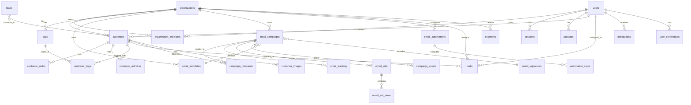
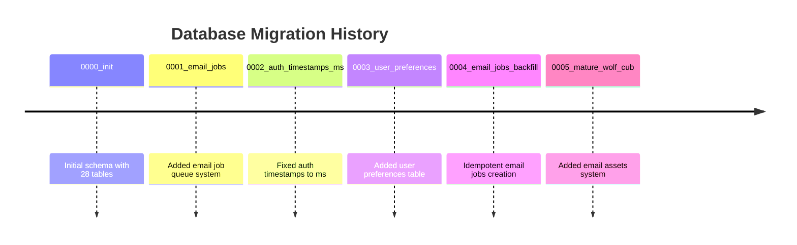
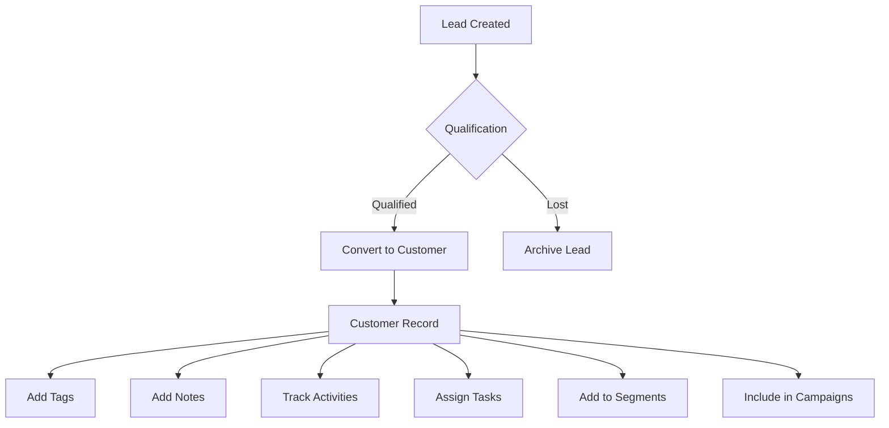
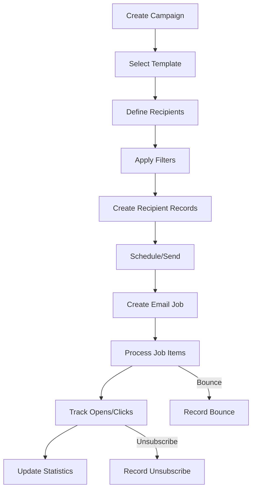

# Database Schema Analysis

**Generated:** 2026-02-14  
**Database Type:** SQLite (Turso/libSQL)  
**ORM:** Drizzle ORM  
**Schema File:** [`src/lib/db/schema.ts`](src/lib/db/schema.ts)

---

## Table of Contents

1. [Entity-Relationship Overview](#entity-relationship-overview)
2. [Database Configuration](#database-configuration)
3. [Complete Table Schemas](#complete-table-schemas)
4. [Migration History](#migration-history)
5. [Data Flow Patterns](#data-flow-patterns)
6. [Database Scripts](#database-scripts)

---

## Entity-Relationship Overview

### High-Level Architecture



### Domain Grouping

The database schema is organized into the following functional domains:

| Domain | Tables | Purpose |
|--------|--------|---------|
| **Multi-Tenant** | `organizations`, `organization_members`, `organization_invitations` | Organization management and membership |
| **Authentication** | `users`, `sessions`, `accounts`, `verification_tokens` | NextAuth.js compatible auth system |
| **CRM Core** | `customers`, `customer_notes`, `customer_activities`, `customer_tags`, `tags` | Customer relationship management |
| **Custom Fields** | `custom_fields`, `customer_custom_values` | Extensible customer data |
| **Leads** | `leads` | Lead management and conversion |
| **Email Marketing** | `email_templates`, `email_campaigns`, `campaign_recipients`, `email_signatures`, `email_assets`, `campaign_assets` | Email campaign management |
| **Email Jobs** | `email_jobs`, `email_job_items` | Background email sending queue |
| **Email Tracking** | `email_tracking`, `unsubscribes` | Email analytics and compliance |
| **Automations** | `email_automations`, `automation_steps` | Automated email workflows |
| **Integrations** | `gmail_credentials`, `google_calendar_tokens` | Third-party service connections |
| **Maps** | `saved_locations`, `territories`, `geocode_cache` | Geographic data |
| **Tasks** | `tasks` | Task management |
| **Segments** | `segments` | Saved customer filters |
| **System** | `sync_metadata`, `notifications`, `user_preferences` | System utilities |

---

## Database Configuration

### Connection Setup

**File:** [`src/lib/db/index.ts`](src/lib/db/index.ts)

```typescript
// Database connection uses Turso/libSQL
const DATABASE_URL = process.env.DATABASE_URL || process.env.TURSO_DATABASE_URL;
const DATABASE_AUTH_TOKEN = process.env.DATABASE_AUTH_TOKEN || process.env.TURSO_AUTH_TOKEN;

// Drizzle ORM initialization
export const db = drizzle(
  createClient({
    url: DATABASE_URL,
    authToken: DATABASE_AUTH_TOKEN,
  }),
  { schema }
);
```

### Drizzle Kit Configuration

**File:** [`drizzle.config.ts`](drizzle.config.ts)

| Setting | Value |
|---------|-------|
| Schema | `./src/lib/db/schema.ts` |
| Output | `./drizzle` |
| Dialect | `sqlite` or `turso` (auto-detected) |
| URL Source | `DATABASE_URL` or `TURSO_DATABASE_URL` |

### Environment Variables Required

| Variable | Purpose |
|----------|---------|
| `DATABASE_URL` | Primary database URL |
| `TURSO_DATABASE_URL` | Alternative Turso URL |
| `DATABASE_AUTH_TOKEN` | Auth token for Turso |
| `TURSO_AUTH_TOKEN` | Alternative auth token |

---

## Complete Table Schemas

### Multi-Tenant Tables

#### `organizations`

The root entity for multi-tenant data isolation.

| Column | Type | Constraints | Description |
|--------|------|--------------|-------------|
| `id` | text | PRIMARY KEY | Unique identifier |
| `name` | text | NOT NULL | Organization name |
| `slug` | text | NOT NULL, UNIQUE | URL-friendly identifier |
| `logo` | text | | Logo URL |
| `settings` | text (JSON) | | Organization settings object |
| `subscription_tier` | text | DEFAULT 'free' | Subscription level |
| `created_at` | integer (timestamp) | NOT NULL | Creation timestamp |
| `updated_at` | integer (timestamp) | NOT NULL | Last update timestamp |

**Settings JSON Structure:**
```typescript
{
  currency: string;
  dateFormat: string;
  timeFormat: string;
  timezone: string;
  language: string;
  companyProfile?: {
    vatId?: string;
    address?: string;
    city?: string;
    phone?: string;
    website?: string;
  };
}
```

#### `organization_members`

Junction table for user-organization membership.

| Column | Type | Constraints | Description |
|--------|------|--------------|-------------|
| `id` | text | PRIMARY KEY | Unique identifier |
| `user_id` | text | NOT NULL, FK -> users.id, CASCADE | User reference |
| `org_id` | text | NOT NULL, FK -> organizations.id, CASCADE | Organization reference |
| `role` | text | NOT NULL, DEFAULT 'member' | Role: owner, admin, member |
| `invited_at` | integer (timestamp) | | Invitation timestamp |
| `joined_at` | integer (timestamp) | NOT NULL | Join timestamp |

**Indexes:**
- `organization_members_user_org_uidx` (UNIQUE on user_id, org_id)

#### `organization_invitations`

Pending organization invitations.

| Column | Type | Constraints | Description |
|--------|------|--------------|-------------|
| `id` | text | PRIMARY KEY | Unique identifier |
| `email` | text | NOT NULL | Invitee email |
| `org_id` | text | NOT NULL, FK -> organizations.id, CASCADE | Organization reference |
| `role` | text | NOT NULL, DEFAULT 'member' | Assigned role |
| `token` | text | NOT NULL, UNIQUE | Invitation token |
| `expires_at` | integer (timestamp) | NOT NULL | Expiration timestamp |
| `created_at` | integer (timestamp) | NOT NULL | Creation timestamp |

---

### Authentication Tables (NextAuth.js Compatible)

#### `users`

User accounts with NextAuth.js compatibility.

| Column | Type | Constraints | Description |
|--------|------|--------------|-------------|
| `id` | text | PRIMARY KEY | Unique identifier |
| `name` | text | | Display name |
| `email` | text | NOT NULL, UNIQUE | Email address |
| `emailVerified` | integer (timestamp_ms) | | Email verification timestamp (ms) |
| `image` | text | | Profile image URL |
| `avatar` | text | | Avatar URL |
| `password_hash` | text | | Hashed password |
| `created_at` | integer (timestamp) | | Creation timestamp |
| `updated_at` | integer (timestamp) | | Update timestamp |

**Note:** `emailVerified` uses `timestamp_ms` mode (milliseconds) for NextAuth.js compatibility.

#### `sessions`

User sessions (NextAuth.js).

| Column | Type | Constraints | Description |
|--------|------|--------------|-------------|
| `sessionToken` | text | PRIMARY KEY | Session token |
| `userId` | text | NOT NULL, FK -> users.id, CASCADE | User reference |
| `expires` | integer (timestamp_ms) | NOT NULL | Expiration timestamp (ms) |

#### `accounts`

OAuth provider accounts (NextAuth.js).

| Column | Type | Constraints | Description |
|--------|------|--------------|-------------|
| `id` | text | PRIMARY KEY | Unique identifier |
| `userId` | text | NOT NULL, FK -> users.id, CASCADE | User reference |
| `type` | text | NOT NULL | Account type |
| `provider` | text | NOT NULL | Provider name |
| `providerAccountId` | text | NOT NULL | Provider account ID |
| `refresh_token` | text | | OAuth refresh token |
| `access_token` | text | | OAuth access token |
| `expires_at` | integer | | Token expiration |
| `token_type` | text | | Token type |
| `scope` | text | | OAuth scope |
| `id_token` | text | | ID token |
| `session_state` | text | | Session state |

**Indexes:**
- `accounts_provider_account_uidx` (UNIQUE on provider, providerAccountId)

#### `verification_tokens`

Email verification tokens (NextAuth.js).

| Column | Type | Constraints | Description |
|--------|------|--------------|-------------|
| `identifier` | text | NOT NULL | Identifier (usually email) |
| `token` | text | NOT NULL, UNIQUE | Verification token |
| `expires` | integer (timestamp_ms) | NOT NULL | Expiration timestamp (ms) |

---

### CRM Core Tables

#### `customers`

The central CRM entity with extensive business fields.

| Column | Type | Constraints | Description |
|--------|------|--------------|-------------|
| `id` | text | PRIMARY KEY | Unique identifier |
| `org_id` | text | NOT NULL, FK -> organizations.id, CASCADE | Organization reference |
| **Basic Info** | | | |
| `first_name` | text | NOT NULL | First name |
| `last_name` | text | | Last name |
| `company` | text | | Company name |
| `title` | text | | Job title |
| `avatar` | text | | Avatar URL |
| **Contact Info** | | | |
| `email` | text | | Primary email |
| `email_secondary` | text | | Secondary email |
| `phone` | text | | Primary phone |
| `phone_secondary` | text | | Secondary phone |
| `mobile` | text | | Mobile phone |
| `fax` | text | | Fax number |
| `website` | text | | Website URL |
| **Address** | | | |
| `street` | text | | Street address |
| `city` | text | | City |
| `state` | text | | State/region |
| `postal_code` | text | | Postal code |
| `country` | text | DEFAULT 'Greece' | Country |
| **Greek Business Fields** | | | |
| `afm` | text | | Tax ID (AFM) |
| `doy` | text | | Tax office (DOY) |
| `gemh` | text | | Business registry (GEMH) |
| `activity_code` | text | | Activity code (KAD) |
| `legal_form` | text | | Legal form (AE, EPE, IKE) |
| **Classification** | | | |
| `category` | text | DEFAULT 'retail' | Customer category |
| `lifecycle_stage` | text | DEFAULT 'customer' | Lifecycle stage |
| `lead_source` | text | | Lead source |
| `lead_score` | integer | DEFAULT 0 | Lead score |
| **Financial** | | | |
| `revenue` | real | DEFAULT 0 | Revenue amount |
| `currency` | text | DEFAULT 'EUR' | Currency |
| `payment_terms` | text | | Payment terms |
| `credit_limit` | real | | Credit limit |
| **Dates** | | | |
| `birthday` | text | | Birthday (YYYY-MM-DD) |
| `last_contact_date` | integer (timestamp) | | Last contact |
| `next_follow_up_date` | integer (timestamp) | | Next follow-up |
| **Location** | | | |
| `latitude` | real | | Latitude |
| `longitude` | real | | Longitude |
| `geocoded_at` | integer (timestamp) | | Geocode timestamp |
| **Metadata** | | | |
| `notes` | text | | General notes |
| `is_vip` | integer (boolean) | DEFAULT false | VIP flag |
| `is_active` | integer (boolean) | DEFAULT true | Active flag |
| `unsubscribed` | integer (boolean) | DEFAULT false | Unsubscribed flag |
| `created_at` | integer (timestamp) | NOT NULL | Creation timestamp |
| `updated_at` | integer (timestamp) | NOT NULL | Update timestamp |
| `created_by` | text | FK -> users.id | Creator reference |

**Indexes:**
- `customers_org_idx` (org_id)
- `customers_email_idx` (email)
- `customers_city_idx` (city)
- `customers_category_idx` (category)
- `customers_afm_idx` (afm)

**Category Values:** `retail`, `wholesale`, `fleet`, `garage`, `vip`, `premium`, `standard`, `basic`

**Lifecycle Stage Values:** `lead`, `prospect`, `customer`, `churned`

#### `customer_notes`

Notes attached to customers.

| Column | Type | Constraints | Description |
|--------|------|--------------|-------------|
| `id` | text | PRIMARY KEY | Unique identifier |
| `org_id` | text | NOT NULL, FK -> organizations.id, CASCADE | Organization reference |
| `customer_id` | text | NOT NULL, FK -> customers.id, CASCADE | Customer reference |
| `content` | text | NOT NULL | Note content |
| `is_pinned` | integer (boolean) | DEFAULT false | Pinned flag |
| `created_by` | text | NOT NULL, FK -> users.id | Creator reference |
| `created_at` | integer (timestamp) | NOT NULL | Creation timestamp |
| `updated_at` | integer (timestamp) | NOT NULL | Update timestamp |

**Indexes:**
- `notes_customer_idx` (customer_id)

#### `customer_activities`

Timeline of customer interactions.

| Column | Type | Constraints | Description |
|--------|------|--------------|-------------|
| `id` | text | PRIMARY KEY | Unique identifier |
| `org_id` | text | NOT NULL, FK -> organizations.id, CASCADE | Organization reference |
| `customer_id` | text | NOT NULL, FK -> customers.id, CASCADE | Customer reference |
| `type` | text | NOT NULL | Activity type |
| `title` | text | NOT NULL | Activity title |
| `description` | text | | Description |
| `metadata` | text (JSON) | | Additional metadata |
| `created_by` | text | FK -> users.id | Creator reference |
| `created_at` | integer (timestamp) | NOT NULL | Creation timestamp |

**Activity Types:** `email_sent`, `email_opened`, `call`, `meeting`, `note`, `status_change`, `tag_added`

**Indexes:**
- `activities_customer_idx` (customer_id)
- `activities_type_idx` (type)

#### `tags`

Organization-level tags for categorization.

| Column | Type | Constraints | Description |
|--------|------|--------------|-------------|
| `id` | text | PRIMARY KEY | Unique identifier |
| `org_id` | text | NOT NULL, FK -> organizations.id, CASCADE | Organization reference |
| `name` | text | NOT NULL | Tag name |
| `color` | text | NOT NULL, DEFAULT '#3B82F6' | Tag color |
| `description` | text | | Description |
| `created_at` | integer (timestamp) | NOT NULL | Creation timestamp |

**Indexes:**
- `tags_org_name_idx` (org_id, name)

#### `customer_tags`

Junction table for customer-tag relationships.

| Column | Type | Constraints | Description |
|--------|------|--------------|-------------|
| `id` | text | PRIMARY KEY | Unique identifier |
| `customer_id` | text | NOT NULL, FK -> customers.id, CASCADE | Customer reference |
| `tag_id` | text | NOT NULL, FK -> tags.id, CASCADE | Tag reference |
| `created_at` | integer (timestamp) | NOT NULL | Creation timestamp |

**Indexes:**
- `customer_tag_idx` (customer_id, tag_id)

---

### Custom Fields Tables

#### `custom_fields`

Organization-defined custom fields.

| Column | Type | Constraints | Description |
|--------|------|--------------|-------------|
| `id` | text | PRIMARY KEY | Unique identifier |
| `org_id` | text | NOT NULL, FK -> organizations.id, CASCADE | Organization reference |
| `name` | text | NOT NULL | Field name (internal) |
| `label` | text | NOT NULL | Display label |
| `type` | text | NOT NULL | Field type |
| `options` | text (JSON) | | Options for select fields |
| `required` | integer (boolean) | DEFAULT false | Required flag |
| `sort_order` | integer | DEFAULT 0 | Display order |
| `created_at` | integer (timestamp) | NOT NULL | Creation timestamp |

**Field Types:** `text`, `number`, `date`, `select`, `multiselect`, `checkbox`

#### `customer_custom_values`

Custom field values for customers.

| Column | Type | Constraints | Description |
|--------|------|--------------|-------------|
| `id` | text | PRIMARY KEY | Unique identifier |
| `customer_id` | text | NOT NULL, FK -> customers.id, CASCADE | Customer reference |
| `field_id` | text | NOT NULL, FK -> custom_fields.id, CASCADE | Field reference |
| `value` | text | | Field value |
| `created_at` | integer (timestamp) | NOT NULL | Creation timestamp |
| `updated_at` | integer (timestamp) | NOT NULL | Update timestamp |

**Indexes:**
- `custom_values_idx` (customer_id, field_id)

---

### Leads Table

#### `leads`

Lead management with conversion tracking.

| Column | Type | Constraints | Description |
|--------|------|--------------|-------------|
| `id` | text | PRIMARY KEY | Unique identifier |
| `org_id` | text | NOT NULL, FK -> organizations.id, CASCADE | Organization reference |
| **Basic Info** | | | |
| `first_name` | text | NOT NULL | First name |
| `last_name` | text | | Last name |
| `company` | text | | Company name |
| `email` | text | | Email address |
| `phone` | text | | Phone number |
| **Lead Info** | | | |
| `source` | text | NOT NULL | Lead source |
| `status` | text | NOT NULL, DEFAULT 'new' | Lead status |
| `score` | integer | DEFAULT 0 | Lead score |
| **Assignment** | | | |
| `assigned_to` | text | FK -> users.id | Assigned user |
| **Conversion** | | | |
| `converted_to_customer_id` | text | FK -> customers.id | Converted customer |
| `converted_at` | integer (timestamp) | | Conversion timestamp |
| `notes` | text | | Notes |
| `created_at` | integer (timestamp) | NOT NULL | Creation timestamp |
| `updated_at` | integer (timestamp) | NOT NULL | Update timestamp |

**Status Values:** `new`, `contacted`, `qualified`, `proposal`, `won`, `lost`

**Source Values:** `website`, `referral`, `import`, `manual`

**Indexes:**
- `leads_org_idx` (org_id)
- `leads_status_idx` (status)

---

### Email Marketing Tables

#### `email_templates`

Reusable email templates.

| Column | Type | Constraints | Description |
|--------|------|--------------|-------------|
| `id` | text | PRIMARY KEY | Unique identifier |
| `org_id` | text | NOT NULL, FK -> organizations.id, CASCADE | Organization reference |
| `name` | text | NOT NULL | Template name |
| `subject` | text | NOT NULL | Email subject |
| `content` | text | NOT NULL | HTML content |
| `category` | text | | Template category |
| `is_default` | integer (boolean) | DEFAULT false | Default flag |
| `thumbnail` | text | | Thumbnail URL |
| `created_by` | text | FK -> users.id | Creator reference |
| `created_at` | integer (timestamp) | NOT NULL | Creation timestamp |
| `updated_at` | integer (timestamp) | NOT NULL | Update timestamp |

**Category Values:** `welcome`, `offers`, `updates`, `birthday`

**Indexes:**
- `templates_org_category_idx` (org_id, category)

#### `email_campaigns`

Email marketing campaigns.

| Column | Type | Constraints | Description |
|--------|------|--------------|-------------|
| `id` | text | PRIMARY KEY | Unique identifier |
| `org_id` | text | NOT NULL, FK -> organizations.id, CASCADE | Organization reference |
| `name` | text | NOT NULL | Campaign name |
| `subject` | text | NOT NULL | Email subject |
| `content` | text | NOT NULL | HTML content |
| `template_id` | text | FK -> email_templates.id | Template reference |
| `signature_id` | text | FK -> email_signatures.id | Signature reference |
| `status` | text | NOT NULL, DEFAULT 'draft' | Campaign status |
| **Sending** | | | |
| `from_email` | text | | Sender email |
| `gmail_credential_id` | text | FK -> gmail_credentials.id | Gmail credentials |
| `recipient_filters` | text (JSON) | | Recipient filters |
| `scheduled_at` | integer (timestamp) | | Scheduled time |
| `sent_at` | integer (timestamp) | | Sent time |
| **Stats** | | | |
| `total_recipients` | integer | DEFAULT 0 | Total recipients |
| `sent_count` | integer | DEFAULT 0 | Sent count |
| `open_count` | integer | DEFAULT 0 | Open count |
| `click_count` | integer | DEFAULT 0 | Click count |
| `bounce_count` | integer | DEFAULT 0 | Bounce count |
| `unsubscribe_count` | integer | DEFAULT 0 | Unsubscribe count |
| `created_by` | text | FK -> users.id | Creator reference |
| `created_at` | integer (timestamp) | NOT NULL | Creation timestamp |
| `updated_at` | integer (timestamp) | NOT NULL | Update timestamp |

**Status Values:** `draft`, `scheduled`, `sending`, `sent`, `paused`, `cancelled`

**Recipient Filters JSON Structure:**
```typescript
{
  cities: string[];
  tags: string[];
  segments: string[];
  categories: string[];
}
```

**Indexes:**
- `campaigns_org_status_idx` (org_id, status)

#### `email_signatures`

Email signatures for campaigns.

| Column | Type | Constraints | Description |
|--------|------|--------------|-------------|
| `id` | text | PRIMARY KEY | Unique identifier |
| `org_id` | text | NOT NULL, FK -> organizations.id, CASCADE | Organization reference |
| `name` | text | NOT NULL | Signature name |
| `content` | text | NOT NULL | HTML content |
| `is_default` | integer (boolean) | DEFAULT false | Default flag |
| `created_by` | text | FK -> users.id | Creator reference |
| `created_at` | integer (timestamp) | NOT NULL | Creation timestamp |
| `updated_at` | integer (timestamp) | NOT NULL | Update timestamp |

#### `email_assets`

Uploaded email assets (images, files).

| Column | Type | Constraints | Description |
|--------|------|--------------|-------------|
| `id` | text | PRIMARY KEY | Unique identifier |
| `org_id` | text | NOT NULL, FK -> organizations.id, CASCADE | Organization reference |
| `uploader_user_id` | text | NOT NULL, FK -> users.id, CASCADE | Uploader reference |
| `blob_url` | text | NOT NULL | Blob storage URL |
| `blob_path` | text | NOT NULL | Blob storage path |
| `file_name` | text | NOT NULL | Original filename |
| `mime_type` | text | NOT NULL | MIME type |
| `size_bytes` | integer | NOT NULL | File size |
| `kind` | text | NOT NULL | Asset kind |
| `width` | integer | | Image width |
| `height` | integer | | Image height |
| `sha256` | text | NOT NULL | SHA256 hash |
| `created_at` | integer (timestamp) | NOT NULL | Creation timestamp |
| `updated_at` | integer (timestamp) | NOT NULL | Update timestamp |
| `deleted_at` | integer (timestamp) | | Soft delete timestamp |

**Kind Values:** `image`, `file`

**Indexes:**
- `email_assets_org_created_idx` (org_id, created_at)
- `email_assets_org_kind_idx` (org_id, kind)
- `email_assets_sha_idx` (sha256)

#### `campaign_assets`

Junction table for campaign-asset relationships.

| Column | Type | Constraints | Description |
|--------|------|--------------|-------------|
| `id` | text | PRIMARY KEY | Unique identifier |
| `campaign_id` | text | NOT NULL, FK -> email_campaigns.id, CASCADE | Campaign reference |
| `asset_id` | text | NOT NULL, FK -> email_assets.id, CASCADE | Asset reference |
| `role` | text | NOT NULL | Asset role |
| `embed_inline` | integer (boolean) | NOT NULL, DEFAULT false | Inline embed flag |
| `display_width_px` | integer | | Display width |
| `align` | text | | Alignment |
| `alt_text` | text | | Alt text |
| `sort_order` | integer | NOT NULL, DEFAULT 0 | Display order |
| `created_at` | integer (timestamp) | NOT NULL | Creation timestamp |
| `updated_at` | integer (timestamp) | NOT NULL | Update timestamp |

**Role Values:** `inline_image`, `attachment`
**Align Values:** `left`, `center`, `right`

**Indexes:**
- `campaign_assets_campaign_role_idx` (campaign_id, role)
- `campaign_assets_asset_idx` (asset_id)

#### `campaign_recipients`

Recipients for email campaigns.

| Column | Type | Constraints | Description |
|--------|------|--------------|-------------|
| `id` | text | PRIMARY KEY | Unique identifier |
| `campaign_id` | text | NOT NULL, FK -> email_campaigns.id, CASCADE | Campaign reference |
| `customer_id` | text | NOT NULL, FK -> customers.id, CASCADE | Customer reference |
| `email` | text | NOT NULL | Email address |
| `status` | text | NOT NULL, DEFAULT 'pending' | Recipient status |
| `sent_at` | integer (timestamp) | | Sent timestamp |
| `error_message` | text | | Error message |

**Status Values:** `pending`, `sent`, `failed`, `bounced`

**Indexes:**
- `recipients_campaign_idx` (campaign_id)

---

### Email Job Queue Tables

#### `email_jobs`

Background email sending job queue.

| Column | Type | Constraints | Description |
|--------|------|--------------|-------------|
| `id` | text | PRIMARY KEY | Unique identifier |
| `org_id` | text | NOT NULL, FK -> organizations.id, CASCADE | Organization reference |
| `campaign_id` | text | NOT NULL, FK -> email_campaigns.id, CASCADE | Campaign reference |
| `sender_user_id` | text | NOT NULL, FK -> users.id, CASCADE | Sender reference |
| `status` | text | NOT NULL, DEFAULT 'queued' | Job status |
| `run_at` | integer (timestamp) | NOT NULL | Scheduled run time |
| `attempts` | integer | NOT NULL, DEFAULT 0 | Attempt count |
| `max_attempts` | integer | NOT NULL, DEFAULT 3 | Max attempts |
| `locked_at` | integer (timestamp) | | Lock timestamp |
| `locked_by` | text | | Lock owner |
| `started_at` | integer (timestamp) | | Start timestamp |
| `completed_at` | integer (timestamp) | | Completion timestamp |
| `last_error` | text | | Last error message |
| `created_at` | integer (timestamp) | NOT NULL | Creation timestamp |
| `updated_at` | integer (timestamp) | NOT NULL | Update timestamp |

**Status Values:** `queued`, `processing`, `completed`, `failed`, `cancelled`

**Indexes:**
- `email_jobs_status_run_idx` (status, run_at)
- `email_jobs_campaign_idx` (campaign_id)

#### `email_job_items`

Individual email items within a job.

| Column | Type | Constraints | Description |
|--------|------|--------------|-------------|
| `id` | text | PRIMARY KEY | Unique identifier |
| `job_id` | text | NOT NULL, FK -> email_jobs.id, CASCADE | Job reference |
| `campaign_id` | text | NOT NULL, FK -> email_campaigns.id, CASCADE | Campaign reference |
| `recipient_id` | text | NOT NULL, FK -> campaign_recipients.id, CASCADE | Recipient reference |
| `status` | text | NOT NULL, DEFAULT 'pending' | Item status |
| `sent_at` | integer (timestamp) | | Sent timestamp |
| `error_message` | text | | Error message |
| `created_at` | integer (timestamp) | NOT NULL | Creation timestamp |
| `updated_at` | integer (timestamp) | NOT NULL | Update timestamp |

**Status Values:** `pending`, `sent`, `failed`

**Indexes:**
- `email_job_items_job_idx` (job_id)
- `email_job_items_campaign_idx` (campaign_id)

---

### Email Tracking Tables

#### `email_tracking`

Email open and click tracking.

| Column | Type | Constraints | Description |
|--------|------|--------------|-------------|
| `id` | text | PRIMARY KEY | Unique identifier |
| `campaign_id` | text | NOT NULL, FK -> email_campaigns.id, CASCADE | Campaign reference |
| `recipient_id` | text | NOT NULL, FK -> campaign_recipients.id, CASCADE | Recipient reference |
| `type` | text | NOT NULL | Tracking type |
| `link_url` | text | | Clicked URL |
| `ip_address` | text | | IP address |
| `user_agent` | text | | User agent |
| `created_at` | integer (timestamp) | NOT NULL | Creation timestamp |

**Type Values:** `open`, `click`

**Indexes:**
- `tracking_campaign_type_idx` (campaign_id, type)

#### `unsubscribes`

Email unsubscribe records.

| Column | Type | Constraints | Description |
|--------|------|--------------|-------------|
| `id` | text | PRIMARY KEY | Unique identifier |
| `org_id` | text | NOT NULL, FK -> organizations.id, CASCADE | Organization reference |
| `email` | text | NOT NULL | Email address |
| `reason` | text | | Unsubscribe reason |
| `campaign_id` | text | FK -> email_campaigns.id | Campaign reference |
| `created_at` | integer (timestamp) | NOT NULL | Creation timestamp |

**Indexes:**
- `unsubscribes_org_email_idx` (org_id, email)

---

### Email Automation Tables

#### `email_automations`

Automated email workflow definitions.

| Column | Type | Constraints | Description |
|--------|------|--------------|-------------|
| `id` | text | PRIMARY KEY | Unique identifier |
| `org_id` | text | NOT NULL, FK -> organizations.id, CASCADE | Organization reference |
| `name` | text | NOT NULL | Automation name |
| `description` | text | | Description |
| `trigger` | text | NOT NULL | Trigger type |
| `trigger_config` | text (JSON) | | Trigger configuration |
| `is_active` | integer (boolean) | DEFAULT false | Active flag |
| `created_by` | text | FK -> users.id | Creator reference |
| `created_at` | integer (timestamp) | NOT NULL | Creation timestamp |
| `updated_at` | integer (timestamp) | NOT NULL | Update timestamp |

**Trigger Values:** `customer_created`, `tag_added`, `birthday`, `inactivity`

#### `automation_steps`

Steps within an automation workflow.

| Column | Type | Constraints | Description |
|--------|------|--------------|-------------|
| `id` | text | PRIMARY KEY | Unique identifier |
| `automation_id` | text | NOT NULL, FK -> email_automations.id, CASCADE | Automation reference |
| `type` | text | NOT NULL | Step type |
| `config` | text (JSON) | | Step configuration |
| `sort_order` | integer | NOT NULL | Execution order |
| `created_at` | integer (timestamp) | NOT NULL | Creation timestamp |

**Step Types:** `send_email`, `wait`, `condition`, `add_tag`, `remove_tag`

---

### Integration Tables

#### `gmail_credentials`

Gmail OAuth credentials for sending.

| Column | Type | Constraints | Description |
|--------|------|--------------|-------------|
| `id` | text | PRIMARY KEY | Unique identifier |
| `org_id` | text | NOT NULL, FK -> organizations.id, CASCADE | Organization reference |
| `email` | text | NOT NULL | Gmail address |
| `access_token` | text | NOT NULL | OAuth access token |
| `refresh_token` | text | NOT NULL | OAuth refresh token |
| `expires_at` | integer (timestamp) | NOT NULL | Token expiration |
| `is_default` | integer (boolean) | DEFAULT false | Default flag |
| `created_at` | integer (timestamp) | NOT NULL | Creation timestamp |
| `updated_at` | integer (timestamp) | NOT NULL | Update timestamp |

#### `google_calendar_tokens`

Google Calendar OAuth credentials.

| Column | Type | Constraints | Description |
|--------|------|--------------|-------------|
| `id` | text | PRIMARY KEY | Unique identifier |
| `user_id` | text | NOT NULL, FK -> users.id, CASCADE | User reference |
| `access_token` | text | NOT NULL | OAuth access token |
| `refresh_token` | text | NOT NULL | OAuth refresh token |
| `expires_at` | integer (timestamp) | NOT NULL | Token expiration |
| `calendar_id` | text | | Calendar ID |
| `created_at` | integer (timestamp) | NOT NULL | Creation timestamp |
| `updated_at` | integer (timestamp) | NOT NULL | Update timestamp |

---

### Maps Tables

#### `saved_locations`

Saved geographic locations.

| Column | Type | Constraints | Description |
|--------|------|--------------|-------------|
| `id` | text | PRIMARY KEY | Unique identifier |
| `org_id` | text | NOT NULL, FK -> organizations.id, CASCADE | Organization reference |
| `name` | text | NOT NULL | Location name |
| `address` | text | | Address |
| `latitude` | real | NOT NULL | Latitude |
| `longitude` | real | NOT NULL | Longitude |
| `category` | text | | Location category |
| `notes` | text | | Notes |
| `created_by` | text | FK -> users.id | Creator reference |
| `created_at` | integer (timestamp) | NOT NULL | Creation timestamp |

**Category Values:** `office`, `warehouse`, `competitor`, `other`

#### `territories`

Geographic territories for assignment.

| Column | Type | Constraints | Description |
|--------|------|--------------|-------------|
| `id` | text | PRIMARY KEY | Unique identifier |
| `org_id` | text | NOT NULL, FK -> organizations.id, CASCADE | Organization reference |
| `name` | text | NOT NULL | Territory name |
| `color` | text | NOT NULL, DEFAULT '#3B82F6' | Display color |
| `geometry` | text (JSON) | | Geometry definition |
| `assigned_to` | text | FK -> users.id | Assigned user |
| `created_by` | text | FK -> users.id | Creator reference |
| `created_at` | integer (timestamp) | NOT NULL | Creation timestamp |
| `updated_at` | integer (timestamp) | NOT NULL | Update timestamp |

**Geometry JSON Structure:**
```typescript
{
  type: 'Polygon' | 'Circle';
  coordinates: number[][] | { center: number[]; radius: number };
}
```

#### `geocode_cache`

Cache for geocoding results.

| Column | Type | Constraints | Description |
|--------|------|--------------|-------------|
| `id` | text | PRIMARY KEY | Unique identifier |
| `address` | text | NOT NULL, UNIQUE | Address string |
| `latitude` | real | NOT NULL | Latitude |
| `longitude` | real | NOT NULL | Longitude |
| `formatted_address` | text | | Formatted address |
| `created_at` | integer (timestamp) | NOT NULL | Creation timestamp |

---

### Tasks Table

#### `tasks`

Task management.

| Column | Type | Constraints | Description |
|--------|------|--------------|-------------|
| `id` | text | PRIMARY KEY | Unique identifier |
| `org_id` | text | NOT NULL, FK -> organizations.id, CASCADE | Organization reference |
| `title` | text | NOT NULL | Task title |
| `description` | text | | Description |
| `customer_id` | text | FK -> customers.id, SET NULL | Customer reference |
| `assigned_to` | text | FK -> users.id | Assignee reference |
| `status` | text | NOT NULL, DEFAULT 'todo' | Task status |
| `priority` | text | NOT NULL, DEFAULT 'medium' | Priority level |
| `due_date` | integer (timestamp) | | Due date |
| `completed_at` | integer (timestamp) | | Completion timestamp |
| `created_by` | text | FK -> users.id | Creator reference |
| `created_at` | integer (timestamp) | NOT NULL | Creation timestamp |
| `updated_at` | integer (timestamp) | NOT NULL | Update timestamp |

**Status Values:** `todo`, `in_progress`, `done`
**Priority Values:** `low`, `medium`, `high`

**Indexes:**
- `tasks_org_status_idx` (org_id, status)
- `tasks_assigned_idx` (assigned_to)
- `tasks_due_date_idx` (due_date)

---

### Segments Table

#### `segments`

Saved customer filters/segments.

| Column | Type | Constraints | Description |
|--------|------|--------------|-------------|
| `id` | text | PRIMARY KEY | Unique identifier |
| `org_id` | text | NOT NULL, FK -> organizations.id, CASCADE | Organization reference |
| `name` | text | NOT NULL | Segment name |
| `description` | text | | Description |
| `filters` | text (JSON) | | Filter conditions |
| `customer_count` | integer | DEFAULT 0 | Cached count |
| `created_by` | text | FK -> users.id | Creator reference |
| `created_at` | integer (timestamp) | NOT NULL | Creation timestamp |
| `updated_at` | integer (timestamp) | NOT NULL | Update timestamp |

**Filters JSON Structure:**
```typescript
{
  conditions: Array<{
    field: string;
    operator: string;
    value: unknown;
  }>;
  logic: 'and' | 'or';
}
```

---

### System Tables

#### `sync_metadata`

Table synchronization tracking.

| Column | Type | Constraints | Description |
|--------|------|--------------|-------------|
| `id` | text | PRIMARY KEY | Unique identifier |
| `org_id` | text | NOT NULL, FK -> organizations.id, CASCADE | Organization reference |
| `table_name` | text | NOT NULL | Table name |
| `last_sync_at` | integer (timestamp) | NOT NULL | Last sync time |
| `sync_version` | integer | NOT NULL, DEFAULT 0 | Sync version |

#### `notifications`

User notifications.

| Column | Type | Constraints | Description |
|--------|------|--------------|-------------|
| `id` | text | PRIMARY KEY | Unique identifier |
| `user_id` | text | NOT NULL, FK -> users.id, CASCADE | User reference |
| `org_id` | text | NOT NULL, FK -> organizations.id, CASCADE | Organization reference |
| `type` | text | NOT NULL | Notification type |
| `title` | text | NOT NULL | Title |
| `message` | text | | Message body |
| `link` | text | | Action link |
| `is_read` | integer (boolean) | DEFAULT false | Read flag |
| `created_at` | integer (timestamp) | NOT NULL | Creation timestamp |

**Type Values:** `task_due`, `birthday`, `campaign_complete`

**Indexes:**
- `notifications_user_read_idx` (user_id, is_read)

#### `user_preferences`

User-specific preferences per organization.

| Column | Type | Constraints | Description |
|--------|------|--------------|-------------|
| `id` | text | PRIMARY KEY | Unique identifier |
| `user_id` | text | NOT NULL, FK -> users.id, CASCADE | User reference |
| `org_id` | text | NOT NULL, FK -> organizations.id, CASCADE | Organization reference |
| `notifications` | text (JSON) | NOT NULL | Notification preferences |
| `theme` | text | NOT NULL, DEFAULT 'dark' | UI theme |
| `created_at` | integer (timestamp) | NOT NULL | Creation timestamp |
| `updated_at` | integer (timestamp) | NOT NULL | Update timestamp |

**Notifications JSON Structure:**
```typescript
{
  email: boolean;
  push: boolean;
  birthdays: boolean;
  tasks: boolean;
  campaigns: boolean;
}
```

**Indexes:**
- `user_preferences_user_org_uidx` (UNIQUE on user_id, org_id)

#### `customer_images`

Images attached to customers.

| Column | Type | Constraints | Description |
|--------|------|--------------|-------------|
| `id` | text | PRIMARY KEY | Unique identifier |
| `customer_id` | text | NOT NULL, FK -> customers.id, CASCADE | Customer reference |
| `url` | text | NOT NULL | Image URL |
| `filename` | text | NOT NULL | Filename |
| `mime_type` | text | NOT NULL | MIME type |
| `size` | integer | NOT NULL | File size |
| `created_by` | text | FK -> users.id | Creator reference |
| `created_at` | integer (timestamp) | NOT NULL | Creation timestamp |

---

## Migration History

### Migration Timeline



### Migration Details

#### `0000_init.sql` - Initial Schema

**Created Tables (28):**
- Authentication: `users`, `sessions`, `accounts`, `verification_tokens`
- Multi-tenant: `organizations`, `organization_members`, `organization_invitations`
- CRM: `customers`, `customer_notes`, `customer_activities`, `customer_tags`, `tags`
- Custom fields: `custom_fields`, `customer_custom_values`
- Leads: `leads`
- Email: `email_templates`, `email_campaigns`, `email_signatures`, `campaign_recipients`, `email_tracking`, `unsubscribes`, `email_automations`, `automation_steps`
- Integrations: `gmail_credentials`, `google_calendar_tokens`
- Maps: `saved_locations`, `territories`, `geocode_cache`
- System: `sync_metadata`, `notifications`, `tasks`, `segments`, `customer_images`

**Key Characteristics:**
- SQLite dialect with backtick identifiers
- All timestamps use integer mode
- Cascade delete on most foreign keys
- Comprehensive indexing for query optimization

#### `0001_email_jobs.sql` - Email Job Queue

**Created Tables (2):**
- `email_jobs` - Job queue for batch email sending
- `email_job_items` - Individual email items within jobs

**Purpose:** Enables background processing of large email campaigns with retry logic and status tracking.

#### `0002_auth_timestamps_ms.sql` - Auth Timestamp Fix

**Changes:**
- Updates `sessions.expires` from seconds to milliseconds
- Updates `verification_tokens.expires` from seconds to milliseconds
- Updates `users.emailVerified` from seconds to milliseconds

**Heuristic:** Values < 1e12 are assumed to be seconds and multiplied by 1000.

**Reason:** NextAuth.js expects millisecond timestamps for email magic-link tokens to work correctly.

#### `0003_user_preferences.sql` - User Preferences

**Created Tables (1):**
- `user_preferences` - Per-user, per-organization preferences

**Note:** Uses double-quote identifiers (PostgreSQL style) instead of backticks.

#### `0004_email_jobs_backfill.sql` - Idempotent Email Jobs

**Purpose:** Creates `email_jobs` and `email_job_items` tables with `IF NOT EXISTS` for idempotent migration.

**Reason:** Ensures migration can run safely on databases that may already have these tables from migration 0001.

#### `0005_mature_wolf_cub.sql` - Email Assets System

**Created Tables (3):**
- `email_assets` - Uploaded files for email campaigns
- `campaign_assets` - Junction table linking campaigns to assets
- `user_preferences` - Also creates user_preferences if not exists

**Features:**
- SHA256 deduplication
- Soft delete support (`deleted_at`)
- Image dimension tracking
- Blob storage integration

---

## Data Flow Patterns

### Customer Data Flow



### Email Campaign Flow



### Multi-Tenant Isolation

All tenant-scoped tables include `org_id` with:
- Foreign key to `organizations.id`
- `ON DELETE CASCADE` for cleanup
- Index on `org_id` for query performance
- Application-level filtering by organization membership

### Timestamp Patterns

| Pattern | Mode | Use Case |
|---------|------|----------|
| `timestamp` | Seconds since epoch | General timestamps (created_at, updated_at) |
| `timestamp_ms` | Milliseconds since epoch | NextAuth.js fields (expires, emailVerified) |

---

## Database Scripts

### Migration Scripts

| Script | Purpose |
|--------|---------|
| [`migrate-to-turso.js`](scripts/migrate-to-turso.js) | Migrates customer data from JSON to Turso |
| [`fast-migrate.js`](scripts/fast-migrate.js) | Batch migration with chunking (50 records/batch) |
| [`setup-auth-tables.ts`](scripts/setup-auth-tables.ts) | Creates NextAuth.js compatible auth tables |
| [`fix-users-table.ts`](scripts/fix-users-table.ts) | Recreates users table for NextAuth compatibility |

### Utility Scripts

| Script | Purpose |
|--------|---------|
| [`check-data.ts`](scripts/check-data.ts) | Data verification |
| [`test-statistics.ts`](scripts/test-statistics.ts) | Statistics testing |
| [`migrate-excel.ts`](scripts/migrate-excel.ts) | Excel data migration |
| [`read-excel.js`](scripts/read-excel.js) | Excel file reading |

### Drizzle Utilities

| Script | Purpose |
|--------|---------|
| [`print-drizzle-migrations.cjs`](scripts/print-drizzle-migrations.cjs) | Lists pending migrations |
| [`turso-print-drizzle.cjs`](scripts/turso-print-drizzle.cjs) | Turso-specific migration listing |
| [`turso-baseline-drizzle.cjs`](scripts/turso-baseline-drizzle.cjs) | Baseline migration tracking |
| [`collect-baseline.cjs`](scripts/collect-baseline.cjs) | Baseline collection |

---

## Summary Statistics

| Metric | Count |
|--------|-------|
| **Total Tables** | 33 |
| **Total Indexes** | 28 |
| **Foreign Key Relationships** | 45+ |
| **Domain Areas** | 14 |
| **Migrations** | 6 |

### Table Distribution by Domain

| Domain | Tables |
|--------|--------|
| Email Marketing | 11 |
| CRM Core | 7 |
| Authentication | 4 |
| Multi-Tenant | 3 |
| Maps | 3 |
| System | 3 |
| Custom Fields | 2 |
| Email Jobs | 2 |
| Integrations | 2 |
| Leads | 1 |
| Tasks | 1 |
| Segments | 1 |

---

## Key Design Patterns

1. **Multi-Tenant Architecture**: All business data scoped to `org_id` with cascade delete
2. **Soft Deletes**: `deleted_at` column for recoverable deletion (email_assets)
3. **JSON Configuration**: Complex settings stored as JSON text columns
4. **Timestamp Modes**: Mixed second/millisecond timestamps for NextAuth compatibility
5. **Job Queue Pattern**: Database-backed queue with locking for email sending
6. **Polymorphic Tracking**: Single `email_tracking` table for opens and clicks
7. **Tag-based Categorization**: Flexible tagging system for customers
8. **Custom Field Extension**: Dynamic field definitions per organization
9. **Lead Conversion Flow**: Structured lead-to-customer conversion tracking
10. **Asset Deduplication**: SHA256 hashing for file deduplication

---

*This analysis serves as the source of truth for the database architecture in the final architectural map.*