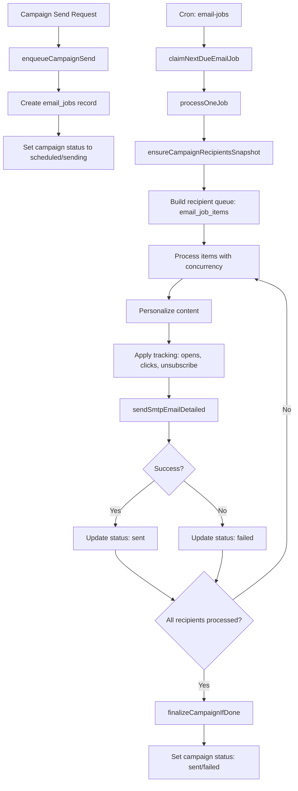
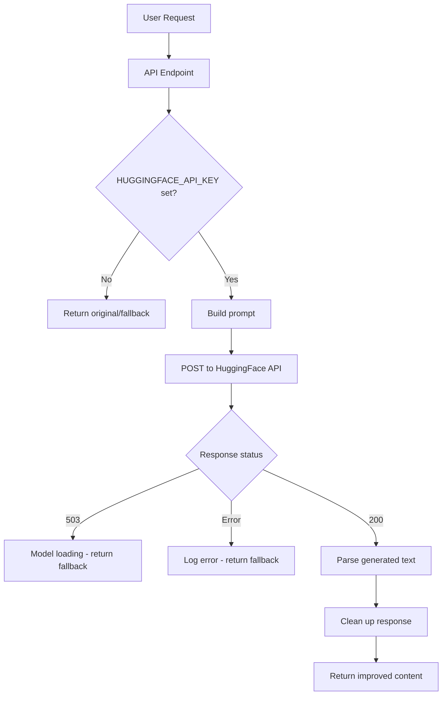
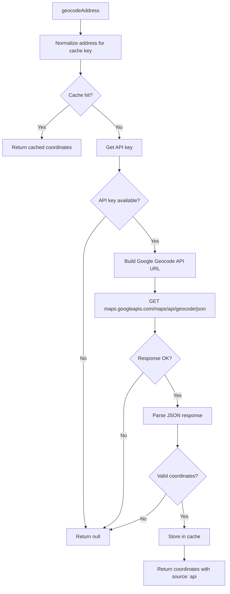
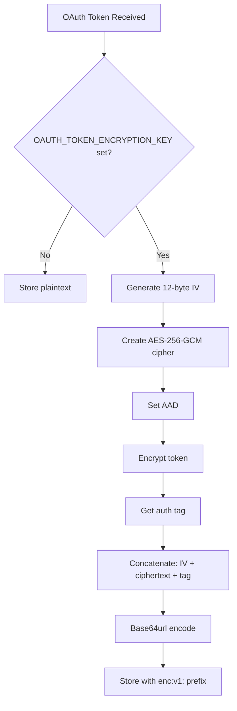
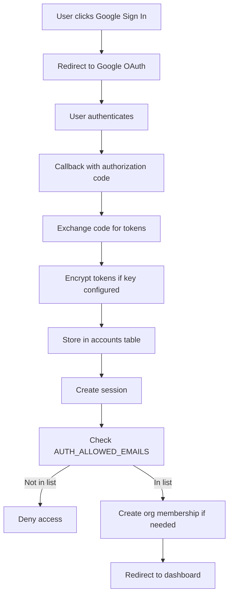
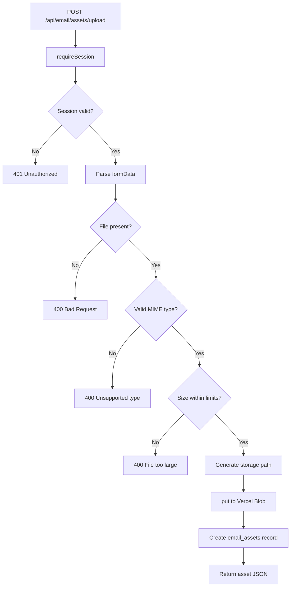
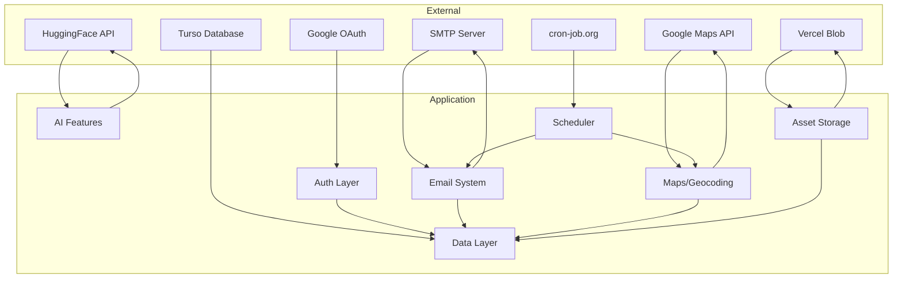

# External Service Integrations Analysis

## Overview

This document provides a comprehensive analysis of all external service integrations in the KK Tires CRM application. The application integrates with seven distinct external services, each serving specific purposes within the system's architecture.

---

## External Services Catalog

| Service | Provider | Purpose | Criticality |
|---------|----------|---------|-------------|
| Cron Jobs | cron-job.org | Scheduled task execution | High |
| Email System | SMTP/Nodemailer | Email delivery | High |
| AI Integration | HuggingFace/Meltemi | Greek language AI assistance | Medium |
| Geocoding | Google Maps API | Address-to-coordinate conversion | Medium |
| OAuth | Google OAuth 2.0 | User authentication | High |
| Blob Storage | Vercel Blob | File/image storage | Medium |
| Database | Turso/libSQL | Data persistence | Critical |

---

## 1. Cron Job Services (cron-job.org)

### Purpose
External scheduler for periodic task execution, specifically for email job processing and customer geocoding.

### API Endpoints

#### [`/api/cron/email-jobs`](src/app/api/cron/email-jobs/route.ts:17)
- **Method**: GET
- **Purpose**: Process due email jobs from the queue
- **Execution Flow**:
  1. Validates cron authorization
  2. Processes email jobs within time budget (default 8000ms)
  3. Handles max 5 jobs per run (configurable)
  4. Cleans up orphan email assets

#### [`/api/cron/geocode-customers`](src/app/api/cron/geocode-customers/route.ts:20)
- **Method**: GET
- **Purpose**: Backfill geocodes for customers missing coordinates
- **Execution Flow**:
  1. Validates cron authorization
  2. Queries customers with null latitude/longitude
  3. Geocodes addresses (max 25 per run, configurable 1-100)
  4. Updates customer records with coordinates

### Authentication Mechanism

Defined in [`src/server/cron/auth.ts`](src/server/cron/auth.ts:22):

```typescript
// Three authentication patterns supported:
// 1. Bearer token: Authorization: Bearer <CRON_SECRET>
// 2. Custom header: x-cron-secret: <CRON_SECRET> or x-api-key: <CRON_SECRET>
// 3. Query param: ?cron_secret=<CRON_SECRET> or ?key=<CRON_SECRET> or ?token=<CRON_SECRET>
```

**Authorization Logic**:
- If `CRON_SECRET` is not set: Allow only in non-production environments
- If `CRON_SECRET` is set: Require matching secret via any supported method

### Environment Variables

| Variable | Required | Default | Description |
|----------|----------|---------|-------------|
| `CRON_SECRET` | Production | - | Shared secret for cron authentication |
| `EMAIL_CRON_TIME_BUDGET_MS` | No | 8000 | Max execution time per run |
| `EMAIL_CRON_MAX_JOBS` | No | 5 | Max jobs to process per run |
| `EMAIL_JOB_MAX_ITEMS_PER_RUN` | No | 450 | Max email items per job run |
| `EMAIL_JOB_CONCURRENCY` | No | 4 | Parallel email sends |
| `EMAIL_JOB_LOCK_TIMEOUT_MS` | No | 900000 | Job lock timeout (15 min) |
| `EMAIL_ASSET_CLEANUP_ENABLED` | No | 1 | Enable orphan asset cleanup |
| `EMAIL_ASSET_CLEANUP_HOURS` | No | 24 | Age threshold for cleanup |
| `EMAIL_ASSET_CLEANUP_LIMIT` | No | 200 | Max assets to clean per run |

### Data Flow Diagram

```mermaid
flowchart TD
    A[cron-job.org Scheduler] -->|HTTP GET with CRON_SECRET| B[/api/cron/email-jobs]
    A -->|HTTP GET with CRON_SECRET| C[/api/cron/geocode-customers]
    
    B --> D{isCronAuthorized}
    D -->|Unauthorized| E[401 Unauthorized]
    D -->|Authorized| F[processDueEmailJobs]
    F --> G[claimNextDueEmailJob]
    G --> H[processOneJob]
    H --> I[sendEmail via SMTP]
    I --> J[Update campaign_recipients]
    
    C --> K{isCronAuthorized}
    K -->|Unauthorized| E
    K -->|Authorized| L[Query customers without coords]
    L --> M[geocodeAddress via Google API]
    M --> N[Update customers table]
```

### Error Handling
- Returns structured JSON error responses with `requestId` for tracing
- Logs errors to console with `requestId` prefix
- Non-blocking: continues processing even if individual items fail
- Graceful degradation: returns partial results on timeout

---

## 2. Email System (SMTP/Nodemailer)

### Purpose
Primary email delivery system for campaign emails and authentication messages.

### Core Components

#### SMTP Configuration - [`src/server/email/smtp.ts`](src/server/email/smtp.ts:1)
- **Transport**: Nodemailer
- **Connection Pooling**: Singleton transport instance
- **Security**: Supports implicit TLS (port 465) and STARTTLS

#### Email Job Queue - [`src/server/email/job-queue.ts`](src/server/email/job-queue.ts:1)
- **Queue Table**: `email_jobs`
- **Job States**: queued, processing, completed, failed, cancelled
- **Locking**: Distributed lock with timeout (15 min default)
- **Recovery**: Automatic stale job recovery for crashed workers

#### Email Transport - [`src/server/email/transport.ts`](src/server/email/transport.ts:1)
- **Provider**: SMTP only (no fallback providers)
- **Interface**: Unified `sendEmail()` function

### Environment Variables

| Variable | Required | Default | Description |
|----------|----------|---------|-------------|
| `SMTP_HOST` | Yes | - | SMTP server hostname |
| `SMTP_PORT` | Yes | 587 | SMTP server port |
| `SMTP_SECURE` | No | false | Use implicit TLS |
| `SMTP_USER` | Yes | - | SMTP authentication username |
| `SMTP_PASS` | Yes | - | SMTP authentication password |
| `SMTP_FROM` | No | SMTP_USER | Default From address |

### SMTP Configuration Logic

```typescript
// Secure connection determination:
const secure = 
  SMTP_SECURE === 'true' || 
  SMTP_SECURE === '1' || 
  port === 465;  // Port 465 = implicit TLS
```

### Email Sending Workflow



### Email Tracking - [`src/server/email/tracking.ts`](src/server/email/tracking.ts:1)

**Tracking Mechanisms**:
1. **Open Tracking**: 1x1 pixel image injected before `</body>`
2. **Click Tracking**: All HTTP/HTTPS links rewritten to tracking URLs
3. **Unsubscribe**: Footer with unsubscribe link

**URL Signing**:
- Uses HMAC-SHA256 with `EMAIL_TRACKING_SECRET`
- Prevents forgery of tracking URLs
- Base64url encoding for URL-safe signatures

**Tracking URL Format**:
```
/api/email/tracking?cid=<campaignId>&rid=<recipientId>&sig=<signature>
/api/email/click?cid=<campaignId>&rid=<recipientId>&u=<destinationUrl>&sig=<signature>
/api/unsubscribe?cid=<campaignId>&rid=<recipientId>&sig=<signature>
```

### Error Handling

| Error Code | Description | Recovery |
|------------|-------------|----------|
| `SMTP_NOT_CONFIGURED` | Missing SMTP env vars | Block email operations |
| `SMTP_SEND_FAILED` | Send operation failed | Retry via job queue |

### Rate Limiting
- **Per-Run Limits**: `EMAIL_JOB_MAX_ITEMS_PER_RUN` (default 450)
- **Concurrency**: `EMAIL_JOB_CONCURRENCY` (default 4)
- **Time Budget**: `EMAIL_CRON_TIME_BUDGET_MS` (default 8000ms)
- **Yield Delay**: `EMAIL_JOB_YIELD_DELAY_MS` (default 0)

---

## 3. AI Integration (HuggingFace/Meltemi)

### Purpose
Greek language AI assistance for email composition using the Meltemi-7B model.

### Model Details
- **Provider**: HuggingFace Inference API
- **Model**: `ilsp/Meltemi-7B-v1`
- **Capabilities**: Greek text generation, email expansion, subject line generation
- **API Endpoint**: `https://api-inference.huggingface.co/models/ilsp/Meltemi-7B-v1`

### Core Module - [`src/lib/ai/meltemi.ts`](src/lib/ai/meltemi.ts:1)

### API Endpoints

#### [`/api/ai/email-assist`](src/app/api/ai/email-assist/route.ts:14)
- **Method**: POST
- **Purpose**: Improve email text with specified tone
- **Input**: `{ content: string, tone: 'professional' | 'friendly' | 'formal' }`
- **Output**: `{ improved: string, source: 'meltemi' | 'fallback' }`

#### [`/api/ai/email-expand`](src/app/api/ai/email-expand/route.ts:20)
- **Method**: POST
- **Purpose**: Expand brief note into full Greek email
- **Input**: `{ briefNote: string, customer?: CustomerContext }`
- **Output**: `{ generatedText: string, source: 'meltemi' | 'fallback' }`

#### [`/api/ai/email-subjects`](src/app/api/ai/email-subjects/route.ts:13)
- **Method**: POST
- **Purpose**: Generate Greek subject line suggestions
- **Input**: `{ emailContent: string, count?: number }`
- **Output**: `{ suggestions: string[], source: 'meltemi' | 'fallback' }`

### Environment Variables

| Variable | Required | Description |
|----------|----------|-------------|
| `HUGGINGFACE_API_KEY` | Yes | HuggingFace API key |
| `MELTEMI_MODEL` | No | Model identifier (default: ilsp/Meltemi-7B-v1) |

### Request/Response Format

**Request Headers**:
```
Authorization: Bearer <HUGGINGFACE_API_KEY>
Content-Type: application/json
```

**Request Body**:
```json
{
  "inputs": "<prompt>",
  "parameters": {
    "max_new_tokens": 500,
    "temperature": 0.7,
    "top_p": 0.95,
    "do_sample": true,
    "return_full_text": false
  }
}
```

**Response**:
```json
[
  {
    "generated_text": "<generated content>"
  }
]
```

### Model Parameters by Endpoint

| Endpoint | max_new_tokens | temperature | top_p | repetition_penalty |
|----------|----------------|-------------|-------|-------------------|
| email-assist | 500 | 0.7 | 0.95 | - |
| email-expand | 500 | 0.7 | 0.9 | 1.1 |
| email-subjects | 200 | 0.8 | - | - |

### Error Handling

| Status | Condition | Response |
|--------|-----------|----------|
| 503 | Model loading | Return original content with message |
| Other non-200 | API error | Return original content (fallback) |
| Network error | Connection failed | Return original content (fallback) |

### Fallback Strategy
All AI endpoints implement graceful degradation:
- If API key missing: Return original content
- If model loading (503): Return original with retry message
- If any error: Return original content, log error

### Data Flow Diagram



---

## 4. Google Maps/Geocoding

### Purpose
Convert customer addresses to geographic coordinates for map display and location-based features.

### Core Module - [`src/server/maps/geocode.ts`](src/server/maps/geocode.ts:1)

### API Endpoints

#### [`/api/maps/geocode/backfill`](src/app/api/maps/geocode/backfill/route.ts:19)
- **Method**: POST
- **Purpose**: Manual geocode backfill for customer addresses
- **Auth**: Requires owner/admin role
- **Query Params**: `limit` (1-100, default 25)

#### [`/api/cron/geocode-customers`](src/app/api/cron/geocode-customers/route.ts:20)
- **Method**: GET
- **Purpose**: Scheduled geocode processing
- **Auth**: Cron authorization
- **Query Params**: `limit` (1-100, default 25)

### Environment Variables

| Variable | Required | Description |
|----------|----------|-------------|
| `GOOGLE_GEOCODING_API_KEY` | Recommended | Server-side geocoding key |
| `NEXT_PUBLIC_GOOGLE_MAPS_API_KEY` | Fallback | Client-side maps key (used if server key missing) |

### Caching Mechanism

**Cache Table**: `geocode_cache`
- **Key**: Normalized address string
- **Fields**: `address`, `latitude`, `longitude`, `formattedAddress`, `createdAt`
- **Strategy**: Persistent cache with no expiration
- **Conflict Resolution**: `onConflictDoNothing()` - first write wins

### Geocoding Flow



### API Request Format
```
GET https://maps.googleapis.com/maps/api/geocode/json?address=<address>&key=<API_KEY>
```

### Response Parsing
```typescript
// Expected response structure
{
  results: [{
    formatted_address: string,
    geometry: {
      location: {
        lat: number,
        lng: number
      }
    }
  }]
}
```

### Rate Limiting
- **Per-Request**: No explicit rate limiting in code
- **Batch Limits**: Max 25-100 addresses per run
- **External**: Subject to Google Maps API quotas

### Error Handling
- Invalid addresses: Return null (no error thrown)
- API errors: Return null, no caching
- Network errors: Caught and return null

---

## 5. Google OAuth Integration

### Purpose
User authentication via Google OAuth 2.0 with optional Gmail send permissions.

### Core Configuration - [`src/auth.ts`](src/auth.ts:1)

### OAuth Provider Setup

```typescript
Google({
  clientId: GOOGLE_CLIENT_ID,
  clientSecret: GOOGLE_CLIENT_SECRET,
  authorization: {
    params: {
      prompt: 'consent',
      access_type: 'offline',
      response_type: 'code',
      scope: 'openid email profile https://www.googleapis.com/auth/gmail.send'
    }
  }
})
```

### Environment Variables

| Variable | Required | Description |
|----------|----------|-------------|
| `GOOGLE_CLIENT_ID` | For Google OAuth | Google OAuth client ID |
| `GOOGLE_CLIENT_SECRET` | For Google OAuth | Google OAuth client secret |
| `AUTH_SECRET` / `NEXTAUTH_SECRET` | Yes | Session encryption secret |
| `NEXTAUTH_URL` | Yes | Application base URL |
| `OAUTH_TOKEN_ENCRYPTION_KEY` | Recommended | Base64 32-byte key for token encryption |
| `AUTH_ALLOWED_EMAILS` | Yes | Comma-separated allowed emails |

### OAuth Scopes

| Scope | Purpose |
|-------|---------|
| `openid` | OpenID Connect authentication |
| `email` | Access to email address |
| `profile` | Access to profile information |
| `https://www.googleapis.com/auth/gmail.send` | Send emails via Gmail API |

### Token Storage

**Table**: `accounts` (via DrizzleAdapter)
- **Fields**: `access_token`, `refresh_token`, `id_token`, `scope`, `expires_at`
- **Encryption**: Optional AES-256-GCM encryption at rest

### Token Encryption - [`src/server/crypto/oauth-tokens.ts`](src/server/crypto/oauth-tokens.ts:1)

**Encryption Details**:
- **Algorithm**: AES-256-GCM
- **IV Size**: 12 bytes
- **Auth Tag**: 16 bytes
- **AAD**: "kktires-oauth-token"
- **Format**: `enc:v1:<base64url(iv + ciphertext + tag)>`

**Encryption Flow**:


### Integration Status Endpoint

[`/api/integrations/gmail`](src/app/api/integrations/gmail/route.ts:5):
```json
{
  "connected": true,
  "hasRefreshToken": true,
  "scope": "openid email profile https://www.googleapis.com/auth/gmail.send",
  "email": "user@example.com"
}
```

### Session Strategy
- **Strategy**: Database-backed sessions
- **Table**: `sessions`
- **Expiry**: Handled by NextAuth.js defaults

### Sign-In Flow



---

## 6. Blob Storage (Vercel Blob)

### Purpose
Persistent storage for email assets (images, attachments) used in email campaigns.

### Core Module - [`src/server/email/assets.ts`](src/server/email/assets.ts:1)

### Upload Endpoint

[`/api/email/assets/upload`](src/app/api/email/assets/upload/route.ts:23):
- **Method**: POST
- **Content-Type**: multipart/form-data
- **Auth**: Session required
- **Fields**: `file` (required), `kind`, `width`, `height`

### Environment Variables

| Variable | Required | Description |
|----------|----------|-------------|
| `BLOB_READ_WRITE_TOKEN` | Yes | Vercel Blob read/write token |

### Storage Patterns

**Path Format**: `email-assets/<orgId>/<timestamp>-<nanoid>.<extension>`

**Example**: `email-assets/org_kktires/1708000000000-abc123.jpg`

### Asset Types and Limits

| Type | Max Size | Allowed MIME Types |
|------|----------|-------------------|
| Image | 8 MB | image/jpeg, image/png, image/webp, image/gif |
| File | 10 MB | All image types + PDF, DOCX, XLSX, CSV, TXT, ZIP |

### Asset Management

**Database Table**: `email_assets`
- `id`: `ast_<nanoid>`
- `blobUrl`: Vercel Blob public URL
- `blobPath`: Storage path
- `fileName`: Original filename
- `mimeType`: Content type
- `sizeBytes`: File size
- `kind`: 'image' | 'file'
- `sha256`: Content hash for deduplication
- `deletedAt`: Soft delete timestamp

### Campaign Asset Linking

**Table**: `campaign_assets`
- Links assets to campaigns
- Roles: `inline_image`, `attachment`
- Configuration: `embedInline`, `displayWidthPx`, `align`, `altText`

### Upload Flow



### Cleanup Mechanism

**Function**: `cleanupOrphanEmailAssets()`
- Removes assets not linked to any campaign
- Threshold: 24 hours old (configurable)
- Limit: 200 assets per run (configurable)
- Called by: `/api/cron/email-jobs`

---

## 7. Database Service (Turso/libSQL)

### Purpose
Primary data persistence layer using Turso's edge database platform.

### Core Module - [`src/lib/db/index.ts`](src/lib/db/index.ts:1)

### Connection Configuration

```typescript
// Connection URL priority:
const DATABASE_URL = 
  process.env.DATABASE_URL || 
  process.env.TURSO_DATABASE_URL;

// Auth token priority:
const DATABASE_AUTH_TOKEN = 
  process.env.DATABASE_AUTH_TOKEN || 
  process.env.TURSO_AUTH_TOKEN;
```

### Environment Variables

| Variable | Required | Description |
|----------|----------|-------------|
| `DATABASE_URL` | Yes | Turso database URL (libsql://...) |
| `DATABASE_AUTH_TOKEN` | Yes | Turso authentication token |
| `TURSO_DATABASE_URL` | Alt | Legacy/alternate database URL |
| `TURSO_AUTH_TOKEN` | Alt | Legacy/alternate auth token |

### Connection Implementation

```typescript
import { drizzle } from 'drizzle-orm/libsql';
import { createClient } from '@libsql/client';

const client = createClient({
  url: DATABASE_URL,
  authToken: DATABASE_AUTH_TOKEN || undefined
});

export const db = drizzle(client, { schema });
```

### Fallback Mechanism

When database is not configured:
- `isDatabaseConfigured` = false
- `db` returns a proxy that throws on any operation
- Auth exports return handlers that throw `DATABASE_URL is required`

### Schema Management

- **ORM**: Drizzle ORM
- **Schema Location**: [`src/lib/db/schema.ts`](src/lib/db/schema.ts)
- **Migrations**: [`drizzle/`](drizzle/) directory
- **Migration API**: [`/api/db/migrate`](src/app/api/db/migrate/route.ts)

### Connection Pooling

- **Client**: `@libsql/client`
- **Pooling**: Handled by Turso platform
- **Edge Optimization**: Native support for edge deployments

### Database Tables Summary

| Table | Purpose |
|-------|---------|
| `users` | User accounts |
| `accounts` | OAuth provider accounts |
| `sessions` | User sessions |
| `organizations` | Organization records |
| `organization_members` | User-org memberships |
| `customers` | Customer CRM data |
| `leads` | Sales leads |
| `tags`, `customer_tags` | Tagging system |
| `segments` | Customer segments |
| `email_campaigns` | Email campaigns |
| `campaign_recipients` | Campaign recipient list |
| `email_jobs`, `email_job_items` | Email job queue |
| `email_assets`, `campaign_assets` | Email attachments |
| `email_signatures` | User email signatures |
| `geocode_cache` | Geocoding cache |
| `user_preferences` | User settings |

---

## Authentication & Security Summary

### Authentication Methods

| Service | Method | Secret/Key |
|---------|--------|------------|
| Cron Jobs | Shared secret | `CRON_SECRET` |
| SMTP | Basic auth | `SMTP_USER` / `SMTP_PASS` |
| HuggingFace | Bearer token | `HUGGINGFACE_API_KEY` |
| Google Maps | API key | `GOOGLE_GEOCODING_API_KEY` |
| Google OAuth | OAuth 2.0 | `GOOGLE_CLIENT_ID` / `GOOGLE_CLIENT_SECRET` |
| Vercel Blob | Bearer token | `BLOB_READ_WRITE_TOKEN` |
| Turso | Auth token | `DATABASE_AUTH_TOKEN` |

### Token/Secret Encryption

| Data | Encryption | Key |
|------|------------|-----|
| OAuth tokens | AES-256-GCM | `OAUTH_TOKEN_ENCRYPTION_KEY` |
| Tracking URLs | HMAC-SHA256 | `EMAIL_TRACKING_SECRET` |
| Sessions | NextAuth secret | `AUTH_SECRET` / `NEXTAUTH_SECRET` |

---

## Error Handling Patterns

### Common Patterns Across Services

1. **Graceful Degradation**: Return fallback values when external services fail
2. **Request Tracing**: All API responses include `requestId` for debugging
3. **Structured Errors**: JSON format with `error`, `code`, `requestId`
4. **Console Logging**: Errors logged with context prefix

### Error Response Format

```json
{
  "error": "Human-readable message",
  "code": "ERROR_CODE",
  "requestId": "req_xxx"
}
```

---

## Configuration Requirements Summary

### Required for Production

| Variable | Service | Notes |
|----------|---------|-------|
| `DATABASE_URL` | Database | Turso connection string |
| `DATABASE_AUTH_TOKEN` | Database | Turso auth |
| `AUTH_SECRET` | Auth | Session encryption |
| `NEXTAUTH_URL` | Auth | Base URL |
| `AUTH_ALLOWED_EMAILS` | Auth | Access control |
| `CRON_SECRET` | Cron | Job authentication |
| `SMTP_HOST` | Email | SMTP server |
| `SMTP_PORT` | Email | SMTP port |
| `SMTP_USER` | Email | SMTP username |
| `SMTP_PASS` | Email | SMTP password |

### Optional Enhancements

| Variable | Service | Benefit |
|----------|---------|---------|
| `GOOGLE_CLIENT_ID` | OAuth | Google sign-in |
| `GOOGLE_CLIENT_SECRET` | OAuth | Google sign-in |
| `HUGGINGFACE_API_KEY` | AI | Email AI assistance |
| `GOOGLE_GEOCODING_API_KEY` | Maps | Customer geocoding |
| `BLOB_READ_WRITE_TOKEN` | Storage | Email attachments |
| `OAUTH_TOKEN_ENCRYPTION_KEY` | Security | Token encryption at rest |
| `EMAIL_TRACKING_SECRET` | Analytics | Open/click tracking |

---

## Data Flow Overview



---

## Conclusion

The KK Tires CRM application integrates with seven external services, each with distinct authentication mechanisms and interaction patterns. The architecture demonstrates:

1. **Defense in Depth**: Multiple layers of authentication and authorization
2. **Graceful Degradation**: Fallback behaviors when external services are unavailable
3. **Security Best Practices**: Token encryption, HMAC signing, timing-safe comparisons
4. **Scalability**: Queue-based email processing, caching for geocoding
5. **Observability**: Request tracing, structured logging, error codes

All integrations are configurable via environment variables, allowing for easy deployment across different environments (development, staging, production).