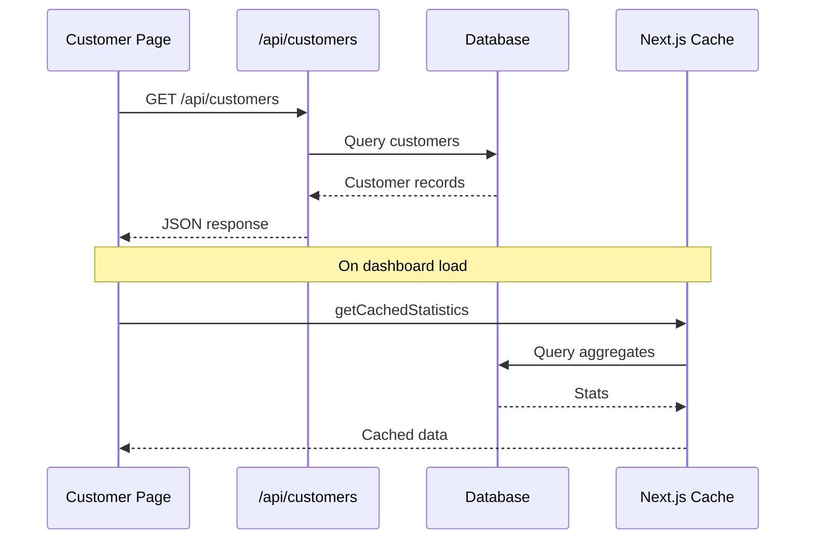
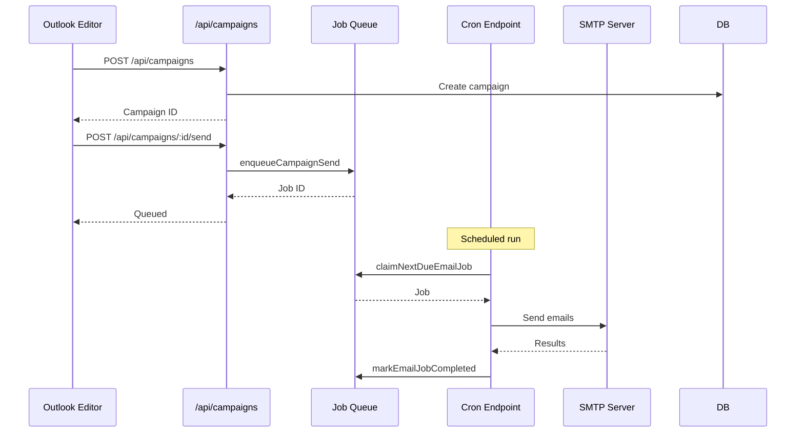
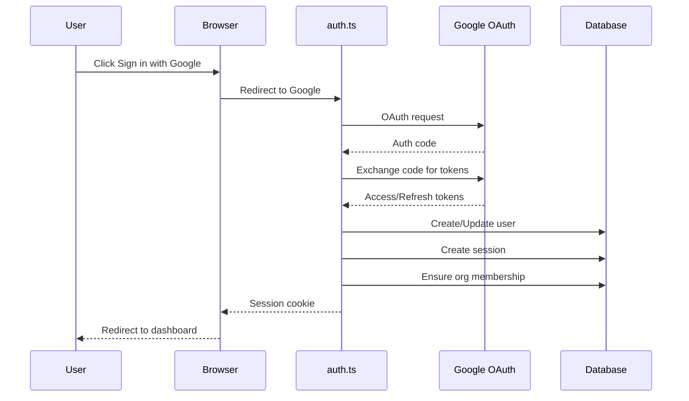

# Source Code Architecture Analysis

> **Phase 3: Comprehensive forensic analysis of the KK Tires CRM repository**
> 
> This document provides a detailed analysis of the source code architecture, including library modules, server-side code, components, authentication, and root application files.

---

## Table of Contents

1. [Library Modules](#library-modules)
2. [Server-Side Code](#server-side-code)
3. [Components](#components)
4. [Authentication](#authentication)
5. [Proxy Configuration](#proxy-configuration)
6. [Root Application Files](#root-application-files)
7. [Module Dependency Graph](#module-dependency-graph)
8. [Component Hierarchy](#component-hierarchy)
9. [Key Abstractions and Patterns](#key-abstractions-and-patterns)
10. [Data Flow](#data-flow)

---

## Library Modules

### Directory Structure

```
src/lib/
|-- cache.ts              # Next.js cached data accessors
|-- html-sanitize.ts      # HTML sanitization utilities
|-- utils.ts              # General utility functions
|-- ai/
|   |-- meltemi.ts        # Greek AI integration (Meltemi 7B)
|-- auth/                 # (empty - auth config in src/auth.ts)
|-- db/
|   |-- index.ts          # Database connection and exports
|   |-- schema.ts         # Drizzle ORM schema definitions
|-- stores/
    |-- auth-store.ts     # Zustand auth state store
    |-- ui-store.ts       # Zustand UI state store
```

### Core Utility Modules

#### [`src/lib/utils.ts`](src/lib/utils.ts)

General-purpose utility functions for the application:

| Function | Purpose |
|----------|---------|
| `cn()` | Tailwind CSS class merger using `clsx` and `twMerge` |
| `formatCurrency()` | Greek EUR currency formatting |
| `formatDate()` / `formatDateTime()` | Greek date/time formatting |
| `formatRelativeTime()` | Relative time display in Greek |
| `getInitials()` | Avatar initials extraction |
| `truncate()` | Text truncation with ellipsis |
| `getRandomColor()` | Random avatar/tag color generation |
| `debounce()` | Function debouncing utility |
| `sleep()` | Promise-based delay |
| `validateAFM()` | Greek Tax ID validation algorithm |
| `formatPhone()` | Greek phone number formatting |
| `generateId()` | Unique ID generation |

**Label Mappings** (Greek localization):
- `categoryLabels` - Customer categories (retail, wholesale, fleet, etc.)
- `leadStatusLabels` - Lead status labels
- `taskPriorityLabels` / `taskStatusLabels` - Task management
- `campaignStatusLabels` - Email campaign status
- `lifecycleStageLabels` - Customer lifecycle stages
- `leadSourceLabels` - Lead source channels

#### [`src/lib/cache.ts`](src/lib/cache.ts)

Next.js `unstable_cache` wrappers for optimized data fetching:

```typescript
// Cached data accessors with 60-second revalidation
getCachedCustomerCount()
getCachedStatistics()      // Aggregated dashboard stats
getCachedCampaignStats()  // Email campaign metrics
getCachedTags()           // Tag list
getCachedCustomerLocations()  // Map data (5x cache time)
```

**Cache Configuration**:
- Default revalidation: 60 seconds
- Cache tags: `customers`, `statistics`, `campaigns`, `tags`, `locations`
- Organization filter: `org_kktires` (default)

#### [`src/lib/html-sanitize.ts`](src/lib/html-sanitize.ts)

Dual-environment HTML sanitization:

- **Browser**: Uses `DOMParser` for DOM-level sanitization
- **Server**: Regex-based fallback for SSR

Removes: `<script>`, `<style>`, `<iframe>`, event handlers (`onclick`, etc.), `javascript:` URLs

### AI Module

#### [`src/lib/ai/meltemi.ts`](src/lib/ai/meltemi.ts)

Integration with **Meltemi 7B** - Greek language AI model via Hugging Face Inference API:

```typescript
// Main exports
expandToGreekEmail(briefNote, customer): Promise<MeltemiResponse>
generateGreekSubjectLines(emailContent, count): Promise<MeltemiResponse>
checkMeltemiStatus(): Promise<{ available: boolean; message: string }>
```

**Configuration**:
- API: `https://api-inference.huggingface.co/models/ilsp/Meltemi-7B-v1`
- Auth: `HUGGINGFACE_API_KEY` environment variable
- Parameters: `max_new_tokens: 500`, `temperature: 0.7`, `top_p: 0.9`

### Database Module

#### [`src/lib/db/index.ts`](src/lib/db/index.ts)

Database connection management with graceful degradation:

```typescript
// Exports
export const db: Database           // Drizzle ORM instance
export const isDatabaseConfigured: boolean
export * from './schema'            // Re-export schema
```

**Connection Logic**:
1. Reads `DATABASE_URL` or `TURSO_DATABASE_URL`
2. Reads `DATABASE_AUTH_TOKEN` or `TURSO_AUTH_TOKEN`
3. Creates LibSQL client with Drizzle ORM
4. Returns proxy that throws helpful error if not configured

#### [`src/lib/db/schema.ts`](src/lib/db/schema.ts)

Complete Drizzle ORM schema definitions (see [Database Schema Analysis](database-schema-analysis.md) for full details).

### State Management

#### [`src/lib/stores/auth-store.ts`](src/lib/stores/auth-store.ts)

Zustand store for client-side auth state:

```typescript
interface AuthState {
  currentOrgId: string | null;
  currentOrgName: string | null;
  currentOrgRole: 'owner' | 'admin' | 'member' | null;
  setCurrentOrg(orgId, orgName, role): void;
  clearCurrentOrg(): void;
}
```

- Persisted to `localStorage` as `kktires-auth`

#### [`src/lib/stores/ui-store.ts`](src/lib/stores/ui-store.ts)

Zustand store for UI state management:

```typescript
interface UIState {
  // Sidebar
  sidebarCollapsed: boolean;
  
  // Theme
  theme: 'dark' | 'light';
  
  // Command Palette
  commandPaletteOpen: boolean;
  
  // Notifications
  notificationsOpen: boolean;
  
  // Mobile
  mobileMenuOpen: boolean;
  
  // Toasts
  toasts: Toast[];
  addToast(), removeToast(), clearToasts();
}
```

**Features**:
- Persisted to `localStorage` as `kktires-ui`
- Theme auto-applied via `applyTheme()` function
- Toast helper: `toast.success()`, `toast.error()`, `toast.info()`, `toast.warning()`

---

## Server-Side Code

### Directory Structure

```
src/server/
|-- authz.ts                    # Authorization utilities
|-- api/
|   |-- drizzle-schemas.ts      # Zod validation schemas
|   |-- http.ts                 # HTTP utilities for API routes
|-- cron/
|   |-- auth.ts                 # Cron endpoint authentication
|-- crypto/
|   |-- oauth-tokens.ts         # OAuth token encryption
|-- db/
|   |-- auto-heal.ts            # Schema drift auto-repair
|-- email/
|   |-- assets.ts               # Email asset management
|   |-- gmail.ts                # Gmail API integration
|   |-- job-queue.ts            # Email job queue system
|   |-- process-jobs.ts         # Job processing logic
|   |-- recipients.ts           # Recipient resolution
|   |-- smtp.ts                 # SMTP email sending
|   |-- tracking.ts             # Email tracking (opens/clicks)
|   |-- transport.ts            # Email transport abstraction
|-- maps/
    |-- geocode-utils.ts        # Geocoding utilities
    |-- geocode.ts              # Google Geocoding API
```

### Authorization Module

#### [`src/server/authz.ts`](src/server/authz.ts)

```typescript
// Exports
type OrgRole = 'owner' | 'admin' | 'member';

getDefaultOrgId(): string                    // 'org_kktires' or env override
requireSession(): Promise<Session | null>   // Get valid session
getOrgIdFromSession(session): string        // Extract org ID
getRoleFromSession(session): OrgRole        // Extract user role
hasRole(session, roles): boolean           // Role check
```

### API Utilities

#### [`src/server/api/http.ts`](src/server/api/http.ts)

HTTP utilities for API route handlers:

```typescript
// Error handling
class ApiError extends Error { status, code }
type ApiErrorCode = 'BAD_REQUEST' | 'UNAUTHORIZED' | 'FORBIDDEN' | 'NOT_FOUND' | 'PAYLOAD_TOO_LARGE' | 'INTERNAL_ERROR'

// Request utilities
createRequestId(): string
parsePagination(searchParams, options): { page, limit, offset }
withValidatedBody(request, schema): Promise<z.infer<T>>

// Response helpers
jsonError(error, status, code, requestId): NextResponse
handleApiError(scope, error, requestId, fallback): NextResponse
withApiErrorBoundary(scope, handler): WrappedHandler
```

#### [`src/server/api/drizzle-schemas.ts`](src/server/api/drizzle-schemas.ts)

Zod validation schemas generated from Drizzle schema:

```typescript
// Customer validation
customerInsertSchema          // Full schema
customerCreateRequestSchema   // API request schema (omits auto fields)

// Tag validation
tagInsertSchema
tagCreateRequestSchema

// Template validation
templateInsertSchema
templateCreateRequestSchema
```

### Cron Authentication

#### [`src/server/cron/auth.ts`](src/server/cron/auth.ts)

```typescript
isCronAuthorized(request: Request): boolean
```

Validates cron requests via:
- Bearer token in `Authorization` header
- `x-cron-secret` or `x-api-key` headers
- Query params: `cron_secret`, `key`, `token`
- Falls back to allowing non-production environments

### Database Auto-Heal

#### [`src/server/db/auto-heal.ts`](src/server/db/auto-heal.ts)

Runtime schema drift detection and repair:

```typescript
// Error detection
getErrorMessages(error): string
isMissingColumnError(error, columnName): boolean
isMissingColumnErrorAny(error): boolean
isForeignKeyError(error): boolean
isMissingTableError(error): boolean
isSchemaError(error): boolean

// Schema repair
healEmailCampaignSchema(): Promise<string[]>  // Returns actions taken

// Fallback operations
rawInsertCampaign(values): Promise<void>
rawUpdateCampaign(campaignId, orgId, values): Promise<void>
```

**Auto-healed tables**:
- `email_campaigns`
- `email_signatures`
- `email_assets`
- `campaign_assets`

### Email System

#### [`src/server/email/smtp.ts`](src/server/email/smtp.ts)

SMTP configuration and sending:

```typescript
type SmtpConfig = { host, port, secure, user, pass, from }
type SmtpReadiness = { configured, missing[], host, port, secure, from }

isSmtpConfigured(): boolean
getSmtpReadiness(): SmtpReadiness
sendSmtpEmailDetailed(params): Promise<SmtpSendResult>
sendSmtpEmail(params): Promise<boolean>
```

**Configuration via environment**:
- `SMTP_HOST`, `SMTP_PORT`, `SMTP_USER`, `SMTP_PASS`
- `SMTP_SECURE` (auto-detected for port 465)
- `SMTP_FROM` (defaults to SMTP_USER)

#### [`src/server/email/transport.ts`](src/server/email/transport.ts)

Email transport abstraction layer:

```typescript
type EmailTransportProvider = 'smtp'
type EmailSendParams = { to, subject, html?, text?, headers?, from?, attachments? }

ensureEmailTransportReady(): EmailTransportReadiness
sendEmail(params): Promise<EmailSendResult>
```

#### [`src/server/email/job-queue.ts`](src/server/email/job-queue.ts)

Email campaign job queue system:

```typescript
type EmailJobStatus = 'queued' | 'processing' | 'completed' | 'failed' | 'cancelled'

enqueueCampaignSend(params): Promise<{ ok, jobId, runAt, ... }>
claimNextDueEmailJob(workerId): Promise<EmailJob | null>
yieldEmailJob(jobId, delayMs): Promise<void>
markEmailJobCompleted(jobId): Promise<void>
markEmailJobFailed(jobId, error): Promise<void>
```

**Features**:
- Distributed-safe job claiming with locking
- Stale job recovery (15-minute timeout)
- Retry support via `yieldEmailJob()`

#### [`src/server/email/assets.ts`](src/server/email/assets.ts)

Email asset management (images, attachments):

```typescript
// Asset creation
createEmailAsset(params): Promise<EmailAsset>

// Asset listing
listEmailAssetsForCampaign(orgId, campaignId): Promise<CampaignAssetsResponse>
listRecentEmailAssets(orgId, limit): Promise<EmailAsset[]>

// Asset synchronization
syncCampaignAssets(orgId, campaignId, assets): Promise<void>
normalizeCampaignAssetsInput(input): NormalizedAssets

// Asset preparation for sending
prepareCampaignAssetBundle(orgId, campaignId): Promise<PreparedAssetBundle>
prepareAdhocAssetBundle(orgId, assets): Promise<PreparedAssetBundle>
applyAssetBundleToHtml(html, bundle): { html, attachments }

// Migration
migrateInlineDataImagesToAssets(html, orgId, uploaderUserId): Promise<{ html, inlineImages }>
```

**Storage**: Vercel Blob (`BLOB_READ_WRITE_TOKEN`)

**Allowed MIME types**:
- Images: `image/jpeg`, `image/png`, `image/webp`, `image/gif`
- Attachments: PDF, DOCX, XLSX, CSV, TXT, ZIP

#### [`src/server/email/tracking.ts`](src/server/email/tracking.ts)

Email open/click tracking:

```typescript
// URL builders
buildOpenPixelUrl(campaignId, recipientId): string | null
buildClickUrl(campaignId, recipientId, destinationUrl): string | null
buildUnsubscribeUrl(campaignId, recipientId): string | null

// HTML rewriting
rewriteHtmlLinksForClickTracking(html, campaignId, recipientId): string
injectOpenPixel(html, pixelUrl): string
appendUnsubscribeFooter(html, unsubscribeUrl): string
```

**Security**: HMAC-SHA256 signatures with `EMAIL_TRACKING_SECRET`

### Maps/Geocoding

#### [`src/server/maps/geocode.ts`](src/server/maps/geocode.ts)

Google Geocoding API integration with caching:

```typescript
type GeocodeResult = { latitude, longitude, formattedAddress?, source }

geocodeAddress(address): Promise<GeocodeResult | null>
```

**Features**:
- Cache table: `geocode_cache`
- API key: `GOOGLE_GEOCODING_API_KEY` or `NEXT_PUBLIC_GOOGLE_MAPS_API_KEY`

---

## Components

### Directory Structure

```
src/components/
|-- customers/
|   |-- customer-modal.tsx       # Customer create/edit modal
|-- email/
|   |-- automation-builder.tsx    # Email automation workflow builder
|   |-- campaign-analytics.tsx    # Campaign performance analytics
|   |-- outlook-editor.tsx        # Full email campaign editor
|   |-- outlook-layout.tsx        # Email editor layout wrapper
|   |-- outlook-list.tsx          # Campaign list view
|   |-- outlook-recipient-drawer.tsx  # Recipient selection drawer
|   |-- outlook-sidebar.tsx       # Email editor sidebar
|   |-- recipient-selector.tsx    # Recipient picker component
|   |-- rich-text-editor.tsx      # Rich text editor component
|   |-- template-builder.tsx      # Email template builder
|-- layout/
|   |-- aurora-background.tsx     # Animated background component
|   |-- command-palette.tsx       # Command palette (Cmd+K)
|   |-- header.tsx                # Top navigation header
|   |-- navigation.ts             # Navigation configuration
|   |-- sidebar.tsx               # Main sidebar navigation
|-- providers/
|   |-- session-provider.tsx      # NextAuth session provider wrapper
|   |-- store-hydration.tsx       # Zustand store hydration
|-- ui/
    |-- confirm-dialog.tsx        # Confirmation dialog
    |-- glass-avatar.tsx          # Avatar component
    |-- glass-badge.tsx           # Badge/tag component
    |-- glass-button.tsx          # Button component
    |-- glass-card.tsx            # Card container
    |-- glass-dropdown.tsx        # Dropdown menu
    |-- glass-empty-state.tsx     # Empty state display
    |-- glass-input.tsx           # Text input
    |-- glass-modal.tsx           # Modal dialog
    |-- glass-progress.tsx        # Progress indicators
    |-- glass-select.tsx          # Select dropdown
    |-- glass-skeleton.tsx        # Loading skeleton
    |-- glass-switch.tsx          # Toggle switch
    |-- glass-tabs.tsx            # Tab navigation
    |-- glass-textarea.tsx        # Text area
    |-- glass-toast.tsx           # Toast notifications
    |-- glass-tooltip.tsx         # Tooltip component
    |-- index.ts                  # Barrel export
```

### UI Component Library (Glass Design System)

The [`src/components/ui/index.ts`](src/components/ui/index.ts) exports a complete design system:

| Component | Purpose |
|-----------|---------|
| `GlassCard` | Container with glass-morphism styling |
| `GlassButton` | Styled button with variants (primary, ghost, danger) |
| `GlassInput` / `GlassTextarea` | Form inputs with glass styling |
| `GlassSelect` | Dropdown select with custom styling |
| `GlassBadge` | Status/category badges |
| `GlassModal` / `GlassModalBody` / `GlassModalFooter` | Modal dialogs |
| `GlassAvatar` / `GlassAvatarGroup` | User avatars |
| `GlassSkeleton` / `GlassSkeletonCard` / `GlassSkeletonTable` | Loading states |
| `GlassToastContainer` | Toast notification container |
| `GlassTabs` / `GlassTabsList` / `GlassTabsTrigger` / `GlassTabsContent` | Tab navigation |
| `GlassSwitch` | Toggle switch |
| `GlassDropdown` | Dropdown menu |
| `GlassTooltip` | Hover tooltips |
| `GlassProgress` / `GlassProgressCircle` | Progress indicators |
| `GlassEmptyState` | Empty state displays |

### Layout Components

#### [`src/components/layout/sidebar.tsx`](src/components/layout/sidebar.tsx)

Main navigation sidebar with:
- Collapsible design (260px expanded, 72px collapsed)
- Animated transitions via Framer Motion
- Navigation items from [`navigation.ts`](src/components/layout/navigation.ts)
- User profile section with sign-out
- Role-based visibility for admin items

#### [`src/components/layout/header.tsx`](src/components/layout/header.tsx)

Top header bar with:
- Mobile menu toggle
- Search input (triggers command palette)
- Theme toggle (dark/light)
- Notifications button
- User dropdown menu

#### [`src/components/layout/command-palette.tsx`](src/components/layout/command-palette.tsx)

Command palette implementation:
- Keyboard shortcut: `Cmd+K` / `Ctrl+K`
- Search across customers, campaigns, actions
- Quick navigation

### Email Components

#### [`src/components/email/outlook-editor.tsx`](src/components/email/outlook-editor.tsx)

Full-featured email campaign editor (largest component at 56KB):
- Rich text editing
- Template selection
- Recipient filtering
- Asset management
- AI assistance integration
- Preview and test sending

### Provider Components

#### [`src/components/providers/session-provider.tsx`](src/components/providers/session-provider.tsx)

Wrapper for NextAuth's `SessionProvider`:
```typescript
export function SessionProvider({ children }) {
  return (
    <NextAuthSessionProvider>
      {children}
    </NextAuthSessionProvider>
  );
}
```

---

## Authentication

### [`src/auth.ts`](src/auth.ts)

NextAuth.js v5 configuration with Drizzle adapter.

#### Providers

1. **Google Provider** (if configured):
   - Requires: `GOOGLE_CLIENT_ID`, `GOOGLE_CLIENT_SECRET`
   - Scopes: `openid email profile https://www.googleapis.com/auth/gmail.send`
   - Offline access for Gmail integration

2. **Nodemailer Provider** (if configured):
   - Requires: `SMTP_HOST`, `SMTP_PORT`, `SMTP_USER`, `SMTP_PASS`
   - Magic link email authentication

#### Configuration

```typescript
NextAuth({
  secret: AUTH_SECRET || NEXTAUTH_SECRET,
  trustHost: true,  // Auto-enabled for Vercel or non-production
  
  adapter: DrizzleAdapter(db, {
    usersTable: users,
    accountsTable: accounts,
    sessionsTable: sessions,
    verificationTokensTable: verificationTokens,
  }),
  
  session: { strategy: 'database' },
  
  pages: {
    signIn: '/login',
    error: '/login',
  },
})
```

#### Callbacks

1. **signIn callback**: Email allowlist validation
   - Checks `AUTH_ALLOWED_EMAILS` environment variable
   - Rejects sign-ins from non-allowed emails

2. **session callback**: Enriches session with org data
   - Adds `user.id` to session
   - Adds `user.currentOrgId` and `user.currentOrgRole`

#### Events

**signIn event**: Organization bootstrap
- Creates default organization (`org_kktires`) if not exists
- Adds user as organization member
- First user becomes `owner`, subsequent users become `member`

#### OAuth Token Encryption

OAuth tokens (Google refresh tokens) are encrypted at rest via [`src/server/crypto/oauth-tokens.ts`](src/server/crypto/oauth-tokens.ts).

---

## Proxy Configuration

### [`src/proxy.ts`](src/proxy.ts)

Next.js 16 proxy/middleware for request handling.

#### Rate Limiting

```typescript
const RATE_LIMIT = 100;        // requests per minute
const RATE_WINDOW = 60 * 1000; // 1 minute window
const MAX_RATE_LIMIT_ENTRIES = 10_000;
```

- In-memory rate limiting (Map-based)
- Automatic cleanup of expired entries
- Uses `x-forwarded-for` or `x-real-ip` for client IP

#### Public Endpoints

The following endpoints bypass rate limiting:
- `/_next/*` - Next.js internals
- `/favicon*` - Favicons
- `/manifest.json` - PWA manifest
- `/icons/*` - App icons
- `/api/auth/*` - Auth endpoints
- `/api/health` - Health check
- `/api/email/tracking` - Email open tracking
- `/api/email/click` - Email click tracking
- `/api/unsubscribe` - Unsubscribe handler
- `OPTIONS` requests - CORS preflight

---

## Root Application Files

### [`src/app/layout.tsx`](src/app/layout.tsx)

Root layout component with:

#### Fonts
- **Inter**: Primary font (Latin + Greek subsets)
- **JetBrains Mono**: Monospace font

#### Metadata
```typescript
export const viewport: Viewport = {
  width: 'device-width',
  initialScale: 1,
  maximumScale: 1,
  userScalable: false,
  themeColor: '#06b6d4',
};

export const metadata: Metadata = {
  title: 'KK Tires CRM - Delta-cheirish Pelaton',
  description: 'To po synghrono CRM gia epicheiriseis elastikon stin Ellada.',
  // ... OpenGraph, appleWebApp, etc.
};
```

#### Theme Hydration
Inline script in `<head>` prevents flash of wrong theme:
- Reads `kktires-ui` from localStorage
- Applies theme class before render

#### Service Worker
Registers `/sw.js` for PWA functionality.

### [`src/app/globals.css`](src/app/globals.css)

Complete design system implementation.

#### CSS Variables

```css
:root {
  /* Colors */
  --background: #14151a;
  --foreground: #f4f4f8;
  
  /* Aurora Gradient */
  --aurora-1: #0ea5e9;  /* Cyan */
  --aurora-2: #8b5cf6;  /* Purple */
  --aurora-3: #ec4899;  /* Pink */
  --aurora-4: #10b981;  /* Emerald */
  
  /* Glass Effects */
  --glass-bg: rgba(255, 255, 255, 0.05);
  --glass-border: rgba(255, 255, 255, 0.12);
  --glass-blur: 16px;
  
  /* Accent Colors */
  --accent-primary: #0ea5e9;
  --accent-secondary: #8b5cf6;
  --accent-success: #10b981;
  --accent-warning: #f59e0b;
  --accent-error: #ef4444;
  
  /* Text */
  --text-primary: #f4f4f8;
  --text-secondary: #b4b4c0;
  --text-muted: #7a7a88;
  
  /* Effects */
  --glow-primary: 0 0 20px rgba(14, 165, 233, 0.25);
  --shadow-sm/md/lg: ...;
  --radius-sm/md/lg/xl: 6px/8px/12px/16px;
}
```

#### Light Theme

The `.light` class inverts colors for light mode:
- Background: `#f5f7fa`
- Glass effects use white with transparency
- Text colors inverted
- Custom overrides for Tailwind classes

#### Component Styles

- `.glass` / `.glass-card` - Glass containers
- `.glass-button` / `.glass-button-primary` / `.glass-button-danger` - Buttons
- `.glass-input` / `.glass-select` - Form inputs
- `.glass-modal-overlay` / `.glass-modal` - Modals
- `.glass-sidebar` / `.glass-sidebar-item` - Navigation
- `.glass-table` - Data tables
- `.glass-badge` / `.glass-badge-*` - Status badges
- `.glass-toast` - Toast notifications
- `.skeleton` - Loading skeletons

#### Animations

- `aurora-drift`: Background gradient animation (25s)
- `fade-in` / `slide-up`: Modal animations
- `toast-in` / `toast-out`: Toast transitions
- `skeleton-pulse`: Loading shimmer effect

---

## Module Dependency Graph

```mermaid
graph TB
    subgraph Lib[Library Modules]
        utils[lib/utils.ts]
        cache[lib/cache.ts]
        sanitize[lib/html-sanitize.ts]
        meltemi[lib/ai/meltemi.ts]
        db[lib/db/index.ts]
        schema[lib/db/schema.ts]
        authStore[lib/stores/auth-store.ts]
        uiStore[lib/stores/ui-store.ts]
    end

    subgraph Server[Server Modules]
        authz[server/authz.ts]
        http[server/api/http.ts]
        drizzleSchemas[server/api/drizzle-schemas.ts]
        cronAuth[server/cron/auth.ts]
        oauth[server/crypto/oauth-tokens.ts]
        autoheal[server/db/auto-heal.ts]
        smtp[server/email/smtp.ts]
        transport[server/email/transport.ts]
        jobqueue[server/email/job-queue.ts]
        assets[server/email/assets.ts]
        tracking[server/email/tracking.ts]
        geocode[server/maps/geocode.ts]
    end

    subgraph Components[UI Components]
        glass[components/ui/*]
        layout[components/layout/*]
        email[components/email/*]
        providers[components/providers/*]
    end

    subgraph Root[Root Files]
        auth[auth.ts]
        proxy[proxy.ts]
        layoutTx[app/layout.tsx]
        globals[app/globals.css]
    end

    %% Dependencies
    db --> schema
    cache --> db
    cache --> schema
    drizzleSchemas --> schema
    autoheal --> db
    smtp --> transport
    transport --> smtp
    jobqueue --> db
    jobqueue --> schema
    jobqueue --> transport
    assets --> db
    assets --> schema
    tracking --> db
    geocode --> db
    geocode --> schema
    auth --> db
    auth --> schema
    auth --> oauth
    auth --> authz
    authz --> auth
    http --> drizzleSchemas
    glass --> utils
    glass --> uiStore
    layout --> glass
    layout --> uiStore
    layout --> authStore
    email --> glass
    email --> utils
    email --> meltemi
    providers --> auth
    layoutTx --> providers
    layoutTx --> globals
```



---

## Component Hierarchy

```mermaid
graph TB
    subgraph RootLayout[Root Layout]
        LayoutTx[layout.tsx]
        SessionProvider[SessionProvider]
        Globals[globals.css]
    end

    subgraph DashboardShell[Dashboard Shell]
        AuroraBackground[aurora-background.tsx]
        Sidebar[sidebar.tsx]
        Header[header.tsx]
        CommandPalette[command-palette.tsx]
        ToastContainer[glass-toast.tsx]
    end

    subgraph Pages[Page Components]
        Customers[customers/page.tsx]
        Email[email/page.tsx]
        Maps[map/page.tsx]
        Settings[settings/page.tsx]
        Statistics[statistics/page.tsx]
    end

    subgraph EmailComponents[Email Feature]
        OutlookEditor[outlook-editor.tsx]
        OutlookSidebar[outlook-sidebar.tsx]
        OutlookList[outlook-list.tsx]
        RecipientDrawer[outlook-recipient-drawer.tsx]
        RichTextEditor[rich-text-editor.tsx]
        TemplateBuilder[template-builder.tsx]
        CampaignAnalytics[campaign-analytics.tsx]
    end

    subgraph UIComponents[Glass UI Library]
        GlassCard[glass-card.tsx]
        GlassButton[glass-button.tsx]
        GlassInput[glass-input.tsx]
        GlassModal[glass-modal.tsx]
        GlassTable[glass-table.tsx]
        GlassBadge[glass-badge.tsx]
        GlassAvatar[glass-avatar.tsx]
        GlassDropdown[glass-dropdown.tsx]
        GlassTooltip[glass-tooltip.tsx]
        GlassSkeleton[glass-skeleton.tsx]
    end

    %% Hierarchy
    LayoutTx --> SessionProvider
    LayoutTx --> Globals
    SessionProvider --> AuroraBackground
    SessionProvider --> Sidebar
    SessionProvider --> Header
    SessionProvider --> CommandPalette
    SessionProvider --> ToastContainer
    SessionProvider --> Pages

    Sidebar --> GlassAvatar
    Sidebar --> GlassTooltip
    Header --> GlassInput
    Header --> GlassButton
    Header --> GlassAvatar
    Header --> GlassDropdown

    Email --> OutlookEditor
    Email --> OutlookList
    Email --> CampaignAnalytics
    OutlookEditor --> OutlookSidebar
    OutlookEditor --> RecipientDrawer
    OutlookEditor --> RichTextEditor
    OutlookEditor --> TemplateBuilder

    EmailComponents --> UIComponents
    DashboardShell --> UIComponents
    Pages --> UIComponents
```



---

## Key Abstractions and Patterns

### 1. Glass Design System

A consistent visual language built on:
- **Glass-morphism**: Translucent backgrounds with blur
- **Aurora gradients**: Animated multi-color gradients
- **Dark-first design**: Dark theme as primary, light as override
- **Consistent spacing**: 6px/8px/12px/16px radius scale

### 2. Server/Client Separation

- **Server modules** (`src/server/`): Pure business logic, no React
- **Client state** (`src/lib/stores/`): Zustand with persistence
- **API routes**: Bridge between server logic and client

### 3. Database Access Patterns

```typescript
// Direct query
const customers = await db.select().from(customersTable);

// Relational query
const customer = await db.query.customers.findFirst({
  where: (c, { eq }) => eq(c.id, id),
  with: { tags: true },
});

// Cached query
const count = await getCachedCustomerCount();
```

### 4. Error Handling

```typescript
// API routes use consistent error handling
try {
  // ... operation
} catch (error) {
  return handleApiError('scope', error, requestId);
}

// Database operations use auto-heal
try {
  await db.insert(campaigns).values(data);
} catch (error) {
  if (isSchemaError(error)) {
    await healEmailCampaignSchema();
    // retry...
  }
}
```

### 5. Email System Architecture

```
Campaign Creation
       |
       v
Job Enqueue (job-queue.ts)
       |
       v
Cron Trigger (/api/cron/email-jobs)
       |
       v
Job Claim (distributed-safe)
       |
       v
Recipient Resolution (recipients.ts)
       |
       v
Asset Preparation (assets.ts)
       |
       v
HTML Processing (tracking.ts)
       |
       v
Transport Send (transport.ts -> smtp.ts)
       |
       v
Job Completion
```

### 6. Authentication Flow

```
User Sign-in Request
       |
       v
Provider Selection (Google/Email)
       |
       v
Email Allowlist Check
       |
       v
Session Creation (database strategy)
       |
       v
Organization Bootstrap (signIn event)
       |
       v
Session Enrichment (session callback)
       |
       v
Client Session (SessionProvider)
```

---

## Data Flow

### Customer Data Flow



### Email Campaign Flow



### Authentication Flow



---

## Summary

The KK Tires CRM application follows a well-organized architecture:

1. **Library modules** provide core utilities, database access, and state management
2. **Server modules** encapsulate business logic for email, maps, and API handling
3. **Components** are organized by feature (email, layout) with a reusable Glass UI library
4. **Authentication** uses NextAuth.js v5 with database sessions and organization support
5. **Proxy** handles rate limiting and public endpoint routing
6. **Root files** set up fonts, themes, and PWA support

The architecture demonstrates:
- Clear separation of concerns
- Greek localization throughout
- Resilient error handling (auto-heal, graceful degradation)
- Modern React patterns (Server Components where possible, Client Components for interactivity)
- Comprehensive email system with tracking and job queues